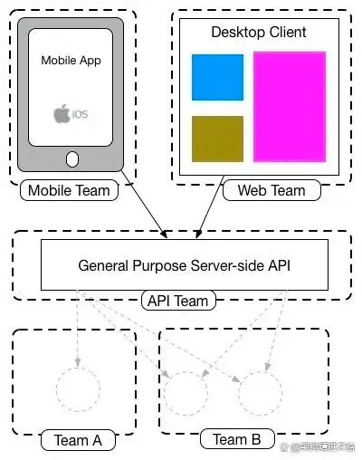

---
sidebar:
group:
title: BFF
isTimeLine: true
date: 2024-12-22
---
# BFF

## 什么是BFF

BFF：Backends For Frontends（服务于前端的后端）。

BFF是一种Web架构，微服务设计系列丛书的作者 Sam Newman曾在他的博客中写了一篇相关文章《Pattern: Backends For Frontends》。

服务端设计API时会考虑到不同设备的需求，即为不同设备提供不同API接口，虽然它们可能实现相同功能，但因不同设备的特殊性，它们对服务端的API访问也各有其特点，需区别处理。在计算机科学中，所有问题都可以通过加一层来解决，于是 BFF 架构设计应运而生。

一方面 BFF 隔离了前端UI展示对后端API的需求，企业可以专注在后端构建核心业务能力，另一方面，BFF根据已有的后端API，快速满足前端在UI展示上的需求，来不断提升用户体验；

从知识管理的角度，BFF模式让知识边界定义得更清晰，后端专注于构建业务能力，不需要考虑前端各种场景适配的问题；而前端更关注用户体验，可以随时独立发布更新。

## BFF有什么用

### 背景

从DDD角度看，提倡围绕领域业务能力进行接口设计，服务端应该聚焦领域自身能提供什么样的能力来设计接口，而展示相关的处理逻辑不应该是领域业务。

因此站在不同的角度来

* 前端
  良好的用户体验 -> 高频发布迭代
* 后端
  实现特定业务逻辑 -> 比较稳定，不会随着前端体验有大的变化

那既然前端没错，后端也没错，因此引入一层单独的架构BFF（Backend For Frontend）（微服务架构下的产物    ），通过引入BFF解耦了前后端，也对组织架构做了归属和指导。

* #### 多端功能差异（字段裁减）

   App端往往只能展示少量信息，浏览器网页则需要全部信息，因此需要适配各端而裁减字段

* #### 不同业务场景展示差异（聚合和编排多种数据）

   一个页面要展示多个服务端的数据，因此需要聚合多个API的数据（串行或并行编排多个API）

* #### 数据格式转换

   服务功能不断迭代，面对服务端不同的数据格式，甚至有历史遗留系统，需要适配成前端展示更友好的格式

* #### 不同业务试验效果

   试验不同的展示方案效果，需要快速支持新业务方案上线
    
### 优点

* 服务端对数据展示服务进行解耦，展示服务由独立的BFF端提供，服务端可以聚焦于业务处理；
* 多端展示或者多业务展示时，对与数据获取有更好的灵活性，避免数据冗余造成消耗服务端资源；
* 对于复杂的前端展示，将数据获取和组装的负责逻辑在BFF端执行，降低前端处理的复杂度，提高前端页面响应效率；
* 部分展示业务，可以抽象出来利用BFF实现，对于服务端实现接口复用；
* 降低多端业务的耦合性，避免不同端业务开发互相影响；
* 其他优势，包括数据缓存，接口安全校验等。

### 缺点

* 模块和接口职责的划分与分工
* 业务模块在什么时机需要独立拆分出BFF？看起来只能凭经验，应根据实际需求开发过程中数据编排和加工的逻辑占比看
* 需要明确前端、BFF、后端微服务三者的定位、职责、界限，以及相应的保障措施比如设计和编码规范
* 警惕业务逻辑往BFF服务蔓延，前后端在责任划分时容易偷懒，不进行深入思考，往BFF写不必要的代码逻辑
* 响应时间延迟（服务如果是内网之间访问，延迟时间较低）
* 编写起来较为浪费时间（因为在基础服务上添加的一层转发，所以会多写一部分代码）
* 业务异常处理（统一格式化业务异常的返回内容）
* 分布式事务（微服务的通病）

## BFF如何实现和落地？

### 实现方式

* **前端模式**

    优点：前端团队负责，自主取数，减少跨团队沟通
    缺点：需要深入业务逻辑、需要掌握基础设施建设的能力

* **后端模式**

  优点：复用后端现有基础设施
  缺点：前端服务、bff服务和业务服务三者的职责和边界把控

### BFF的需求

* 服务注册和发现：BFF服务应该融入现有微服务注册发现的机制
* 服务治理：如何跟其他微服务（不限语言）互相调用、接口流量的控制如限流
* 可观测能力：日志、链路、指标等方面的采集、监控、告警
* 融入现有开发流程：接口文档在线化、测试（Mock、自动化）
* 按照什么粒度划分BFF模块：根据不同的展示端、不同的业务模块、不同的业务团队等

BFF的能力层次
根据上面提到的关键诉求满足程度以及当前业务发展情况，笔者结合自己经历过的项目实践以及了解到的其他团队的实践，把BFF服务能力划分为如下几个不同层次。方便你根据团队和业务现状进行BFF技术选型和建设力度的决策。

第一层：BFF独立存在，解耦了前端和后端微服务。仍旧按照后端开发接口的方式一个查询场景对应一个接口，开发效率中等。
前端模式，用NodeJS开发，基于express/koa等框架在MVC模式下开发查询接口
后端模式，用Java开发，和API网关合体，或者独立存在。但BFF服务还是按照正常后端接口的开发流程进行。
第二层：在第一层基础上具备更高的接口开发效率和模型复用。
前端模式，基于GraphQL，但模型的复用没落实到字段级别。意味着模型和取数接口复用度有优化空间。
后端模式，用Java开发，低层次的元数据驱动。即基于自定义DSL（Json格式）来表达接口编排细节。
第三层：在第二层基础上具备更高的复用，最大程度地提高了接口开发效率和模型复用。
前端模式，基于GraphQL，Schema的定义拆解到每一个字段级别，并能够在组织范围内共享使用。这意味着模型和取数接口的复用度极高，带来查询接口开发效率和微服务接口使用效率高。
后端模式，通过元数据驱动，低代码方式开发查询接口，附带可视化后台开发界面。美团有一篇文章介绍他们的做法（传送门）。

BFF的实践
前面多次提到了GraphQL，下面笔者结合经历过的一个生产项目实践来聊一下GraphQL的落地细节。为什么需要建设BFF这一层就不多说了，因为是ToB项目，界面展示逻辑普遍复杂，产品同时支持浏览器、App、小程序、M站等

3.1 选型考虑
选择了前端模式，为什么？
希望提高前端团队理解业务逻辑的水平。前后端对业务逻辑的理解水平对产品的演进很关键，而前端比较缺乏业务理解。
拓宽前端团队的技术栈，增加NodeJS、TypeScript等服务端开发能力，以及服务部署和运维的基本能力。
当前团队是按照业务模块划分敏捷小组，因此BFF服务根据业务模块来划分。
选择了GraphQL，为什么？
GraphQL的模型优先思想很契合团队在服务端的DDD实践。产品、前端、后端一起沟通需求时都习惯先弄清楚领域模型，GraphQL的Schema包括数据结构以及数据对应的取数接口。这和DDD的领域模型很类似，因此有利于加强这种习惯，落地起来也很顺畅。
基于GraphQL的开发心智简单。GraphQL开发只需要完成三个步骤，定义Schema、Resolver、Service。而BFF的核心功能就是考虑取哪些数，从哪些接口取数，取完数要做哪些加工。另外结合TypeScript也能加强JS代码的质量，提高调试体验。
另外前端也有一些按需查询的场景。即针对同一个Shema有不同的查询需求。
和API网关的关系？
BFF服务和API网关独立存在，BFF和API GW都是正常的微服务，可以互相发现，通过http协议互相调用。
如何保证NodeJS服务的非功能需求支持能力？
虽然服务端主要基于Java开发，但整体集群底座都已经service mesh化。服务之间的调用基于K8s service，流量控制能力基于Istio控制面。加上APM可观测组件也已经mesh化，因此NodeJS服务可以快速融入到现有的服务集群里。

https://baijiahao.baidu.com/s?id=1731604919892634643&wfr=spider&for=pc

