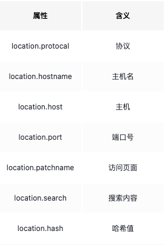
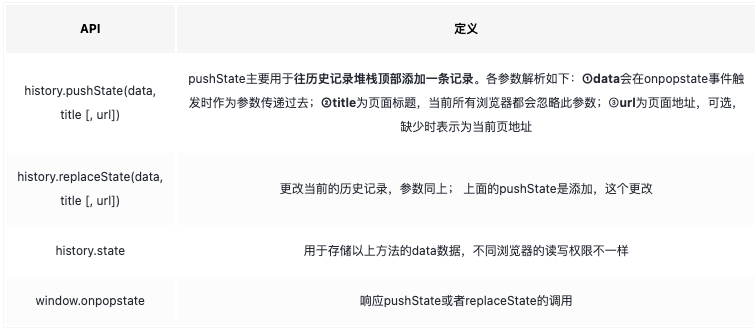

# 路由基础-history

# 网页url组成部分




# history 新增 api



## history 详解

todo

https://blog.csdn.net/caseywei/article/details/122252366

## 与hash的区别
我们用一个例子来演示， hash 与 history 在浏览器下刷新时的区别。具体如下：

```text

// 正常页面浏览
https://github.com/xxx 刷新页面

https://github.com/xxx/yyy 刷新页面

https://github.com/xxx/yyy/zzz 刷新页面

//改造H5 history模式
https://github.com/xxx 刷新页面

https://github.com/xxx/yyy 前端跳转，不刷新页面

https://github.com/xxx/yyy/zzz 前端跳转，不刷新页面
```

## history的特点
对于 history 来说，主要有以下特点：

* 新的 url 可以是与当前 url 同源的任意 url ，也可以是与当前 url 一样的地址，但是这样会导致的一个问题是，会把重复的这一次操作记录到栈当中。
* 通过 history.state ，添加任意类型的数据到记录中。
* 可以额外设置 title 属性，以便后续使用。
* 通过 pushState 、 replaceState 来实现无刷新跳转的功能。

## 存在问题
对于 history 来说，确实解决了不少 hash 存在的问题，但是也带来了新的问题。具体如下：

使用 history 模式时，在对当前的页面进行刷新时，此时浏览器会重新发起请求。如果 nginx 没有匹配得到当前的 url ，就会出现 404 的页面。
而对于 hash 模式来说，  它虽然看着是改变了 url ，但不会被包括在 http 请求中。所以，它算是被用来指导浏览器的动作，并不影响服务器端。因此，改变 hash 并没有真正地改变 url ，所以页面路径还是之前的路径， nginx 也就不会拦截。
因此，在使用 history 模式时，需要通过服务端来允许地址可访问，如果没有设置，就很容易导致出现 404 的局面。

## 两者选择
下面我们再来介绍下在实际的项目中，如何对这两者进行选择。具体如下：

* to B 的系统推荐用 hash ，相对简单且容易使用，且因为 hash 对 url 规范不敏感；
* to C 的系统，可以考虑选择 H5 history ，但是需要服务端支持；
* 能先用简单的，就别用复杂的，要考虑成本和收益。


