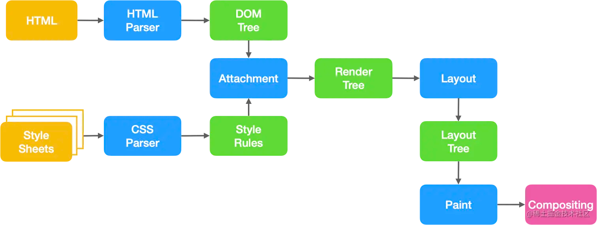
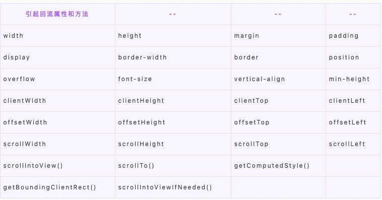
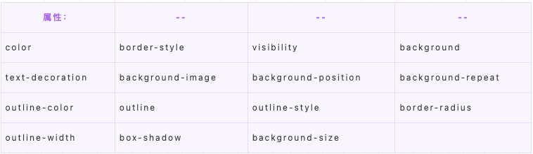

---
sidebar:
group:
title: 回流和重绘
date: 2023-11-14

sticky: 1
---
# 回流和重绘

## 页面渲染过程



* 解析HTML构建DOM Tree
* 解析CSS构建CSSOM Tree
* 构建渲染树（Render Tree），渲染树🌲只包含渲染网页所需的节点

**为构建渲染树，浏览器大体上完成了下列工作:**

1. 从 DOM 树的根节点开始遍历每个可见节点。
   1. 某些节点不可见（例如脚本标记、元标记等），因为它们不会体现在渲染输出中，所以会被忽略。
   2. 某些节点通过 CSS 隐藏（例如display: none），因此在渲染树中也会被忽略。
2. 对于每个可见节点，为其找到适配的 CSSOM 规则并应用它们。
3. 发射可见节点，连同其内容和计算的样式。

**visibility: hidden 与 display: none**

**“布局”阶段**

布局计算每个DOM对象的精确位置和大小
渲染（绘制，合成），使用最终渲染树将像素渲染到屏幕上

https://juejin.cn/post/7028385332391477255


## 回到主题 什么是回流（Reflow）与重绘（Repaint）？

**回流（Reflow）**

当渲染树render tree中的一部分(或全部)因为元素的规模尺寸，布局，隐藏等改变而需要重新构建。这就称为回流(reflow)。每个页面至少需要一次回流，就是在页面第一次加载的时候，这时候是一定会发生回流的，因为要构建render tree。在回流的时候，浏览器会使渲染树中受到影响的部分失效，并重新构造这部分渲染树，完成回流后，浏览器会重新绘制受影响的部分到屏幕中，该过程称为重绘。

简单来说，回流就是计算元素在设备内的确切位置和大小并且重新绘制

回流的代价要远大于重绘。并且回流必然会造成重绘，但重绘不一定会造成回流。

**重绘（Repaint）**

当渲染树render tree中的一些元素需要更新样式，但这些样式属性只是改变元素的外观，风格，而不会影响布局的，比如background-color。则就叫称为重绘(repaint)。

简单来说，重绘就是将渲染树节点转换为屏幕上的实际像素，不涉及重新布局阶段的位置与大小计算

## **为什么不建议频繁操作DOM？**

**_不仅要避免去操作DOM，还要减少访问DOM的次数。_**

因为在浏览器中，DOM和JS的实现，并不是在同一个引擎中完成的。DOM是属于渲染引擎中的东⻄，⽽JS⼜是JS引擎中的东⻄。当我们通过JS操作DOM的时候，就涉及到了两个线程之间的通信，那么势必会带来⼀些性能上的损耗。操作DOM次数⼀多，也就等同于⼀直在进⾏线程之间的通信，并且操作DOM可能还会带来重绘回流的情况，所以也就导致了性能上的问题。

## 何时会发生回流（Reflow）与重绘（Repaint）？

**会导致回流的操作：**

* 页面首次渲染（无法避免且开销最大的一次）
* 浏览器窗口大小发生改变（resize事件）
* 元素尺寸或位置发生改变（边距、宽高、边框等）
* 元素内容变化（文字数量或图片大小等等）
* 元素字体大小变化（font-size）
* 添加或者删除可见的DOM元素
* 激活CSS伪类（例如：:hover）
* 查询某些属性或调用某些方法



**为什么获取一些属性或调用方法也会导致回流？**

因为以上属性和方法都需要返回最新的布局信息，因此浏览器不得不触发回流重绘来返回正确的值。

会导致重绘的属性



[CSS Triggers](https://link.juejin.cn/?target=https%3A%2F%2Fcsstriggers.com%2F)

## 浏览器的优化机制

由于每次重排都会造成额外的计算消耗，因此大多数浏览器都会通过队列化修改并批量执行来优化重排过程。浏览器会将修改操作放入到队列里，直到过了一段时间或者操作达到了一个阈值，才会进行批量修改并清空队列。但是，在获取布局信息的时候，会强制刷新队列，比如当你访问以下属性或者使用以下方法：

* clientTop、clientLeft、clientWidth、clientHeight
* offsetTop、offsetLeft、offsetWidth、offsetHeight
* scrollTop、scrollLeft、scrollWidth、scrollHeight
* getComputedStyle()
* getBoundingClientRect
* 具体可以访问这个网站：[paulirish](https://link.juejin.cn/?target=https%253A%252F%252Fgist.github.com%252Fpaulirish%252F5d52fb081b3570c81e3a)

以上属性和方法都需要返回最新的布局信息，因此浏览器不得不清空队列，触发回流重绘来返回正确的值。因此，我们在修改样式的时候，最好避免使用上面列出的属性，他们都会刷新渲染队列。


## 如何减少回流（Reflow）与重绘（Repaint）？（优化）

1、合并对DOM样式的修改，采用css class来修改

```js
const el = document.querySelector('.box')
el.style.margin = '5px'
el.style.borderRadius = '12px'
el.style.boxShadow = '1px 3px 4px #ccc'

=>
.update{
   margin: 5px;
   border-dadius: 12px;
   box-shadow: 1px 3px 4px #ccc
}
const el = document.querySelector('.box')
el.classList.add('update')

```

如果需要对DOM进行多次访问，尽量使用局部变量缓存该DOM

避免使用table布局，可能很⼩的⼀个⼩改动会造成整个table的重新布局

CSS选择符从右往左匹配查找，避免节点层级过多

2、DOM离线处理，减少回流重绘次数

离线的DOM不属于当前DOM树中的任何一部分，这也就意味着我们对离线DOM处理就不会引起页面的回流与重绘。

使用display: none，上面我们说到了 (display: none) 将元素从渲染树中完全移除，元素既不可见，也不是布局的组成部分，之后在该DOM上的操作不会触发回流与重绘，操作完之后再将display属性改为显示，只会触发这一次回流与重绘。

visibility : hidden 的元素只对重绘有影响，不影响重排。

通过 documentFragment 创建一个 dom 文档片段,在它上面批量操作 dom，操作完成之后，再添加到文档中，这样只会触发一次重排。

```js
const el = document.querySelector('.box')
const fruits = ['front', 'nanjiu', 'study', 'code'];
const fragment = document.createDocumentFragment();
fruits.forEach(item => {
  const li = document.createElement('li');
  li.innerHTML = item;
  fragment.appendChild(li);
});
el.appendChild(fragment);

```

克隆节点，修改完再替换原始节点

```js
const el = document.querySelector('.box')
const fruits = ['front', 'nanjiu', 'study', 'code'];
const cloneEl = el.cloneNode(true)
fruits.forEach(item => {
  const li = document.createElement('li');
  li.innerHTML = item;
  cloneEl.appendChild(li);
});
el.parentElement.replaceChild(cloneEl,el)

```

## DOM脱离普通文档流

使用absoult或fixed让元素脱离普通文档流，使用绝对定位会使的该元素单独成为渲染树中 body 的一个子元素，重排开销比较小，不会对其它节点造成太多影响。

## CSS3硬件加速（GPU加速）

使用css3硬件加速，可以让transform、opacity、filters这些动画不会引起回流重绘 。但是对于动画的其它属性，比如background-color这些，还是会引起回流重绘的，不过它还是可以提升这些动画的性能。
常见的触发硬件加速的css属性：

* transform
* opacity
* filters
* Will-change

## 将节点设置为图层

图层能够阻⽌该节点的渲染⾏为影响别的节点。⽐如对于video标签来说，浏览器会⾃动将该节点变为图层。


