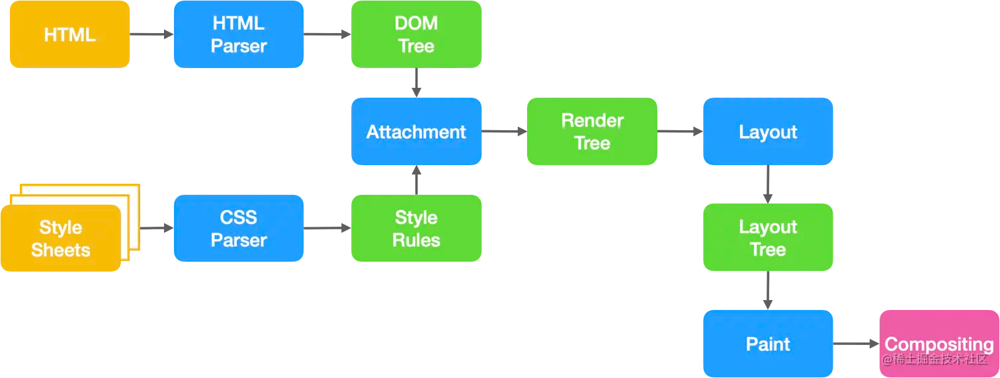

---
sidebar:
group:
title: 浏览器是如何解析代码的
date: 2023-11-14
isTimeLine: true
tags:
- 浏览器
---
# 浏览器是如何解析代码的



**解析HTML**

HTML是逐行解析的，浏览器的渲染引擎会将HTML文档解析并转换成DOM节点。

* 将HTML解析成许多Tokens
* 将Tokens解析成object
* 将object组合成一个DOM树

**解析CSS**

浏览器会从右往左解析CSS选择器

我们知道DOM树与CSSOM树合并成render树，实际上是将CSSOM附着到DOM树上，因此需要根据选择器提供的信息对DOM树进行遍历。

demo
```text
<style>
.nav .title span {color:blue}
</style>
​
<div class='nav'>
  <div class='title'>
    <span>南玖</span>
  </div>
  <div class="sub_title">前端</header>
</div>


从右至左的匹配：

先找到所有的最右节点 span，对于每一个 span，向上寻找节点 div.title
由 h3再向上寻找 div.nav 的节点
最后找到根元素 html 则结束这个分支的遍历。
```

**解析JS**

在浏览器中有一个js解析器的工具，专门用来解析我们的js代码。

当浏览器遇到js代码时，立马召唤“js解析器”出来工作。

解析器会找到js当中的所有变量、函数、参数等等，并且把变量赋值为未定义(undefined)。

把函数取出来成为一个函数块，然后存放到仓库当中。这件事情做完了之后才开始逐行解析代码（由上向下，由左向右），然后再去和仓库进行匹配。


