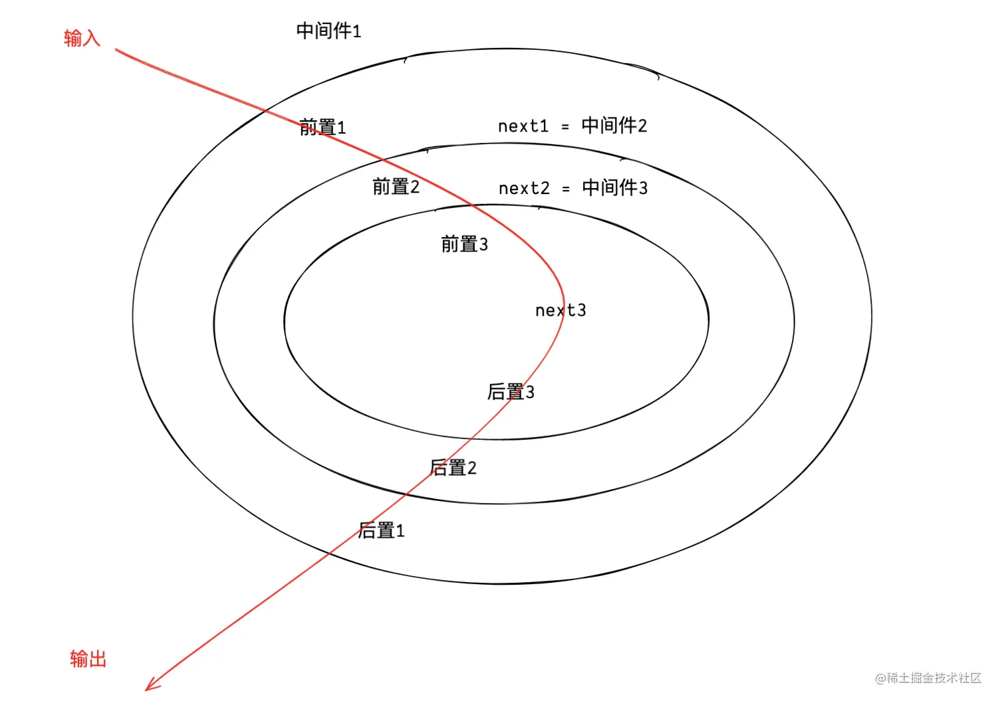

---
sidebar:
title: 洋葱模型
date: 2022-09-14
tags:
- nodejs
---
# 洋葱模型

洋葱圈模型的执行顺序是从外层中间件进入，然后依次经过内层中间件，最后再从外层中间件返回。

```js
// demo
const Koa = require("koa")
const app = new Koa();

// 中间件1
app.use(async (ctx, next) => {
    console.log("1")
    await next()
    console.log("2")
});
// 中间件2
app.use(async (ctx, next) => {
    console.log("3")
    await next()
    console.log("4")
});
// 中间件3
app.use(async (ctx, next) => {
    console.log("5")
    await next()
    console.log("6")
});
app.listen(8002);

// 打印结果
// 1
// 3
// 5
// 6
// 4
// 2
```




```js
// 洋葱模型核心方法
  function compose(middlewares){
    const dispatch = (ctx, i) => {
      if(middlewares.length === i) return;
      return middlewares[i](ctx, () => dispatch(ctx, i+1))
    }
    return (ctx) => {
      middlewares[0](ctx, () => dispatch(ctx, 1))
    }
  }
  
  // middlewares是一个数组，里面存放的是所有的插件方法，compose方式则通过递归的方式，把这些插件方法串成一串了，ctx是线，next也就是（()=>dispatch(ctx, i+1)）指向下一个插件。compose会返回一个串起来的方法，当执行这个方法时，就会调用之前use的插件方法，层层执行再层层返回
```


## 什么是 AOP？

AOP 为 Aspect Oriented Programming 的缩写，中文意思为：面向切面编程，它是函数式编程的一种衍生范式

就是在现有程序中，加入或减去一些功能不影响原有的代码功能。


洋葱圈模型是一种面相切面编程思想，将横切关注点从主要业务逻辑中分离出来，以提高代码的可维护性和可重用性。这些横切关注点可以被多个请求共享，并与主要业务逻辑解耦，从而使代码更加模块化和可维护。


## Koa.js
Koa.js 是一个极其精简的 Web 服务框架，主要提供以下功能：

* HTTP 服务：主要处理 request 和 response
* 中间件数据处理机制（洋葱模型）

## koa实现 

> 精华的部分就是compose函数

极简版

```js
const App = function () {
  // 中间件公共的处理数据
  let context = {}
  // 中间件队列
  let middlewares = []
  return {
    // 将中间件放入队列中
    use (fn) {
      middlewares.push(fn)
    },
    // 调用中间件
    callback () {
      // 初始调用 middlewares 队列中的第 1 个中间件
      return dispatch(0)
      function dispatch (i) {
        // 获取要执行的中间件函数
        let fn = middlewares[i]
        // 执行中间件函数，回调参数是：公共数据、调用下一个中间件函数
        // 返回一个 Promise 实例
        return Promise.resolve(
          fn(context, function next () { dispatch(i + 1) })
        )
      }
    },
  }
}
// 测试

let app = App()

app.use(async (cxt, next) => {
    console.log('middleware_01 start')
    await next()
    console.log('middleware_01 end')
})

app.use(async (cxt, next) => {
    console.log('middleware_02 start')
    await next()
    console.log('middleware_02 end')
})

app.use(async (cxt, next) => {
    console.log('middleware_03 start')
    console.log('middleware_03 end')
})

// Koa2.js 源码中，放在 http.createServer(callback) 回调中调用
// 这里我们直接调用
app.callback()

// 输出如下：

// middleware_01 start
// middleware_02 start
// middleware_03 start
// middleware_03 end
// middleware_02 end
// middleware_01 end
```

```js
// 写一个miniKoa
const http = require('http');
const Stream = require('stream')

class Application {
  constructor() {
    this.middleware = [];
  }

  use(fn) {
    if(!fn || Object.prototype.toString.call(fn) !== '[object Function]') {
      return new Error("use函数值接受function参数且不能为空值");
    }
    this.middleware.push(fn);
    return this;
  }

  listen(port) {
    const server = http.createServer(this.callback());
    console.log(`服务器正在端口:${port} 上启动`);
    return server.listen(port);
  }

  callback() {
    // koa核心亮点：洋葱模型
    const fn = this.compose(this.middleware);

    // 想象这里为什么要是箭头函数（用function()报错）
    return (req, res) => {
      const ctx = this.createContext(req, res);
      // 真正处理请求的函数
      this.handleRequest(ctx, fn);
    }
  }

  createContext(req, res) {
    const ctx = {};
    ctx.app = this;
    ctx.req = req;
    ctx.res = res;
    return ctx;
  }

  handleRequest(ctx, middleware) {
    // 获取插件处理请求之后的结果
    middleware(ctx);
    // 对返回值进行处理
    this.handleResponse(ctx);
  }

  handleResponse(ctx) {
    const res = ctx.res;
    let body = ctx.body;
  
    // 如果 body 是一个 stream，则通过 pipe 方法进行响应
    if (body instanceof Stream) return body.pipe(res)
  
    body = JSON.stringify(body)
    return res.end(body);
  }

  // 洋葱模型核心方法
  compose(middlewares) {
    const dispatch = (ctx, i) => {
      if(middlewares.length === i) return;
      return middlewares[i](ctx, () => dispatch(ctx, i+1))
    }
    return (ctx) => {
      middlewares[0](ctx, () => dispatch(ctx, 1))
    }
  }
}

const koa = new Application();
koa.use((ctx, next) => {
  ctx.body = ctx.body + 'first use';
  console.log("1");
  next();
  console.log("2");
})

koa.use((ctx, next) => {
  ctx.body = ctx.body + 'second use';
  console.log("3");
  next();
  console.log("4");
})
koa.listen(3000);
```


编写一个中间件

```js

const Koa = require('koa');
const app = new Koa();

// 中间件过多，可以创建一个middleares文件夹，将cors函数放到middleares/cors.js文件里面
const cors = () => {
    return async (ctx, next) => {
        ctx.set('Access-Control-Allow-Headers', 'X-Requested-With')
        ctx.set('Access-Control-Allow-Origin', '*')
        ctx.set('Access-Control-Allow-Methods', 'GET,HEAD,PUT,POST,DELETE,PATCH')
        await next();
    }
};

app.use(cors());
app.use(async (ctx, next) => {
    console.log('第一个中间件', ctx.request.method,ctx.request.url);
    await next();
    ctx.body = 'hello world'
});

```
