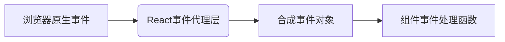
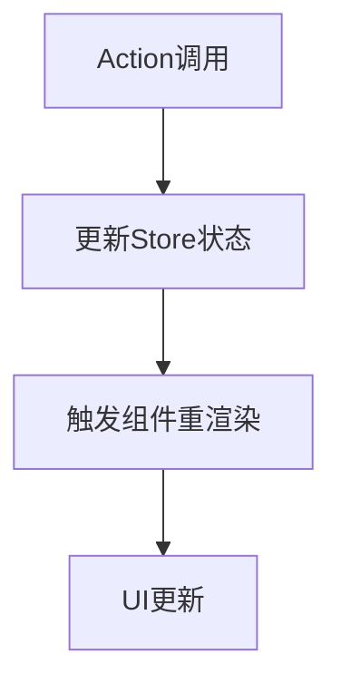

---
sidebar:
title: react基础
date: 2023-09-14
tags:
- react
- react基础
---
# react基础

## 一、什么是 React 合成事件？

| 特性	| 原生 DOM 事件	| React 合成事件 | 
|----------------------|-----------------------------------|-----------------------|
| 事件绑定	| addEventListener	| JSX 属性（如onClick）
| 事件对象	| NativeEvent	| SyntheticEvent
| 事件传播	| 捕获/冒泡阶段	| 仅冒泡阶段（默认）
| 性能优化	| 无自动回收机制	| 事件池复用机制

### 官方定义核心要点：
**合成事件（Synthetic Event）** 是 React 实现的一套跨浏览器事件系统，具有以下特性：

1. **虚拟事件对象**  
   - 不是直接使用浏览器原生 DOM 事件
   - 通过包装（Wrapper）模拟原生事件的所有能力

2. **核心设计目的**  
   - ✅ 统一不同浏览器的兼容性差异
   - ✅ 实现事件池机制（Event Pooling）提升性能
   - ✅ 提供与 React 声明式编程匹配的事件处理方式

### 工作原理图示：


## 什么是“批处理”以及 React 如何使用它来处理多个 state 更新

React 会在事件处理函数执行完成之后处理 state 更新。这被称为批处理。
- 只有在事件处理函数及所有代码执行完成之后，state 更新 -> UI 才会更新

#### 特性
- 渲染会及时生成一张快照
- props、事件处理函数和内部变量都是 根据当前渲染时的 state 被计算出来的


一个 state 变量的值永远不会在一次渲染的内部发生变化， 即使其事件处理函数的代码是异步的。在 那次渲染的 onClick 内部，number 的值即使在调用 setNumber(number + 5) 之后也还是 0。它的值在 React 通过调用你的组件“获取 UI 的快照”时就被“固定”了

## 如何连续多次对同一 state 变量进行更新

使用 *更新函数*

####  更新函数？

> 更新函数必须是 纯函数 并且只 返回 结果
> 
> React 会获取你上一个更新函数的返回值，并将其作为 n 传递给下一个更新函数

例子：setNumber(n => n + 1);

当你将它传递给一个 state 设置函数时：
React 会将此函数加入队列，以便在事件处理函数中的所有其他代码运行后进行处理。

## 渲染过程

当 React 重新渲染一个组件时：

* React 会再次调用你的函数
* 函数会返回新的 JSX 快照
* React 会更新界面以匹配返回的快照

## Hooks 

以 use 开头的函数——只能在组件或自定义 Hook 的最顶层调用。 

- fiber是基于链表的，

## 状态提升

把 state 放到它们的公共父级 - 即为状态提升

## 什么是受控组件和非受控组件

包含“不受控制”状态的组件称为“非受控组件”

## 在组件间共享状态

* 状态向上提升
* 状态管理- redux，zustand...

## 原则

1、永远要将组件定义在最上层并且不要把它们的定义嵌套起来


## Reducers

Reducers 可能需要你写更多的代码，但是这有利于代码的调试和测试

#### action 对象

```js
// "action" 对象：
{
    type: 'deleted',
    id: taskId,
}
```
####  reducer 函数

> reducers 必须是纯粹的. -> 当输入相同时，输出也是相同的
>
> 每个 action 都描述了一个单一的用户交互，即使它会引发数据的多个变化

```JSX
// 接受两个参数，分别为当前 state 和 action 对象，并且返回的是更新后的 state
function yourReducer(state, action) {
  // 给 React 返回更新后的状态
}

```

#### useReducer

```JSX
// useReducer 钩子接受 2 个参数：

// 一个 reducer 函数
// 一个初始的 state

// 返回如下内容：

// 一个有状态的值
// 一个 dispatch 函数（用来 “派发” 用户操作给 reducer）

const [tasks, dispatch] = useReducer(tasksReducer, initialTasks);

```

### 使用 Immer 简化 reducers (选用)


```js
import { useImmerReducer } from 'use-immer';
function tasksReducer(draft, action) {
  switch (action.type) {
    case 'added': {
      draft.push({
        id: action.id,
        text: action.text,
        done: false,
      });
      break;
    }
    case 'changed': {
      const index = draft.findIndex((t) => t.id === action.task.id);
      draft[index] = action.task;
      break;
    }
    case 'deleted': {
      return draft.filter((t) => t.id !== action.id);
    }
    default: {
      throw Error('未知 action：' + action.type);
    }
  }
}

export default function TaskApp() {
    const [tasks, dispatch] = useImmerReducer(tasksReducer, initialTasks);

}
```

## Context 深层传递参数

Context 允许父组件向其下层无论多深的任何组件提供信息，而无需通过 props 显式传递

Context 使组件向其下方的整个树提供信息。
* 传递 Context 的方法:
* 通过 export const MyContext = createContext(defaultValue) 创建并导出 context。
* 在无论层级多深的任何子组件中，把 context 传递给 useContext(MyContext) Hook 来读取它。
* 在父组件中把 children 包在 <MyContext.Provider value={...}> 中来提供 context。
* Context 会穿过中间的任何组件。
* Context 可以让你写出 “较为通用” 的组件。
* 在使用 context 之前，先试试传递 props 或者将 JSX 作为 children 传递。

什么是 “prop 逐级透传”
如何使用 context 代替重复的参数传递
Context 的常见用法
Context 的常见替代方案

Context 的使用场景 
* 主题： 如果你的应用允许用户更改其外观（例如暗夜模式），你可以在应用顶层放一个 context provider，并在需要调整其外观的组件中使用该 context。
* 当前账户： 许多组件可能需要知道当前登录的用户信息。将它放到 context 中可以方便地在树中的任何位置读取它。某些应用还允许你同时操作多个账户（例如，以不同用户的身份发表评论）。在这些情况下，将 UI 的一部分包裹到具有不同账户数据的 provider 中会很方便。
* 路由： 大多数路由解决方案在其内部使用 context 来保存当前路由。这就是每个链接“知道”它是否处于活动状态的方式。如果你创建自己的路由库，你可能也会这么做。
* 状态管理： 随着你的应用的增长，最终在靠近应用顶部的位置可能会有很多 state。许多遥远的下层组件可能想要修改它们。通常 将 reducer 与 context 搭配使用来管理复杂的状态并将其传递给深层的组件来避免过多的麻烦。

```js
// step1 context.js -> 创建context
import { createContext } from 'react';

export const ImageSizeContext = createContext(500);

// step2 app.js -> 引入，提供给子孙组件
import { ImageSizeContext } from './Context.js';
  return (
    <ImageSizeContext.Provider
      value={1000}
    >
    </ImageSizeContext.Provider>
  
//setp3  children.js -> 需要用的地方使用

const imageSize = useContext(ImageSizeContext);

```

## useRef 

组件不会在每次递增时重新渲染。 与 state 一样，React 会在每次重新渲染之间保留 ref。但是，设置 state 会重新渲染组件，更改 ref 不会！

## Effect 

* 默认情况下，Effect 在每次渲染（包括初始渲染）后运行。
* 如果 React 的所有依赖项都与上次渲染时的值相同，则将跳过本次 Effect。
* React 总是在执行下一轮渲染的 Effect 之前清理上一轮渲染的 Effect

```jsx
// useEffect 会把这段代码放到屏幕更新渲染之后执行
useEffect(() => {
  // 这里的代码会在每次渲染后执行
});

useEffect(() => {
  // 这里的代码只会在组件挂载后执行
}, []);

useEffect(() => {
  //这里的代码只会在每次渲染后，并且 a 或 b 的值与上次渲染不一致时执行
}, [a, b]);
}
```
在 React 中，JSX 的渲染必须是纯粹操作，不应该包含任何像修改 DOM 的副作用。

### 指定 Effect 依赖 

指定 [isPlaying] 会告诉 React，如果 isPlaying 在上一次渲染时与当前相同，它应该跳过重新运行 Effect

```jsx
 useEffect(() => {
    if (isPlaying) { // isPlaying 在此处使用……
      // ...
    } else {
      // ...
    }
  }, [isPlaying]); // ……所以它必须在此处声明！
```

### 清理（cleanup） 函数

> 在开发环境中，React 会在初始挂载组件后，立即再挂载一次...选择关闭 严格模式 来关闭开发环境下特有的行为，但我们建议保留它

```jsx
  useEffect(() => {
    const connection = createConnection();
    connection.connect();
    return () => {
      connection.disconnect();
    };
  }, []);

  useEffect(() => {
    function handleScroll(e) {
        console.log(window.scrollX, window.scrollY);
    }
    window.addEventListener('scroll', handleScroll);
    return () => window.removeEventListener('scroll', handleScroll);
 }, []);
```


## useEffect模拟生命周期

https://blog.csdn.net/qq_37212162/article/details/147014936

## #📌 核心对照表
| 类组件生命周期        | `useEffect` 实现方式               | 执行时机                |
|----------------------|-----------------------------------|-----------------------|
| `componentDidMount`  | `useEffect(fn, [])`              | 初次渲染后执行，组件挂载后执行一次          |
| `componentDidUpdate` | `useEffect(fn, [deps])`          | 依赖项变化后执行        |
| `componentWillUnmount`| `useEffect(() => { return fn }, [])` | 组件卸载前执行清理函数      |
| `shouldComponentUpdate`| 无直接对应，用 React.memo 或 useMemo | 通过浅比较 props 避免重渲染      |

### 🛠️ 具体实现

#### 1. 挂载阶段（Mount）
```jsx
useEffect(() => {
  console.log('等同于 componentDidMount');
  // 初始化操作（API请求、事件监听）
  
  return () => {
    console.log('等同于 componentWillUnmount');
    // 清理操作
  };
}, []);
```


#### 2. 更新阶段（Update）

```jsx
// 单个依赖项
useEffect(() => {
  console.log('count变化时触发:', count);
}, [count]);

// 多个依赖项
useEffect(() => {
  console.log('props或state变化时触发');
}, [props.value, state.data]);
```

#### 3. 卸载阶段（Unmount）

```jsx
useEffect(() => {
  const timer = setInterval(() => {}, 1000);
  
  return () => {
    clearInterval(timer); // 清理定时器
  };
}, []);
```

## zustand


### 🌐 核心数据流模型
Zustand 采用**单向数据流**架构，通过 `create` 创建的 store 成为唯一可信数据源：




