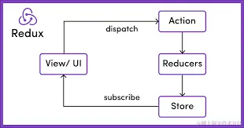

---
sidebar:
title: 状态管理
date: 2023-09-14
tags:
- react
- 状态管理
---
# 状态管理


## Flux

Flux最大特点是数据单向流动

> flux四部分（View Action Dispatcher Store)

* View 视图层
* Action 动作 （视图层发来的消息）
* Dispacher 派发器（用来接收
* Store 数据层（存储应用状态

## Redux



**三大原则(单一、只读、纯函数）**
* 单一数据源（一个Redux应用只有一个Store），也是单向的数据流；
* state只读（state只可整体替换，不可直接修改）；
* 使用纯函数（Reducer）来修改state。

```js
// index.js
import React from 'react';
import ReactDOM from 'react-dom';
import { createStore } from 'redux';
import { Provider, connect } from 'react-redux';

// reducer.js
const initialState = { count: 0 };
const reducer = (state = initialState, action) => {
  switch (action.type) {
    case 'INCREMENT':
      return { count: state.count + 1 };
    default:
      return state;
  }
};

const store = createStore(reducer);

// App.js
const App = ({ count, dispatch }) => (
  <div>
    <p>Count: {count}</p>
    <button onClick={() => dispatch({ type: 'INCREMENT' })}>Increment</button>
  </div>
);

const mapStateToProps = (state) => ({
  count: state.count,
});

const ConnectedApp = connect(mapStateToProps)(App);

ReactDOM.render(
  <Provider store={store}>
    <ConnectedApp />
  </Provider>,
  document.getElementById('root')
);

```

## React-Redux

React-Redux 是一个专为 React 设计的库，旨在简化 Redux 在 React 中的使用。它并没有改变 Redux 的基础原理，如单一状态树、Action 和 Reducer，而是提供了一系列 React 组件和 Hooks，让你能更轻松地在 React 应用中实现状态管理。
通过使用 React-Redux 提供的 Provider 组件和 connect 高阶组件或者新引入的 Hooks（useSelector 和 useDispatch 等），可以避免编写大量样板代码，同时也可以更方便地将 Redux store 的状态和 dispatch 方法传递给 React 组件

源码解析

就是判断每个经过它的action：如果是function类型，就调用这个function（并传入 dispatch 和 getState 及 extraArgument 为参数），而不是任由让它到达 reducer，因为 reducer 是个纯函数，Redux 规定到达 reducer 的 action 必须是一个 plain object 类型。

```js

function createThunkMiddleware(extraArgument) {
  return ({ dispatch, getState }) => next => action => {
    if (typeof action === 'function') {
      return action(dispatch, getState, extraArgument);
    }

    return next(action);
  };
}

const thunk = createThunkMiddleware();
thunk.withExtraArgument = createThunkMiddleware;

export default thunk;

```

1、单一数据源：整个应用的 state 被储存在一棵 object tree 中，并且这个 object tree 只存在于唯一一个 store 中。

2、State 是只读的

3、唯一改变 state 的方法就是触发 action，action 是一个用于描述已发生事件的普通对象。

4、使用纯函数来执行修改：为了描述 action 如何改变 state tree ，你需要编写 reducers。

<br/>

### *connect*

<br/>

connect([mapStateToProps], [mapDispatchToProps], [mergeProps], [options])

1）mapStateToProps

mapStateToProps(state, ownProps) : stateProps

这个函数允许我们将store中的数据作为props绑定到组件上。

第一个参数就是 Redux 的store

```javascript
//demo
const mapStateToProps = (state, ownProps) => {
  // state 是 {userList: [{id: 0, name: '王二'}]}
  return {
    user: _.find(state.userList, {id: ownProps.userId})
  }
}

class MyComp extends Component {
  
  static PropTypes = {
    userId: PropTypes.string.isRequired,
    user: PropTypes.object
  };
  
  render(){
    return <div>用户名：{this.props.user.name}</div>
  }
}

const Comp = connect(mapStateToProps)(MyComp);
```

第二个参数ownProps，是MyComp自己的props。有的时候，ownProps也会对其产生影响。比如，当你在store中维护了一个用户列表，而你的组件MyComp只关心一个用户（通过props中的userId体现）。

```javascript
//当state变化，或者ownProps变化的时候，mapStateToProps都会被调用，计算出一个新的stateProps，（在与ownProps merge 后）更新给MyComp
const mapStateToProps = (state, ownProps) => {
  // state 是 {userList: [{id: 0, name: '王二'}]}
  return {
    user: _.find(state.userList, {id: ownProps.userId})
  }
}

class MyComp extends Component {
  
  static PropTypes = {
    userId: PropTypes.string.isRequired,
    user: PropTypes.object
  };
  
  render(){
    return <div>用户名：{this.props.user.name}</div>
  }
}

const Comp = connect(mapStateToProps)(MyComp);

```

1）mapDispatchToProps

mapDispatchToProps(dispatch, ownProps): dispatchProps

connect 的第二个参数是mapDispatchToProps，它的功能是，将action作为props绑定到MyComp上。

```javascript
const mapDispatchToProps = (dispatch, ownProps) => {
  return {
    increase: (...args) => dispatch(actions.increase(...args)),
    decrease: (...args) => dispatch(actions.decrease(...args))
  }
}

class MyComp extends Component {
  render(){
    const {count, increase, decrease} = this.props;
    return (<div>
      <div>计数：{this.props.count}次</div>
      <button onClick={increase}>增加</button>
      <button onClick={decrease}>减少</button>
    </div>)
  }
}

const Comp = connect(mapStateToProps， mapDispatchToProps)(MyComp);
```

3)mergeProps通常情况下可以不传这个参数

4)options使用不多待了解

## Vuex

