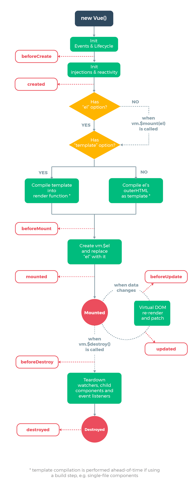

# 简介

vue3笔记，只记录一些关键点或者自己觉得容易忘记的，基础知识不记录。

## 常看常新的图

## 目录

进阶

* [虚拟dom和diff算法 - 双端diff](./diff.md)

## 源码解析

[vue源码分析 -- 基于 2.2.6版本](https://github.com/liutao/vue2.0-source?tab=readme-ov-file)
[vue源码逐行注释分析+40多m的vue源码程序流程图思维导图](https://github.com/ygs-code/vue)
[vue源码分析 -- 基于 2.3.0版本](https://github.com/answershuto/learnVue)
[vue源码分析](https://github.com/ustbhuangyi/vue-analysis)

