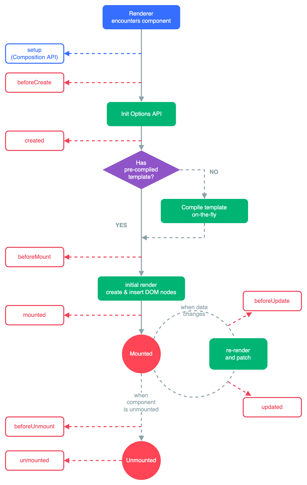

# 简介

vue3笔记，只记录一些关键点或者自己觉得容易忘记的，基础知识不记录。

## 常看常新的图

## 目录

响应式
* [响应式基础](./响应式基础.md)
* [响应式核心](./响应式核心.md)

组件

* [hooks](./hooks.md)
* [自定义指令](./自定义指令.md)
* [插件 plugin](./plugin.md)

逻辑复用

* [模板引用](./模板引用.md)
* [异步组件](./异步组件.md)

内置指令

* v-memo - v-memo="[valueA, valueB]"，仅用于性能至上场景中的微小优化

内置组件

* [Transition - 应用动画](./Transition.md)
* [TransitionGroup - v-for 列表应用动画](./TransitionGroup.md)
* [KeepAlive - 缓存组件实例](./KeepAlive.md)
* [Teleport - 操作模板在dom中位置](./Teleport.md)
* [Suspense - 组件树中协调对异步依赖的处理](./Suspense.md)
  
优化

* 从 created 到 setup
* 从 mixin 到 hooks

进阶

* [complier 原理](./complier.md)
* [虚拟dom和diff算法 - 快速diff-最长递增子序列](./diff.md)
* [web components](./web-components.md)

hooks收集

https://juejin.cn/post/7308277343243141172?searchId=20240122143043CF59962A462004E9FB2F#heading-7

源码解析

[vue3源码逐行解析！-v3.2.26](https://github.com/yixinagqingyuan/vue-next-analysis)

[Mokou的小书房](https://zhongmeizhi.github.io/fed-note/resource-analysis/vue3_reactive.html)

