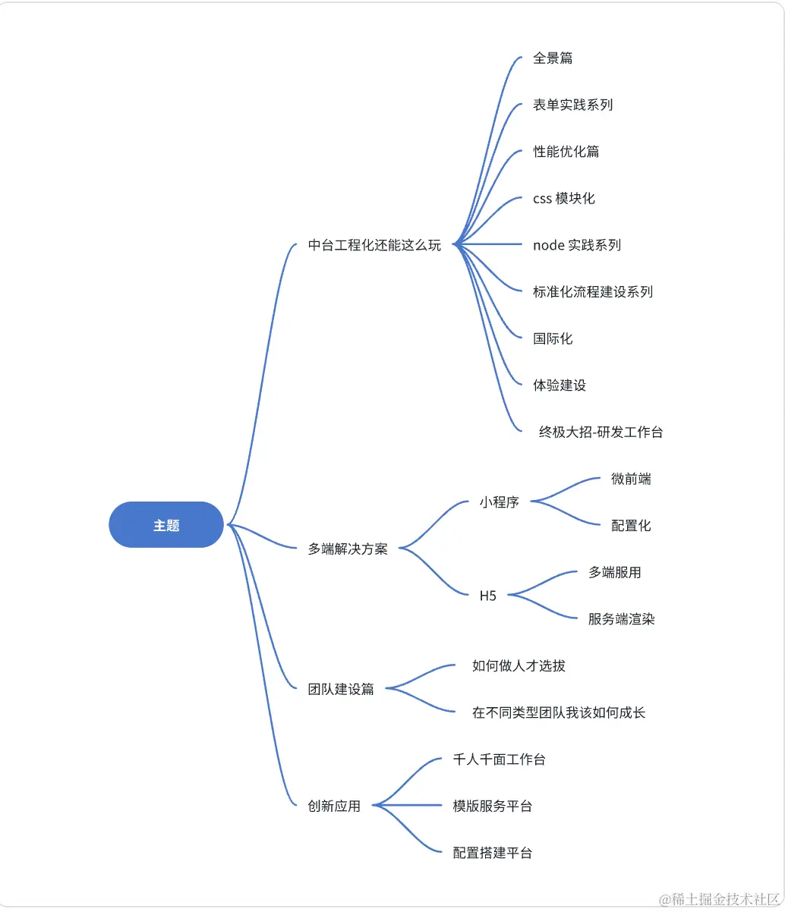

# 简介

记录项目中一些工程化的实现和总结

工程化基石 - AST抽象语法树

https://juejin.cn/post/7155151377013047304

## 目录

* [vite是个啥](./vite.md)
* [前端规范问题](../../note/standard/规范.md)
* [发布流程](./发布流程.md)
* [错误上报](./错误上报.md)
* [webpack详解](./webpack.md)
* [vite.config.js注释](./vite.config.js注释.md)
  
https://juejin.cn/post/7311596602249134106?utm_source=gold_browser_extension

