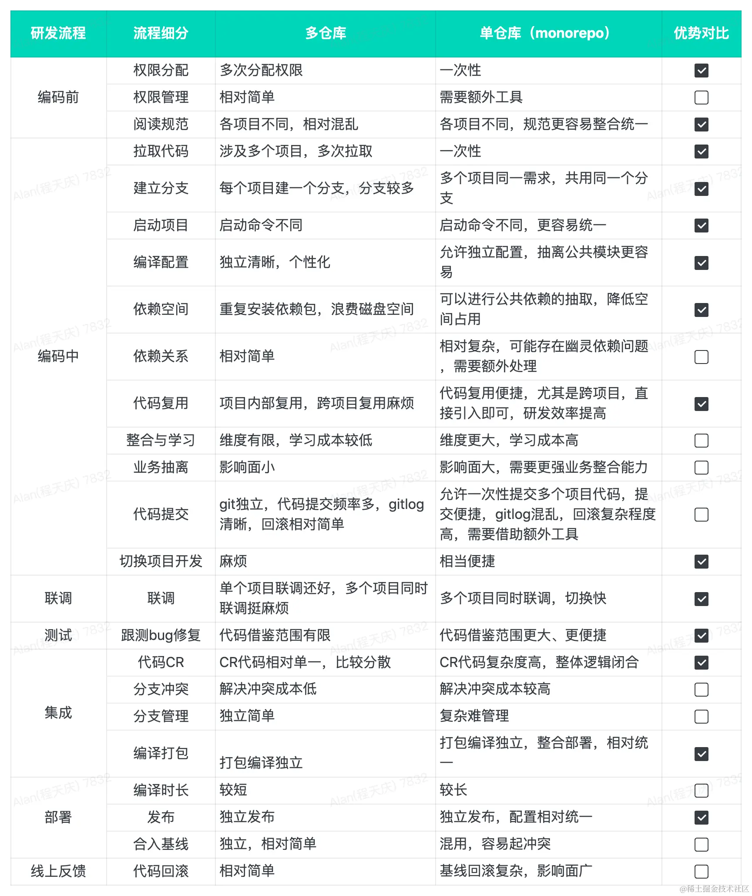
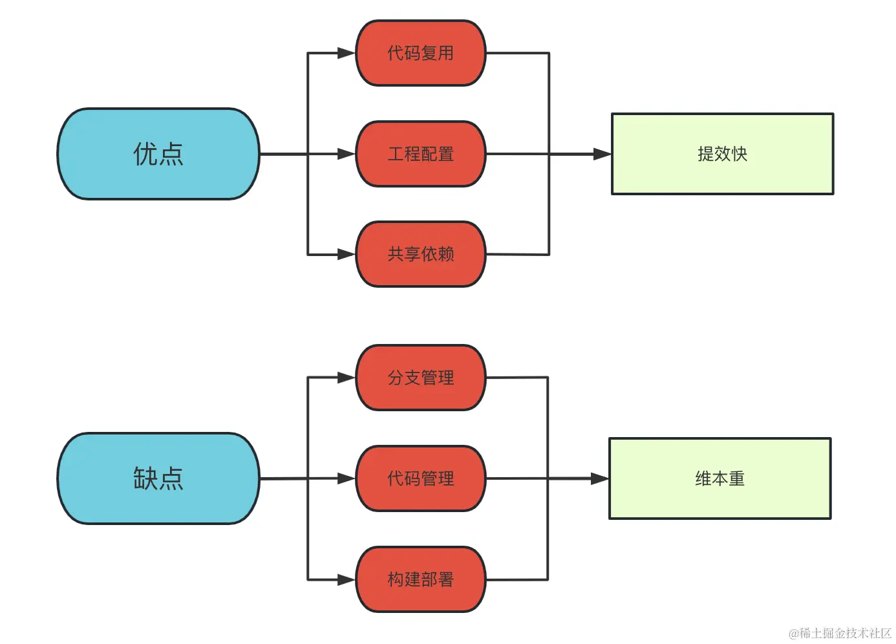

---
sidebar:
title: monorepo项目管理方式
step: 6
isTimeLine: true
date: 2023-09-14
tags:
- CI/CD
categories:
- 工程化
---
# monorepo项目管理方式

## monorepo项目管理方式 --单仓库多模块

痛点： 多个项目运维成本、维护成本、公共代码无法通用

搭建过程： 选型 -> 设计拆分 ->  代码实现 ->  部署

构建效率 ， 依赖优化

每个子项目都可以独立打包、独立部署

提取公共组件、逻辑，更好的工程化，模块化
依赖统一
构建配置统一

* 集中式代码库： 所有项目代码和相关资源都集中存储在一个单一的代码库中，而不是分散在多个独立的代码库中。
* 共享依赖： 不同的项目、模块或组件可以共享依赖库，避免重复的依赖安装和维护，提高代码复用和开发效率。
* 一致的 版本控制 ： 所有代码在同一个版本控制系统中管理，便于跟踪变更、版本控制和回滚。
* 统一的构建和测试： 通过Monorepo可以统一管理构建和测试过程，确保不同模块或组件之间的兼容性和一致性。
* 协作和共享： Monorepo促进了团队成员之间的协作和交流，提高代码共享、知识传递和团队合作能力。

## 单仓vs多仓

monorepo优缺点:

