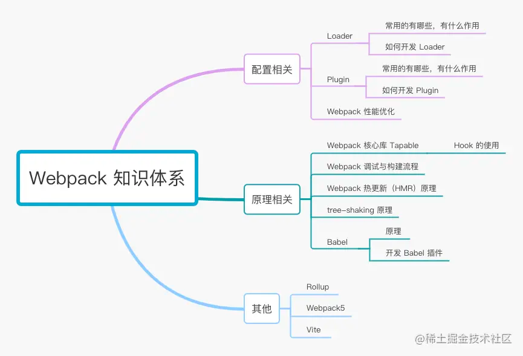
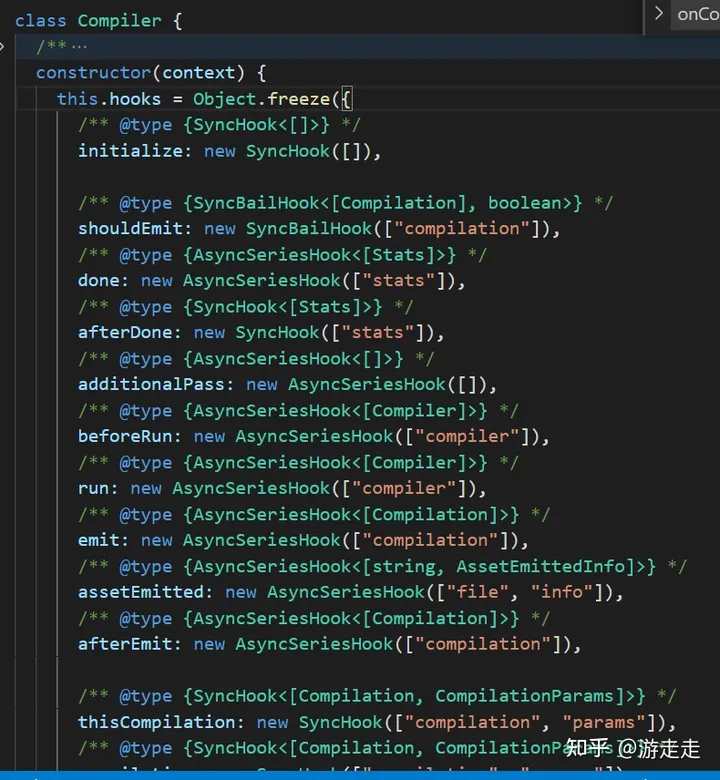
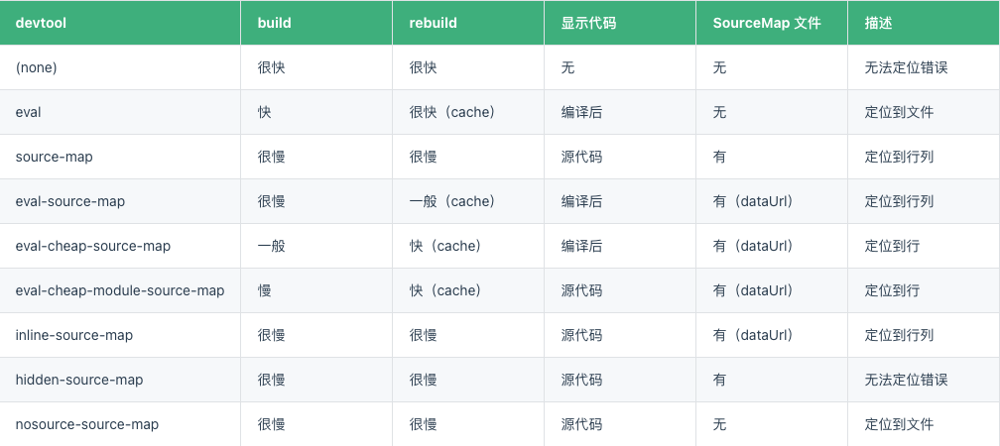
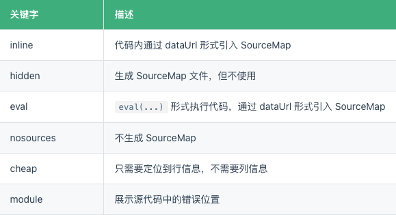
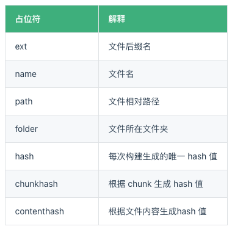

# webpack



**Webpack 慢的原因**
Webpack 启动后会做一堆事情，经历一条很长的编译打包链条，从入口开始需要逐步经历语法解析、依赖收集、代码转译、打包合并、代码优化，最终将高版本的、离散的源码编译打包成低版本、高兼容性的产物代码，中间CPU、IO 操作过多，在 Node 运行时下性能必然是有问题。


## webpack魔法注释

https://blog.itpub.net/69992959/viewspace-2754851/

## webpack一些配置实战

https://blog.csdn.net/array__/article/details/134496709

## 基础

微内核服务架构，就是一个打包工具。

主要有三个作用：

* 模块打包 -》 将不同模块的文件打包整合在一起，保证项目结构的清晰和可读性 
* 编译兼容 -》 可以使用新特性和新语法做开发，提高开发效率
* 能力扩展 -》 通过webpack的Plugin机制，实现模块化打包和编译兼容的基础上，可以进一步实现诸如按需加载，代码压缩等一系列功能，帮助我们进一步提高自动化程度，工程效率以及打包输出的质量


> webpack 默认支持处理 JS 与 JSON 文件，打包其他文件需要借助loader。

**比较重点的配置解析**

mode（模式）

* development 开发模式，打包更加快速，省了代码优化步骤
* production 生产模式，打包比较慢，会开启 tree-shaking 和 压缩代码
* none 不使用任何默认优化选项

**& 不同环境功能侧重点**

**本地环境**：

* 需要更快的构建速度
* 需要打印 debug 信息
* 需要 live reload 或 hot reload 功能
* 需要 sourcemap 方便定位问题
  ...

**生产环境**：

* 需要更小的包体积，代码压缩+tree-shaking
* 需要进行代码分割
* 需要压缩图片体积
* ...


## input

项目入口

## output

打包出口

## 打包原理

* 1、读取webpack的配置参数；
* 2、启动webpack，创建Compiler对象并开始解析项目；
* 3、从入口文件（entry）开始解析，并且找到其导入的依赖模块，递归遍历分析，形成依赖关系树；
* 4、对不同文件类型的依赖模块文件使用对应的Loader进行编译，最终转为Javascript文件；
* 5、整个过程中webpack会通过发布订阅模式，向外抛出一些hooks，而webpack的插件即可通过监听这些关键的事件节点，执行插件任务进而达到干预输出结果的目的。


**webpack主要依赖于compiler和compilation两个核心对象实现。**

compiler对象是一个全局单例，他负责把控整个webpack打包的构建流程。
compilation对象是每一次构建的上下文对象，它包含了当次构建所需要的所有信息，每次热更新和重新构建，compiler都会重新生成一个新的compilation对象，负责此次更新的构建过程。

而每个模块间的依赖关系，则依赖于AST语法树。每个模块文件在通过Loader解析完成之后，会通过acorn库生成模块代码的AST语法树，通过语法树就可以分析这个模块是否还有依赖的模块，进而继续循环执行下一个模块的编译解析。

最终Webpack打包出来的bundle文件是一个IIFE的执行函数。

```js
// webpack 5 打包的bundle文件内容

(() => { // webpackBootstrap
  var __webpack_modules__ = ({
    'file-A-path': ((modules) => {
      // ...
    }),
    'index-file-path': ((__unused_webpack_module, __unused_webpack_exports, __webpack_require__) => {
      // ... 
    })
  })

  // The module cache
  var __webpack_module_cache__ = {};

  // The require function
  function __webpack_require__(moduleId) {
    // Check if module is in cache
    var cachedModule = __webpack_module_cache__[moduleId];
    if (cachedModule !== undefined) {
      return cachedModule.exports;
    }
    // Create a new module (and put it into the cache)
    var module = __webpack_module_cache__[moduleId] = {
      // no module.id needed
      // no module.loaded needed
      exports: {}
    };

    // Execute the module function
    __webpack_modules__[moduleId](module, module.exports, __webpack_require__);

    // Return the exports of the module
    return module.exports;
  }

  // startup
  // Load entry module and return exports
  // This entry module can't be inlined because the eval devtool is used.
  var __webpack_exports__ = __webpack_require__("./src/index.js");
})
```

和webpack4相比，webpack5打包出来的bundle做了相当的精简。在上面的打包demo中，整个立即执行函数里边只有三个变量和一个函数方法，__webpack_modules__存放了编译后的各个文件模块的JS内容，__webpack_module_cache__ 用来做模块缓存，__webpack_require__是Webpack内部实现的一套依赖引入函数。最后一句则是代码运行的起点，从入口文件开始，启动整个项目。

其中值得一提的是__webpack_require__模块引入函数，我们在模块化开发的时候，通常会使用ES Module或者CommonJS规范导出/引入依赖模块，webpack打包编译的时候，会统一替换成自己的__webpack_require__来实现模块的引入和导出，从而实现模块缓存机制，以及抹平不同模块规范之间的一些差异性。

## loader

webpack是个模块打包器。但是webpack只能处理js和json文件。loader的作用就是用来解析对应类型的文件。

> loader 让 webpack 能够去处理其他类型的文件，并将它们转换为有效模块，以供应用程序使用，以及被添加到依赖图中。

loader本质上是一个导出函数的JS模块，函数的入参和出参可以理解为文件流(String或Buffer类)，函数对传入的文件流进行处理，然后返回处理后的新文件流。

loader支持**同步**和**异步**；两种方式，官方推荐异步方式

```js
// 同步方式
module.exports = function (content, map, meta) {
    // content就是传进来的文件内容
    // 对content进行处理
    const newContent = doSomething(content);
    return newContent; // 返回处理后的文件内容
};

// 异步方式
module.exports = function (content, map, meta) {
    const callback = this.async(); // 获取到callback函数
// 对content进行处理
    const newContent = doSomething(content);
// callback的参数有4个，按顺序分别是：
// 1. 错误参数Error或null，必传
// 2. String/Buffer类型的content，必传
// 3. 可选参数sourceMap
// 4. 可选参数meta
    callback(null, newContent, map, meta);
};
```

**使用示例：**

```js
// webpack.config.js配置loader
// 
module: {
    rules: [{
        test: /\.css$/i,
        use: ['style-loader', 'css-loader']
    }]
}
```

rules规则数组用于指定对模块应用哪些loader

* 「test」属性的值是个正则表达式，用于进行文件类型匹配，这里匹配的是以.css或.CSS结尾的文件；
* 「use」属性的值是一个loader数组，指明要对这些css文件执行哪些loader操作。这里多个loader会「**从右到左**」进行「**链式调用**
  」，比如上面的配置中，会先执行css-loader，再执行style-loader。和gulp的task有点类似，但是执行顺序不一样，gulp是从左到右顺序执行；而loader更像是复合函数，从右往左执行。

### 实现自己的loader

**官方推荐的开发准则** --- [loader开发文档](https://www.webpackjs.com/api/loaders/)

1. 保持简单，一个loader只作一件事
2. 利用链式调用
3. 模块化
4. 无状态，每次运行都与之前的运行结果无关
5. 利用loader-utils包
6. 用addDependency标明使用的外部文件
7. 需要解决代码中的模块依赖问题，比如css中的 @import，可以转换成require方式等
8. 提取公共代码
9. 避免绝对路径
10. 使用 peerDependency

针对每个文件类型，loader是支持以数组的形式配置多个的，因此当Webpack在转换该文件类型的时候，会按顺序链式调用每一个loader，前一个loader返回的内容会作为下一个loader的入参。因此loader的开发需要遵循一些规范，比如返回值必须是标准的JS代码字符串，以保证下一个loader能够正常工作，同时在开发上需要严格遵循“单一职责”，只关心loader的输出以及对应的输出。

loader函数中的this上下文由webpack提供，可以通过this对象提供的相关属性，获取当前loader需要的各种信息数据，事实上，这个this指向了一个叫loaderContext的loader-runner特有对象。

```js
// webpack.config.js
module.exports = {
  // ...other config
  module: {
    rules: [
      {
        test: /^your-regExp$/,
        use: [
          {
             loader: 'loader-name-A',
          }, 
          {
             loader: 'loader-name-B',
          }
        ]
      },
    ]
  }
}
```

**实现：**

```js
// my-loader/index.js
module.exports = function (content, map, meta) {
    const callback = this.async();
    console.log('my loader is running');
    callback(null, content, map, meta);
}
```

**使用：**

```js
//webpack.config.js
const path = require("path");

module.exports = {
    entry: "./src/index.js",
    mode: "development",
    output: {
        filename: "main.js",
        path: path.resolve(__dirname, "dist"),
    },
    module: {
        rules: [{
            test: /\.css$/i,
            use: [{
                loader: path.resolve("../my-loader/index.js"),
            },
            ],
        },
        ],
    },
};
```

 ---

## plugin

> plugin (插件)，是一个具有 apply 方法的 JavaScript 对象，webpack基于**发布订阅模式**，在运行的生命周期中会广播出许多事件，插件通过监听这些事件，就可以在特定的阶段执行自己的插件任务，从而实现自己想要的功能

如果说Loader负责文件转换，那么Plugin便是负责功能扩展。Loader和Plugin作为Webpack的两个重要组成部分，承担着两部分不同的职责。

compiler和compilation是Webpack两个非常核心的对象，其中compiler暴露了和 Webpack整个生命周期相关的钩子（[compiler-hooks](https://webpack.js.org/api/compiler-hooks/)），而compilation则暴露了与模块和依赖有关的粒度更小的事件钩子（[Compilation Hooks](https://webpack.js.org/api/compilation-hooks/)）。

Compiler类提供了很多hook函数(钩子函数)：


**核心-Tapable**

```js
// Tapable的简单使用
const { SyncHook } = require("tapable");

class Car {
    constructor() {
        // 在this.hooks中定义所有的钩子事件
        this.hooks = {
            accelerate: new SyncHook(["newSpeed"]),
            brake: new SyncHook(),
            calculateRoutes: new AsyncParallelHook(["source", "target", "routesList"])
        };
    }

    /* ... */
}


const myCar = new Car();
// 通过调用tap方法即可增加一个消费者，订阅对应的钩子事件了
myCar.hooks.brake.tap("WarningLampPlugin", () => warningLamp.on());
```

**plugin工作流程**

* plugin是：「一个具有 apply 方法的 JavaScript 对象」；
* webpack启动后就会创建Compiler实例对象；
* 然后调用plugin.apply(compiler)，把当前Compiler实例对象传给plugin；
* 最后在webpack运行的生命周期里通过hooks.钩子函数名.call来调用钩子函数中的回调函数。
* 无论打包成功或失败，钩子函数afterDone都会在最后被调用

**一个webpack插件包括**：

* 一个JS函数或JS类；
* 定义apply方法；
* 利用钩子函数的tap方法
* 在钩子函数的回调里处理webpack内部实例数据(compilation/stats等)
* 如果是异步的tapAsync/tapPromise，在处理完成后需调用callback回调函数。

### 实现一个自己的plugin

注意点：
* 插件必须是一个函数或者是一个包含 apply 方法的对象，这样才能访问compiler实例；
* 传给每个插件的 compiler 和 compilation 对象都是同一个引用，若在一个插件中修改了它们身上的属性，会影响后面的插件;
* 异步的事件需要在插件处理完任务时调用回调函数通知 Webpack 进入下一个流程，不然会卡住;


```js
class myPlugin {
    constructor(options) {
        console.log('插件被使用了')
        console.log(options)
        this.options = options
    }

    // 这里的compiler是Compiler类的一个实例对象；而Compiler类『扩展(extend)自Tapable类，用来注册和调用插件
    apply(compiler) {
        console.log("我运行了！myPlugin");
        // compiler -》 实例对象
        // --监听：hooks.钩子函数.tap(name, callback)，name是监听的事件名称，一般与plugin同名；callback是个函数，当钩子函数被触发(call)时会调用callback函数

        //初始化 
        compiler.hooks.initialize.tap('myPlugin', () => {
            // --触发：hooks.钩子函数.call([args])
            // 在这里自定义操作，当钩子函数被call时，就会执行
            // 可以通过hooks.initialize.call来查看钩子函数在源码中的运行时机
        });

        // 打包完毕都会运行 afterDone
        compiler.hooks.afterDone.tap('myPlugin', (stats) => {
            const {name} = this.options;
            console.log(name);
            if (name !== '张三') {
                console.log("我不认识你，你走吧！");
            } else if (stats) {
                const subject = stats.hasErrors() ? "[ERROR]webpack打包失败" : "[SUCCESS]webpack打包成功";
                const html = stats.toString() + `<br><div>${"打包时间：" + new Date(stats.startTime).toLocaleString() + "-" + new Date(stats.endTime).toLocaleString()}</div>`;
                console.log('打包完毕了，干点啥呗');
            }
        });
    }
}

module.exports = myPlugin;
```

**如何使用** - webpack.config.js

```js
const MyPlugin = require(path.resolve("../my-plugin")); // 这里用的是本地的相对路径引入
module.exports = {
    // ...省略一万字
    entry: "./src/index.js",
    mode: "development",
    output: {
        filename: "main.js",
        path: path.resolve(__dirname, "dist"),
    },
    plugins: [
        new HtmlWebpackPlugin({
            title: "Webpack~",
        }),
        new MyPlugin({
            name: '张三'
        }) // 使用我们的自定义插件
    ],
}
```

## Babel

Babel 比较重要，单独拿出来。

> 解决 JS 兼容性

* babel-loader 使用 Babel 加载 ES2015+ 代码并将其转换为 ES5
* @babel/core Babel 编译的核心包
* @babel/preset-env Babel 编译的预设，可以理解为 Babel 插件的超集

**基本使用**

根目录增加.babelrc.js

```js
// ./babelrc.js

module.exports = {
  presets: [
    [
      "@babel/preset-env",
      {
        // useBuiltIns: false 默认值，无视浏览器兼容配置，引入所有 polyfill
        // useBuiltIns: entry 根据配置的浏览器兼容，引入浏览器不兼容的 polyfill
        // useBuiltIns: usage 会根据配置的浏览器兼容，以及你代码中用到的 API 来进行 polyfill，实现了按需添加
        useBuiltIns: "entry",
        corejs: "3.9.1", // 是 core-js 版本号
        targets: {
          chrome: "58",
          ie: "11",
        },
      },
    ],
  ],
};
```

## SourceMap 配置选择

> SourceMap 是一种映射关系，当项目运行后，如果出现错误，我们可以利用 SourceMap 反向定位到源码位置

```js
const config = {
    entry: './src/index.js', // 打包入口地址
    output: {
        filename: 'bundle.js', // 输出文件名
        path: path.join(__dirname, 'dist'), // 输出文件目录
    },
    devtool: 'source-map',
    module: {
        // ...
    }
}
  // ...
```


**其他 SourceMap 类型**

* source-map - 生成了对应的 SourceMap 文件，打包速度慢，在源代码中定位到错误所在行列信息
* eval  - 源代码位置通过 @sourceURL 注明， 无法定位到错误位置，只能定位到某个文件，不用生成 SourceMap 文件，打包速度快
* eval-source-map - 生成代码通过 eval 执行，包含 dataUrl 形式的 SourceMap 文件，可以在编译后的代码中定位到错误所在行列信息，生成 dataUrl 形式的 SourceMap，打包速度慢
* cheap-source-map
* eval-cheap-module-source-map - 生成代码通过 eval 执行 ,包含 dataUrl 形式的 SourceMap 文件 ,可以在编译后的代码中定位到错误所在行信息 ,不需要定位列信息，打包速度较快 ,在源代码中定位到错误所在行信息
* inline-source-map - 通过 dataUrl 的形式引入 SourceMap 文件
* cheap-module-source-map
* inline-cheap-source-map
* cheap-module-eval-source-map
* inline-cheap-module-source-map
* hidden-source-map - 看不到 SourceMap 效果，但是生成了 SourceMap 文件
* nosources-source-map - 能看到错误出现的位置，但是没有办法现实对应的源码

**一图流** ：



**校验规则 ^(inline-|hidden-|eval-)?(nosources-)?(cheap-(module-)?)?source-map$**



**推荐配置**

本地开发
eval-cheap-module-source-map

* 本地开发首次打包慢点没关系，因为 eval 缓存的原因，rebuild 会很快
* 开发中，我们每行代码不会写的太长，只需要定位到行就行，所以加上 cheap
* 我们希望能够找到源代码的错误，而不是打包后的，所以需要加上 module

生产环境：(none)


### 三种 hash 值

例如：filename: "[name][hash:8][ext]"

* hash ：任何一个文件改动，整个项目的构建 hash 值都会改变；
* chunkhash：文件的改动只会影响其所在 chunk 的 hash 值；
* contenthash：每个文件都有单独的 hash 值，文件的改动只会影响自身的 hash 值；



## 性能优化

**speed-measure-webpack-plugin - 构建时间分析**

```js
// npm i -D speed-measure-webpack-plugin
// 费时分析
const SpeedMeasurePlugin = require("speed-measure-webpack-plugin");
const smp = new SpeedMeasurePlugin();
...

const config = {...}

module.exports = (env, argv) => {
  // 这里可以通过不同的模式修改 config 配置
  return smp.wrap(config);
}
```

**alias**  - 配置别名

```js
const path = require('path');

// 路径处理方法
function resolve(dir){
  return path.join(__dirname, dir);
}

 const config  = {
//  ...
  resolve:{
    // 配置别名
    alias: {
      '~': resolve('src'),
      '@': resolve('src'),
      'components': resolve('src/components'),
    }
  }
};
```

**extensions**

用户引入模块时不带扩展名,webpack 会按照 extensions 配置的数组从左到右的顺序去尝试解析模块

```js
const config = {
  //...
  resolve: {
    extensions: ['.ts','.js', '.json', '.wasm','...'],
  },
};

```
**modules**
告诉 webpack 解析模块时应该搜索的目录，节省查找时间

```js
const path = require('path');

// 路径处理方法
function resolve(dir){
  return path.join(__dirname, dir);
}

const config = {
  //...
  resolve: {
     modules: [resolve('src'), 'node_modules'],
  },
};
```

**externals**

从输出的 bundle 中排除依赖，节省打包构建的时间

```js
const config = {
  //...
  externals: {
    jquery: 'jQuery',
  },
};
```

**缩小范围**


* **include** - 符合条件的模块进行解析
* **exclude** - 排除符合条件的模块，不解析
* **noParse** - 不需要解析依赖的第三方大型类库等，可以通过这个字段进行配置，以提高构建速度。使用 noParse 进行忽略的模块文件中不会解析 import、require 等语法
* **IgnorePlugin** - 防止在 import 或 require 调用时，生成以下正则表达式匹配的模块：
  * requestRegExp 匹配(test)资源请求路径的正则表达式。
  * contextRegExp 匹配(test)资源上下文（目录）的正则表达式。


```js
const path = require('path');

// 路径处理方法
function resolve(dir){
  return path.join(__dirname, dir);
}

const config = {
  //...
  module: {
    // 不需要解析依赖的第三方大型类库等，可以通过这个字段进行配置，以提高构建速度
    // 使用 noParse 进行忽略的模块文件中不会解析 import、require 等语法
    noParse: /jquery|lodash/,
    rules: [
      {
          /*
          * 在配置 loader 的时候，我们需要更精确的去指定 loader 的作用目录或者需要排除的目录，通过使用 include 和 exclude 两个配置项，可以实现这个功能，常见的例如：
          * include：符合条件的模块进行解析
          * exclude：排除符合条件的模块，不解析
          * exclude 优先级更高
          * */
        test: /\.js$/i,
        include: resolve('src'),
        exclude: /node_modules/,
        use: [
          'babel-loader',
        ]
      },
      // ...
    ]
  },
  plugins:[ // 配置插件
    //将插件中的非中文语音排除掉，节省打包的体积
    new webpack.IgnorePlugin({
      resourceRegExp: /^\.\/locale$/,
      contextRegExp: /moment$/,
    }),
  ]
};

```

### 多进程配置

> 在小型项目中，开启多进程打包反而会增加时间成本，因为启动进程和进程间通信都会有一定开销。

**thread-loader** - 配置在 thread-loader 之后的 loader 都会在一个单独的 worker 池（worker pool）中运行

```js
// npm i -D  thread-loader
const path = require('path');

// 路径处理方法
function resolve(dir){
  return path.join(__dirname, dir);
}

const config = {
  //...
  module: { 
    noParse: /jquery|lodash/,
    rules: [
      {
        test: /\.js$/i,
        include: resolve('src'),
        exclude: /node_modules/,
        use: [
          {
            loader: 'thread-loader', // 开启多进程打包
            options: {
              worker: 3,
            }
          },
          'babel-loader',
        ]
      },
      // ...
    ]
  }
};
```
**happypack ❌**

同样为开启多进程打包的工具，webpack5 已弃用。

## 利用缓存

**babel-loader 开启缓存**

* babel 在转译 js 过程中时间开销比价大，将 babel-loader 的执行结果缓存起来，重新打包的时候，直接读取缓存
* 缓存位置： node_modules/.cache/babel-loader

```js
const config = {
 module: { 
    noParse: /jquery|lodash/,
    rules: [
      {
        test: /\.js$/i,
        include: resolve('src'),
        exclude: /node_modules/,
        use: [
          // ...
          {
            loader: 'babel-loader',
            options: {
              cacheDirectory: true // 启用缓存
            }
          },
        ]
      },
      // ...
    ]
  }
}
```

**cache-loader**

* 缓存一些性能开销比较大的 loader 的处理结果
* 缓存位置：node_modules/.cache/cache-loader

```js
// npm i -D cache-loader
const config = {
 module: { 
    // ...
    rules: [
      {
        test: /\.(s[ac]|c)ss$/i, //匹配所有的 sass/scss/css 文件
        use: [
          // 'style-loader',
          MiniCssExtractPlugin.loader,
          'cache-loader', // 获取前面 loader 转换的结果
          'css-loader',
          'postcss-loader',
          'sass-loader', 
        ]
      }, 
      // ...
    ]
  }
}
```

**cache 持久化缓存** webpack5新增 配置

通过配置 cache 缓存生成的 webpack 模块和 chunk，来改善构建速度。

```js
const config = {
  cache: {
    type: 'filesystem',
  },
};

```

## 优化构建结果

**webpack-bundle-analyzer**  - 构建结果分析

```js
// npm i -D webpack-bundle-analyzer
//
// "scripts": {
//   // ...
//   "analyzer": "cross-env NODE_ENV=prod webpack --progress --mode production"
// },

// 引入插件
const BundleAnalyzerPlugin = require('webpack-bundle-analyzer').BundleAnalyzerPlugin


const config = {
  // ...
  plugins:[ 
    // ...
    // 配置插件 
    new BundleAnalyzerPlugin({
      // analyzerMode: 'disabled',  // 不启动展示打包报告的http服务器
      // generateStatsFile: true, // 是否生成stats.json文件
    })
  ],
};
```


**optimize-css-assets-webpack-plugin**  - 压缩 CSS

```js
// npm install -D optimize-css-assets-webpack-plugin 
// ...
// 压缩css
const OptimizeCssAssetsPlugin = require('optimize-css-assets-webpack-plugin')
// ...

const config = {
  // ...
  optimization: {
    minimize: true,
    minimizer: [
      // 添加 css 压缩配置
      new OptimizeCssAssetsPlugin({}),
    ]
  },
  // ...
}

// ...
```

**terser-webpack-plugin** - 压缩 JS

> 在生成环境下打包默认会开启 js 压缩，但是当我们手动配置 optimization 选项之后，就不再默认对 js 进行压缩，需要我们手动去配置。
> 
> 因为 webpack5 内置了terser-webpack-plugin 插件，所以我们不需重复安装，直接引用就可以了，

```js
const TerserPlugin = require('terser-webpack-plugin');

const config = {
  // ...
  optimization: {
    minimize: true, // 开启最小化
    minimizer: [
      // ...
      new TerserPlugin({})
    ]
  },
  // ...
}

```

**purgecss-webpack-plugin** -  清除无用的 CSS

> purgecss-webpack-plugin 会单独提取 CSS 并清除用不到的 CSS

```js
// npm i -D purgecss-webpack-plugin
// ...
const PurgecssWebpackPlugin = require('purgecss-webpack-plugin')
const glob = require('glob'); // 文件匹配模式
// ...

function resolve(dir){
  return path.join(__dirname, dir);
}

const PATHS = {
  src: resolve('src')
}

const config = {
  plugins:[ // 配置插件
    // ...
    new PurgecssPlugin({
      paths: glob.sync(`${PATHS.src}/**/*`, {nodir: true})
    }),
  ]
}


```

**Tree-shaking** - 剔除没有使用的代码，以降低包的体积

[从过去到现在，聊聊 Tree-shaking](https://mp.weixin.qq.com/s/TNXO2ifPymaTxIqzBAmkSQ)


webpack 默认支持，需要在 .bablerc 里面设置 model：false，即可在生产环境下默认开启

```js
module.exports = {
  presets: [
    [
      "@babel/preset-env",
      {
        module: false,
        useBuiltIns: "entry",
        corejs: "3.9.1",
        targets: {
          chrome: "58",
          ie: "11",
        },
      },
    ],
  ],
  plugins: [    
    ["@babel/plugin-proposal-decorators", { legacy: true }],
    ["@babel/plugin-proposal-class-properties", { loose: true }],
  ]
};

```

**Scope Hoisting** - 作用域提升

> 将多个模块放在同一个作用域下，并重命名防止命名冲突，通过这种方式可以减少函数声明和内存开销。

* webpack 默认支持，在生产环境下默认开启
* 只支持 es6 代码

**优化运行时体验**

> 提升首屏的加载速度 -> 
> 
> 降低首屏加载文件体积，首屏不需要的文件进行预加载或者按需加载


**splitChunks 分包配置**

> optimization.splitChunks 是基于 SplitChunksPlugin 插件实现的

webpack 将根据以下条件自动拆分 chunks：

* 新的 chunk 可以被共享，或者模块来自于 node_modules 文件夹
* 新的 chunk 体积大于 20kb（在进行 min+gz 之前的体积）
* 当按需加载 chunks 时，并行请求的最大数量小于或等于 30
* 当加载初始化页面时，并发请求的最大数量小于或等于 30


```js
module.exports = {
  //...
  optimization: {
    splitChunks: {
      chunks: 'async', // 有效值为`all`，`async` 和 `initial`
      minSize: 20000, // 生成 chunk 的最小体积（≈ 20kb)
      minRemainingSize: 0, // 确保拆分后剩余的最小 chunk 体积超过限制来避免大小为零的模块
      minChunks: 1, // 拆分前必须共享模块的最小 chunks 数。
      maxAsyncRequests: 30, // 最大的按需(异步)加载次数
      maxInitialRequests: 30, // 打包后的入口文件加载时，还能同时加载js文件的数量（包括入口文件）
      enforceSizeThreshold: 50000,
      cacheGroups: { // 配置提取模块的方案
        elementUI: {
          name: 'chunk-elementUI', // split elementUI into a single package
          priority: 20, // the weight needs to be larger than libs and app or it will be packaged into libs or app
          test: /[\\/]node_modules[\\/]_?element-ui(.*)/ // in order to adapt to cnpm
        },
        // echarts: {
        //   name: 'chunk-echarts', // split elementUI into a single package
        //   priority: 20, // the weight needs to be larger than libs and app or it will be packaged into libs or app
        //   test: /[\\/]node_modules[\\/]_?echarts(.*)/ // in order to adapt to cnpm
        // },
        commons: {
          name: 'chunk-components',
          test: resolve('src/components'), // can customize your rules
          minChunks: 3, //  minimum components number
          priority: 5,
          reuseExistingChunk: true
        }
      },
    },
  },
};

```

### 魔法注释

```js
// 预加载  -》 浏览器空闲的时候进行资源的拉取
import(/* webpackPreload: true */ 'ChartingLibrary');
// 路由懒加载 路由分包处理  npm run build  /* webpackChunkName: "homeCom" */ => 魔法注释 分包后进行打包后 包的名字
import(/* webpackChunkName: "loginChunk" */ "@/views/login/index") 
```

1. Webpack 调试
2. Webpack 构建流程
3. 热更新（HRM）原理
4. Webpack 核心库 Tapabel 介绍
5. tree-shaking 原理
6. babel & AST 语法树

## webpack5新特性

webpack5 新增资源模块(asset module)，允许使用资源文件（字体，图标等）而无需配置额外的 loader。


* asset/resource 将资源分割为单独的文件，并导出 url，类似之前的 file-loader 的功能.
* asset/inline 将资源导出为 dataUrl 的形式，类似之前的 url-loader 的小于 limit 参数时功能.
* asset/source 将资源导出为源码（source code）. 类似的 raw-loader 功能.
* asset 会根据文件大小来选择使用哪种类型，当文件小于 8 KB（默认） 的时候会使用 asset/inline，否则会使用 asset/resource


```js
// ./src/index.js

const config = {
  // ...
  module: { 
    rules: [
      // ... 
      {
        test: /\.(jpe?g|png|gif)$/i,
        type: 'asset',
        generator: {
          // 输出文件位置以及文件名
          // [ext] 自带 "." 这个与 url-loader 配置不同
          filename: "[name][hash:8][ext]"
        },
        parser: {
          dataUrlCondition: {
            maxSize: 50 * 1024 //超过50kb不转 base64
          }
        }
      },
      {
        test: /\.(woff2?|eot|ttf|otf)(\?.*)?$/i,
        type: 'asset',
        generator: {
          // 输出文件位置以及文件名
          filename: "[name][hash:8][ext]"
        },
        parser: {
          dataUrlCondition: {
            maxSize: 10 * 1024 // 超过100kb不转 base64
          }
        }
      },
    ]
  },
  // ...
}

module.exports = (env, argv) => {
  console.log('argv.mode=',argv.mode) // 打印 mode(模式) 值
  // 这里可以通过不同的模式修改 config 配置
  return config;
}
```

## 附录

[webpack官网](https://webpack.docschina.org/loaders/)

**1、常用的 loader 以及 作用**

* raw-loader：加载文件原始内容（utf-8）
* file-loader：把文件输出到一个文件夹中，在代码中通过相对 URL 去引用输出的文件 (处理图片和字体)
* url-loader：与 file-loader 类似，区别是用户可以设置一个阈值，大于阈值会交给 file-loader 处理，小于阈值时返回文件 base64 形式编码 (处理图片和字体)
* source-map-loader：加载额外的 Source Map 文件，以方便断点调试
* svg-inline-loader：将压缩后的 SVG 内容注入代码中
* image-loader：加载并且压缩图片文件
* json-loader 加载 JSON 文件（默认包含）
* handlebars-loader: 将 Handlebars 模版编译成函数并返回
* babel-loader：把 ES6 转换成 ES5
* ts-loader: 将 TypeScript 转换成 JavaScript
* awesome-typescript-loader：将 TypeScript 转换成 JavaScript，性能优于 ts-loader
* sass-loader：将SCSS/SASS代码转换成CSS
* css-loader：加载 CSS，支持模块化、压缩、文件导入等特性
* style-loader：把 CSS 代码注入到 JavaScript 中，通过 DOM 操作去加载 CSS
* postcss-loader：扩展 CSS 语法，使用下一代 CSS，可以配合 autoprefixer 插件自动补齐 CSS3 前缀
* eslint-loader：通过 ESLint 检查 JavaScript 代码
* tslint-loader：通过 TSLint检查 TypeScript 代码
* mocha-loader：加载 Mocha 测试用例的代码
* coverjs-loader：计算测试的覆盖率
* vue-loader：加载 Vue.js 单文件组件
* i18n-loader: 国际化
* cache-loader: 可以在一些性能开销较大的 Loader 之前添加，目的是将结果缓存到磁盘里

* cross-env

  环境的区分

* style-loader

  将处理好的 css 通过 style 标签的形式添加到页面上

    ```js
    // 核心逻辑 - 通过动态添加 style 标签的方式，将样式引入页面
    const content = `${样式内容}`
    const style = document.createElement('style');
    style.innerHTML = content;
    document.head.appendChild(style);
    ```
* postcss-loader

  自动添加 CSS3 部分属性的浏览器前缀，解决css兼容性问题。

* less-loader  sass-loader

  less/sass 解析

* 处理图片文件
    * file-loader 解决图片引入问题，并将图片 copy 到指定目录，默认为 dist
    * url-loader 当图片小于 limit 值的时候，会将图片转为 base64 编码，大于 limit 值的时候依然是使用 file-loader 进行拷贝
    * img-loader 压缩图片


**2、常用的 plugin 以及 作用**

* define-plugin：定义环境变量 (Webpack4 之后指定 mode 会自动配置)
* ignore-plugin：忽略部分文件
* html-webpack-plugin：简化 HTML 文件创建 (依赖于 html-loader)
* web-webpack-plugin：可方便地为单页应用输出 HTML，比 html-webpack-plugin 好用
* uglifyjs-webpack-plugin：不支持 ES6 压缩 (Webpack4 以前)
* terser-webpack-plugin: 支持压缩 ES6 (Webpack4)
* webpack-parallel-uglify-plugin: 多进程执行代码压缩，提升构建速度
* mini-css-extract-plugin: 分离样式文件，CSS 提取为独立文件，支持按需加载 (替代extract-text-webpack-plugin)
* serviceworker-webpack-plugin：为网页应用增加离线缓存功能
* clean-webpack-plugin: 目录清理
* ModuleConcatenationPlugin: 开启 Scope Hoisting
* speed-measure-webpack-plugin: 可以看到每个 Loader 和 Plugin 执行耗时 (整个打包耗时、每个 Plugin 和 Loader 耗时)
* webpack-bundle-analyzer: 可视化 Webpack 输出文件的体积 (业务组件、依赖第三方模块)

* html-webpack-plugin

  打包后的资源文件，例如：js 或者 css 文件可以自动引入到 Html 中

* clean-webpack-plugin

  打包前自动清空打包目录

* webpack-dev-server

  本地服务

    ```js
    // 参考配置
    // webpack.config.js
    // contentBase -》 直接到对应的静态目录下面去读取静态文件，而不需对文件做任何移动，节省了时间和性能开销
    const config = {
      // ...
      devServer: {
        contentBase: path.resolve(__dirname, 'public'), // 静态文件目录
        compress: true, //是否启动压缩 gzip
        port: 8080, // 端口号
        // open:true  // 是否自动打开浏览器
      },
     // ...
    }
    ```
* cross-env

  环境的区分

* mini-css-extract-plugin

  **通过 CSS 文件的形式引入到页面上**。tip: style-loader 将样式通过 style 标签的形式添加到页面上

    ```js
    // ...
    // 引入插件
    const MiniCssExtractPlugin = require('mini-css-extract-plugin')
    
    
    const config = {
      // ...
      module: { 
        rules: [
          // ...
          {
            test: /\.(s[ac]|c)ss$/i, //匹配所有的 sass/scss/css 文件
            use: [
              // 'style-loader',
              MiniCssExtractPlugin.loader, // 添加 loader
              'css-loader',
              'postcss-loader',
              'sass-loader', 
            ] 
          },
        ]
      },
      // ...
      plugins:[ // 配置插件
        // ...
        new MiniCssExtractPlugin({ // 添加插件
          filename: '[name].[hash:8].css'
        }),
        // ...
      ]
    }
    
    // ...
    ```


