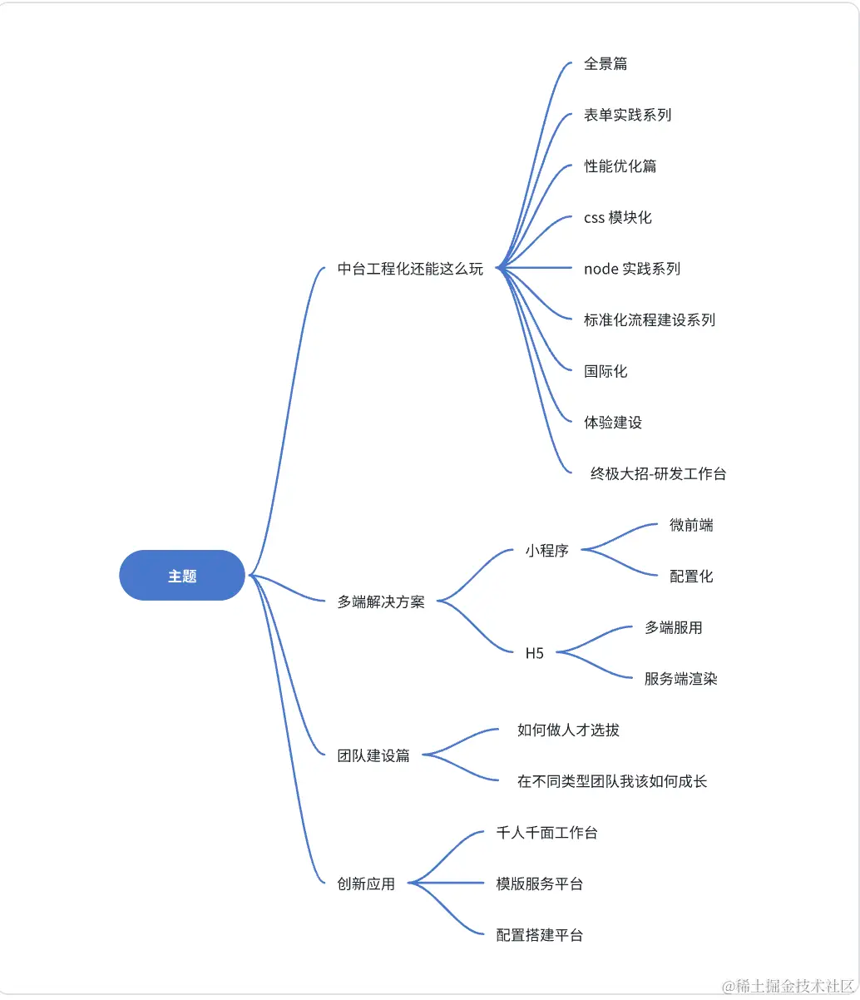

# webpack


## 基础

微内核服务架构，就是一个打包工具。

> webpack 默认支持处理 JS 与 JSON 文件，打包其他文件需要借助loader。

**比较重点的配置解析**

mode（模式）

* development 开发模式，打包更加快速，省了代码优化步骤
* production 生产模式，打包比较慢，会开启 tree-shaking 和 压缩代码
* none 不使用任何默认优化选项

**& 不同环境功能侧重点**

**本地环境**：

* 需要更快的构建速度
* 需要打印 debug 信息
* 需要 live reload 或 hot reload 功能
* 需要 sourcemap 方便定位问题
  ...

**生产环境**：

* 需要更小的包体积，代码压缩+tree-shaking
* 需要进行代码分割
* 需要压缩图片体积
* ...


## input

项目入口

## output

打包出口

## loader

webpack是个模块打包器。但是webpack只能处理js和json文件。loader的作用就是用来解析对应类型的文件。

> loader 让 webpack 能够去处理其他类型的文件，并将它们转换为有效模块，以供应用程序使用，以及被添加到依赖图中。

loader本质上是一个导出函数的JS模块，函数的入参和出参可以理解为文件流(String或Buffer类)，函数对传入的文件流进行处理，然后返回处理后的新文件流。

loader支持**同步**和**异步**；两种方式，官方推荐异步方式

```js
// 同步方式
module.exports = function (content, map, meta) {
    // content就是传进来的文件内容
    // 对content进行处理
    const newContent = doSomething(content);
    return newContent; // 返回处理后的文件内容
};

// 异步方式
module.exports = function (content, map, meta) {
    const callback = this.async(); // 获取到callback函数
// 对content进行处理
    const newContent = doSomething(content);
// callback的参数有4个，按顺序分别是：
// 1. 错误参数Error或null，必传
// 2. String/Buffer类型的content，必传
// 3. 可选参数sourceMap
// 4. 可选参数meta
    callback(null, newContent, map, meta);
};
```

**使用示例：**

```js
// webpack.config.js配置loader
// 
module: {
    rules: [{
        test: /\.css$/i,
        use: ['style-loader', 'css-loader']
    }]
}
```

rules规则数组用于指定对模块应用哪些loader

* 「test」属性的值是个正则表达式，用于进行文件类型匹配，这里匹配的是以.css或.CSS结尾的文件；
* 「use」属性的值是一个loader数组，指明要对这些css文件执行哪些loader操作。这里多个loader会「**从右到左**」进行「**链式调用**
  」，比如上面的配置中，会先执行css-loader，再执行style-loader。和gulp的task有点类似，但是执行顺序不一样，gulp是从左到右顺序执行；而loader更像是复合函数，从右往左执行。

### 实现自己的loader

**官方推荐的开发准则**

1. 保持简单，一个loader只作一件事
2. 利用链式调用
3. 模块化
4. 无状态，每次运行都与之前的运行结果无关
5. 利用loader-utils包
6. 用addDependency标明使用的外部文件
7. 需要解决代码中的模块依赖问题，比如css中的 @import，可以转换成require方式等
8. 提取公共代码
9. 避免绝对路径
10. 使用 peerDependency

**实现：**

```js
// my-loader/index.js
module.exports = function (content, map, meta) {
    const callback = this.async();
    console.log('my loader is running');
    callback(null, content, map, meta);
}
```

**使用：**

```js
//webpack.config.js
const path = require("path");

module.exports = {
    entry: "./src/index.js",
    mode: "development",
    output: {
        filename: "main.js",
        path: path.resolve(__dirname, "dist"),
    },
    module: {
        rules: [{
            test: /\.css$/i,
            use: [{
                loader: path.resolve("../my-loader/index.js"),
            },
            ],
        },
        ],
    },
};
```

 ---

## plugin

> plugin (插件)，是一个具有 apply 方法的 JavaScript 对象

Compiler类提供了很多hook函数(钩子函数)：


**plugin工作流程**

* plugin是：「一个具有 apply 方法的 JavaScript 对象」；
* webpack启动后就会创建Compiler实例对象；
* 然后调用plugin.apply(compiler)，把当前Compiler实例对象传给plugin；
* 最后在webpack运行的生命周期里通过hooks.钩子函数名.call来调用钩子函数中的回调函数。
* 无论打包成功或失败，钩子函数afterDone都会在最后被调用

**一个webpack插件包括**：

* 一个JS函数或JS类；
* 定义apply方法；
* 利用钩子函数的tap方法
* 在钩子函数的回调里处理webpack内部实例数据(compilation/stats等)
* 如果是异步的tapAsync/tapPromise，在处理完成后需调用callback回调函数。

### 实现一个自己的plugin

```js
class myPlugin {
    constructor(options) {
        console.log('插件被使用了')
        console.log(options)
        this.options = options
    }

    // 这里的compiler是Compiler类的一个实例对象；而Compiler类『扩展(extend)自Tapable类，用来注册和调用插件
    apply(compiler) {
        console.log("我运行了！myPlugin");
        // compiler -》 实例对象
        // --监听：hooks.钩子函数.tap(name, callback)，name是监听的事件名称，一般与plugin同名；callback是个函数，当钩子函数被触发(call)时会调用callback函数

        //初始化 
        compiler.hooks.initialize.tap('myPlugin', () => {
            // --触发：hooks.钩子函数.call([args])
            // 在这里自定义操作，当钩子函数被call时，就会执行
            // 可以通过hooks.initialize.call来查看钩子函数在源码中的运行时机
        });

        // 打包完毕都会运行 afterDone
        compiler.hooks.afterDone.tap('myPlugin', (stats) => {
            const {name} = this.options;
            console.log(name);
            if (name !== '张三') {
                console.log("我不认识你，你走吧！");
            } else if (stats) {
                const subject = stats.hasErrors() ? "[ERROR]webpack打包失败" : "[SUCCESS]webpack打包成功";
                const html = stats.toString() + `<br><div>${"打包时间：" + new Date(stats.startTime).toLocaleString() + "-" + new Date(stats.endTime).toLocaleString()}</div>`;
                console.log('打包完毕了，干点啥呗');
            }
        });
    }
}

module.exports = myPlugin;
```

**如何使用** - webpack.config.js

```js
const MyPlugin = require(path.resolve("../my-plugin")); // 这里用的是本地的相对路径引入
module.exports = {
    // ...省略一万字
    entry: "./src/index.js",
    mode: "development",
    output: {
        filename: "main.js",
        path: path.resolve(__dirname, "dist"),
    },
    plugins: [
        new HtmlWebpackPlugin({
            title: "Webpack~",
        }),
        new MyPlugin({
            name: '张三'
        }) // 使用我们的自定义插件
    ],
}
```

## Babel

Babel 比较重要，单独拿出来。

> 解决 JS 兼容性

* babel-loader 使用 Babel 加载 ES2015+ 代码并将其转换为 ES5
* @babel/core Babel 编译的核心包
* @babel/preset-env Babel 编译的预设，可以理解为 Babel 插件的超集

**基本使用**

根目录增加.babelrc.js

```js
// ./babelrc.js

module.exports = {
  presets: [
    [
      "@babel/preset-env",
      {
        // useBuiltIns: false 默认值，无视浏览器兼容配置，引入所有 polyfill
        // useBuiltIns: entry 根据配置的浏览器兼容，引入浏览器不兼容的 polyfill
        // useBuiltIns: usage 会根据配置的浏览器兼容，以及你代码中用到的 API 来进行 polyfill，实现了按需添加
        useBuiltIns: "entry",
        corejs: "3.9.1", // 是 core-js 版本号
        targets: {
          chrome: "58",
          ie: "11",
        },
      },
    ],
  ],
};
```

## SourceMap 配置选择

> SourceMap 是一种映射关系，当项目运行后，如果出现错误，我们可以利用 SourceMap 反向定位到源码位置

```js
const config = {
    entry: './src/index.js', // 打包入口地址
    output: {
        filename: 'bundle.js', // 输出文件名
        path: path.join(__dirname, 'dist'), // 输出文件目录
    },
    devtool: 'source-map',
    module: {
        // ...
    }
}
  // ...
```


**其他 SourceMap 类型**

* source-map - 生成了对应的 SourceMap 文件，打包速度慢，在源代码中定位到错误所在行列信息
* eval  - 源代码位置通过 @sourceURL 注明， 无法定位到错误位置，只能定位到某个文件，不用生成 SourceMap 文件，打包速度快
* eval-source-map - 生成代码通过 eval 执行，包含 dataUrl 形式的 SourceMap 文件，可以在编译后的代码中定位到错误所在行列信息，生成 dataUrl 形式的 SourceMap，打包速度慢
* cheap-source-map
* eval-cheap-module-source-map - 生成代码通过 eval 执行 ,包含 dataUrl 形式的 SourceMap 文件 ,可以在编译后的代码中定位到错误所在行信息 ,不需要定位列信息，打包速度较快 ,在源代码中定位到错误所在行信息
* inline-source-map - 通过 dataUrl 的形式引入 SourceMap 文件
* cheap-module-source-map
* inline-cheap-source-map
* cheap-module-eval-source-map
* inline-cheap-module-source-map
* hidden-source-map - 看不到 SourceMap 效果，但是生成了 SourceMap 文件
* nosources-source-map - 能看到错误出现的位置，但是没有办法现实对应的源码

**一图流** ：


**校验规则 ^(inline-|hidden-|eval-)?(nosources-)?(cheap-(module-)?)?source-map$**


**推荐配置**

本地开发
eval-cheap-module-source-map

* 本地开发首次打包慢点没关系，因为 eval 缓存的原因，rebuild 会很快
* 开发中，我们每行代码不会写的太长，只需要定位到行就行，所以加上 cheap
* 我们希望能够找到源代码的错误，而不是打包后的，所以需要加上 module

生产环境：(none)


### 三种 hash 值

例如：filename: "[name][hash:8][ext]"

* hash ：任何一个文件改动，整个项目的构建 hash 值都会改变；
* chunkhash：文件的改动只会影响其所在 chunk 的 hash 值；
* contenthash：每个文件都有单独的 hash 值，文件的改动只会影响自身的 hash 值；



## 性能优化

**speed-measure-webpack-plugin - 构建时间分析**

```js
// npm i -D speed-measure-webpack-plugin
// 费时分析
const SpeedMeasurePlugin = require("speed-measure-webpack-plugin");
const smp = new SpeedMeasurePlugin();
...

const config = {...}

module.exports = (env, argv) => {
  // 这里可以通过不同的模式修改 config 配置
  return smp.wrap(config);
}
```

**alias**  - 配置别名

```js
const path = require('path');

// 路径处理方法
function resolve(dir){
  return path.join(__dirname, dir);
}

 const config  = {
//  ...
  resolve:{
    // 配置别名
    alias: {
      '~': resolve('src'),
      '@': resolve('src'),
      'components': resolve('src/components'),
    }
  }
};
```

**extensions**

用户引入模块时不带扩展名,webpack 会按照 extensions 配置的数组从左到右的顺序去尝试解析模块

```js
const config = {
  //...
  resolve: {
    extensions: ['.ts','.js', '.json', '.wasm','...'],
  },
};

```
**modules**
告诉 webpack 解析模块时应该搜索的目录，节省查找时间

```js
const path = require('path');

// 路径处理方法
function resolve(dir){
  return path.join(__dirname, dir);
}

const config = {
  //...
  resolve: {
     modules: [resolve('src'), 'node_modules'],
  },
};
```

**externals**

从输出的 bundle 中排除依赖，节省打包构建的时间

```js
const config = {
  //...
  externals: {
    jquery: 'jQuery',
  },
};
```

**缩小范围**


* **include** - 符合条件的模块进行解析
* **exclude** - 排除符合条件的模块，不解析
* **noParse** - 不需要解析依赖的第三方大型类库等，可以通过这个字段进行配置，以提高构建速度。使用 noParse 进行忽略的模块文件中不会解析 import、require 等语法
* **IgnorePlugin** - 防止在 import 或 require 调用时，生成以下正则表达式匹配的模块：
  * requestRegExp 匹配(test)资源请求路径的正则表达式。
  * contextRegExp 匹配(test)资源上下文（目录）的正则表达式。


```js
const path = require('path');

// 路径处理方法
function resolve(dir){
  return path.join(__dirname, dir);
}

const config = {
  //...
  module: {
    // 不需要解析依赖的第三方大型类库等，可以通过这个字段进行配置，以提高构建速度
    // 使用 noParse 进行忽略的模块文件中不会解析 import、require 等语法
    noParse: /jquery|lodash/,
    rules: [
      {
          /*
          * 在配置 loader 的时候，我们需要更精确的去指定 loader 的作用目录或者需要排除的目录，通过使用 include 和 exclude 两个配置项，可以实现这个功能，常见的例如：
          * include：符合条件的模块进行解析
          * exclude：排除符合条件的模块，不解析
          * exclude 优先级更高
          * */
        test: /\.js$/i,
        include: resolve('src'),
        exclude: /node_modules/,
        use: [
          'babel-loader',
        ]
      },
      // ...
    ]
  },
  plugins:[ // 配置插件
    //将插件中的非中文语音排除掉，节省打包的体积
    new webpack.IgnorePlugin({
      resourceRegExp: /^\.\/locale$/,
      contextRegExp: /moment$/,
    }),
  ]
};

```

### 多进程配置

> 在小型项目中，开启多进程打包反而会增加时间成本，因为启动进程和进程间通信都会有一定开销。

**thread-loader** - 配置在 thread-loader 之后的 loader 都会在一个单独的 worker 池（worker pool）中运行

```js
// npm i -D  thread-loader
const path = require('path');

// 路径处理方法
function resolve(dir){
  return path.join(__dirname, dir);
}

const config = {
  //...
  module: { 
    noParse: /jquery|lodash/,
    rules: [
      {
        test: /\.js$/i,
        include: resolve('src'),
        exclude: /node_modules/,
        use: [
          {
            loader: 'thread-loader', // 开启多进程打包
            options: {
              worker: 3,
            }
          },
          'babel-loader',
        ]
      },
      // ...
    ]
  }
};
```
**happypack ❌**

同样为开启多进程打包的工具，webpack5 已弃用。

**利用缓存**


## webpack5新特性

webpack5 新增资源模块(asset module)，允许使用资源文件（字体，图标等）而无需配置额外的 loader。


* asset/resource 将资源分割为单独的文件，并导出 url，类似之前的 file-loader 的功能.
* asset/inline 将资源导出为 dataUrl 的形式，类似之前的 url-loader 的小于 limit 参数时功能.
* asset/source 将资源导出为源码（source code）. 类似的 raw-loader 功能.
* asset 会根据文件大小来选择使用哪种类型，当文件小于 8 KB（默认） 的时候会使用 asset/inline，否则会使用 asset/resource


```js
// ./src/index.js

const config = {
  // ...
  module: { 
    rules: [
      // ... 
      {
        test: /\.(jpe?g|png|gif)$/i,
        type: 'asset',
        generator: {
          // 输出文件位置以及文件名
          // [ext] 自带 "." 这个与 url-loader 配置不同
          filename: "[name][hash:8][ext]"
        },
        parser: {
          dataUrlCondition: {
            maxSize: 50 * 1024 //超过50kb不转 base64
          }
        }
      },
      {
        test: /\.(woff2?|eot|ttf|otf)(\?.*)?$/i,
        type: 'asset',
        generator: {
          // 输出文件位置以及文件名
          filename: "[name][hash:8][ext]"
        },
        parser: {
          dataUrlCondition: {
            maxSize: 10 * 1024 // 超过100kb不转 base64
          }
        }
      },
    ]
  },
  // ...
}

module.exports = (env, argv) => {
  console.log('argv.mode=',argv.mode) // 打印 mode(模式) 值
  // 这里可以通过不同的模式修改 config 配置
  return config;
}
```

## 附录

**1、常用的 loader 以及 作用**

* cross-env

  环境的区分

* style-loader

  将处理好的 css 通过 style 标签的形式添加到页面上

    ```js
    // 核心逻辑 - 通过动态添加 style 标签的方式，将样式引入页面
    const content = `${样式内容}`
    const style = document.createElement('style');
    style.innerHTML = content;
    document.head.appendChild(style);
    ```
* postcss-loader

  自动添加 CSS3 部分属性的浏览器前缀，解决css兼容性问题。

* less-loader  sass-loader

  less/sass 解析

* 处理图片文件
    * file-loader 解决图片引入问题，并将图片 copy 到指定目录，默认为 dist
    * url-loader 当图片小于 limit 值的时候，会将图片转为 base64 编码，大于 limit 值的时候依然是使用 file-loader 进行拷贝
    * img-loader 压缩图片


**2、常用的 plugin 以及 作用**

* html-webpack-plugin

  打包后的资源文件，例如：js 或者 css 文件可以自动引入到 Html 中

* clean-webpack-plugin

  打包前自动清空打包目录

* webpack-dev-server

  本地服务

    ```js
    // 参考配置
    // webpack.config.js
    // contentBase -》 直接到对应的静态目录下面去读取静态文件，而不需对文件做任何移动，节省了时间和性能开销
    const config = {
      // ...
      devServer: {
        contentBase: path.resolve(__dirname, 'public'), // 静态文件目录
        compress: true, //是否启动压缩 gzip
        port: 8080, // 端口号
        // open:true  // 是否自动打开浏览器
      },
     // ...
    }
    ```
* cross-env

  环境的区分

* mini-css-extract-plugin

  **通过 CSS 文件的形式引入到页面上**。tip: style-loader 将样式通过 style 标签的形式添加到页面上

    ```js
    // ...
    // 引入插件
    const MiniCssExtractPlugin = require('mini-css-extract-plugin')
    
    
    const config = {
      // ...
      module: { 
        rules: [
          // ...
          {
            test: /\.(s[ac]|c)ss$/i, //匹配所有的 sass/scss/css 文件
            use: [
              // 'style-loader',
              MiniCssExtractPlugin.loader, // 添加 loader
              'css-loader',
              'postcss-loader',
              'sass-loader', 
            ] 
          },
        ]
      },
      // ...
      plugins:[ // 配置插件
        // ...
        new MiniCssExtractPlugin({ // 添加插件
          filename: '[name].[hash:8].css'
        }),
        // ...
      ]
    }
    
    // ...
    ```


