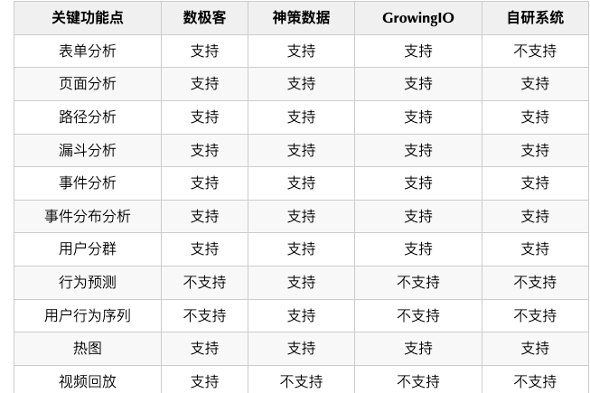

---
sidebar:
title: 前端监控系统
step: 6
isTimeLine: true
date: 2020-09-14
tags:
 - 工程化
 - CI/CD
categories:
 - 工程化
---
# 前端监控系统

## 前端监控系统包括哪些？

对于前端监控来说，大致可以分成三个方向：数据监控、性能监控、异常监控。

**数据监控 / 埋点**


数据监控即通过数据分析用户行为，常见的监控数据包括：PV/UV、页面停留时长、通过什么入口进入、在页面触发了什么行为等。统计这些数据就是为了清楚用户来源，拓宽产品的推广渠道；了解用户在页面停留的时间情况，针对停留较短的页面进行分析改进。也就是我们常说的：who(uuid)、when(time)、from where(referrer)、where(x,y)、what (自定义拓展数据)串成的用户行为路径。

### **性能监控**


性能监控主要是针对前端进行监控，比如不同用户在不同地区使用不同机型下的首屏加载时间、页面的白屏时间、静态资源下载时间等数据。

通过针对这些性能数据进行监控，可以大概反映前端性能的好坏，根据性能监测的结果可以进一步的去优化前端性能。

监测应用程序的性能指标，如页面加载时间、资源加载时间、请求耗时等。通过监控性能，可以识别潜在的性能瓶颈，优化应用程序的加载速度和响应时间。

###  **异常监控 & 错误上报**
前端代码在执行过程中也可能会发生异常，因此需要引入异常监控例如 sentry 等工具及时的上报异常情况，可以避免线上故障的发上。常见的异常包括：Javascript 的异常监控、css 的异常监控等。

**异常监控**


异常监测前端应用程序中的异常情况，如 JavaScript 错误、未捕获的异常、网络错误等。通过监控异常，可以及时定位并解决问题，提高应用程序的稳定性和用户体验。

错误类型：

2.1 语法错误
比如常见的单词拼写错误，中英文符号错误等，然后就是 语法错误是无法被 try-catch 捕获的，但其实如果存在语法错误一般编写代码的软件直接就会爆红，所以语法错误在可发阶段就可以发现，一般不会发布到线上环境。
2.2 同步错误
同步错误指的是在js同步执行过程中的错误，比如变量未定义等，同步错误是可以被 try-catch 给捕获到的。
try { const name = 'zs'; console.log(nam); } catch (error) { console.log('同步错误！') // 会输出！ }

## 为什么要做前端监控系统？

### 不同的角度对于系统的关注点不同

**站在产品的视角，经常会问如下几个问题：**

* 产品有没有用户使用
* 用户用得怎么样
* 系统会不会经常出现异常
* 如何更好地满足用户需求服务用户

**当站在技术视角时，经常会问如下几个问题：**

* 系统出现异常的频率如何
* 异常出现后如何快速进行定位追踪
* 如何分析解决问题


**而当站在老板的视角时，问题可能又会变为：**

* 我的存量用户多少，未来还有多少潜力
* 多少用户在系统内进行了消费


# 参考方案 -todo ：现有监控系统字段整理

```text
(1) 页面进入 (pageIn)

{ 
   title: '政采云', // document title 
   pre: '', // referrer 
   utm-url: 'a.b.c.d.e', // url 中获取的 utm 
   utm-cnt: 'a.b.0.0.e', // 这个页面的 utm a b 值 
   scr: '1400x900', // 分辨率 
   os: 'mac', // 操作系统 
   k: 'webkit', // 浏览器内核 
   b: 'chrome/70', // 浏览器及版本 
   lver: '1.0.0', // js 版本 
   createTime: '', // 当前时间的时间戳（用户本地时间）
   logType: 1 // 页面进入发送数据 
}

(2) 事件触发 (Event)
{ 
  evt: 'click', // 事件类型 
  utm-cnt: 'a.b.c.d.e', // utm 值 
  bdata: '{"test": "12345" }', // 业务数据 
  mx: xx, // 鼠标点击位置 x 
  my: xx, // 鼠标点击位置 y 
  lver: '1.0.0', // js 版本 
  logType: 2 // 数据类型 
}

(3) 页面离开 (pageOut)
{ 
 title: '政采云', // document title 
 pre: '', // referrer 
 utm-url: 'a.b.c.d.e', // url 中获取的 utm 
 utm-cnt: 'a.b.0.0.e', // 这个页面的 utm a b 值 
 lver: '1.0.0', // js 版本 
  createTime: '', // 当前时间的时间戳（用户本地时间）
 logType: 3 // 页面离开发送数据 
}

```

**浏览器加载过程**


```js
const getPerformanceData = () => {
  let performance = {};
  try {
    performance = window.performance.getEntries()[0];
  } catch (e) {}
  const {
    domainLookupEnd = 0,
    domainLookupStart = 0,
    connectStart = 0,
    connectEnd = 0,
    requestStart = 0,
    responseStart = 0,
    // etc...
  } = performance;
  const dns = ~~(domainLookupEnd - domainLookupStart);
  const tcp = ~~(connectEnd - connectStart);
  const ttfb = ~~(responseStart - requestStart);
  // etc...
  return {
    // TODO...
  };
};
```

## 政采云 埋点菜单




* PV/UV 排序或趋势（PV：PageView，页面浏览次数，用户每打开一次记录一次，多次打开同一页面将累计多次；UV：UserView，浏览页面人数；下文中将直接用PV/UV；）
  * 全站的PV/UV单日趋势图：分时段查看访问量的高峰和低谷；
  * PV/UV排序：查看Top页面的PV/UV
  * 按页面、时间区间查询PV/UV
* 漏斗分析：按流程排序每个阶段的人数，计算出转化率；
* 路径分析：查询各个页面的来源和去向；
* 热图分析
  * 点击热图：按钮及链接点击的热图；
  * 滚屏热图（即将上线）：用户页面滚屏触达率；
* 用户画像（即将上线）：针对重点用户的回访次数、浏览路径、用户身份、所在地、操作系统、浏览器等详细信息查询；
* 自定义看板：可选择首页看板的展示项；

### 用户行为相关的四种数据。

* PV：通过计算日志中所有进入页面日志条数的总和我们可以得到 pv
* UV：以唯一 uuid 将 pv 进行过滤后可以得到 uv ；
* 按钮点击数：直接通过统计按钮点击事件上报的日志条数可以得到按钮的点击量；
* 链接点击数：与按钮点击有所不同，按钮点击是通过单独发送的点击事件上报来进行统计，而链接点击往往导致的是一次页面跳转，此处即为从电子卖场首页离开进入了搜索结果页，此时我们所统计的就是搜索结果页的页面进入事件中的 utmUrl（即来源按钮的唯一识别码）值，判断出该次搜索结果页的进入是来源于首页常见搜索关键词的点击，从而统计出该位置的的链接点击量。
* 用户停留时长


