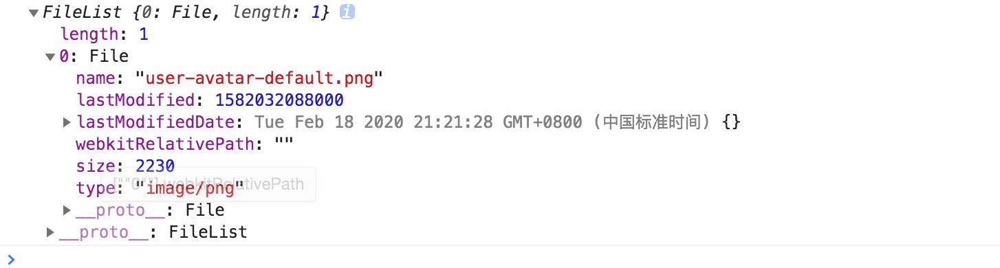
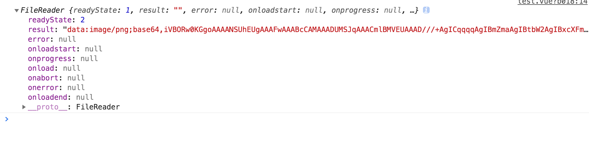
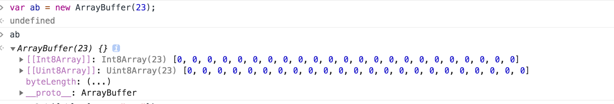

# JS 的二进制家族(base64、File、Blob、ArrayBuffer)

## 一、File对象

**定义： 一个FileList 对象通常来自于一个 HTML input 元素的 files 属性,你可以通过这个对象访问到用户所选择的文件，或者拖拽文件**

> File 对象是特殊类型的 Blob，且可以用在任意的 Blob 类型的 context 中

input type="file" id="upload" @change="choose" 当你选择一张图片时，$("#upload").files 会返回一个对象



## 二、base64

**定义：Base64就是一种基于64个可打印字符来表示二进制数据的方法**



## 三、ArrayBuffer

**定义：ArrayBuffer对象、TypedArray对象、DataView对象是JavaScript操作二进制数据的一个接口**

不能设置MIME类型，是原始的二进制数据缓冲区，无法直接读取或写入，需要通过具体的视图来读取或写入，即TypedArray对象或DataView对象对内存大小进行读取或写入



## 四、Blob：

**定义：Blob 对象表示一个不可变、原始数据的类文件对象**

存储二进制文件容器,可设置MIME类型

> Blob(binary large object)，二进制类文件大对象，是一个可以存储二进制文件的“容器”，HTML5中的Blob对象除了存放二进制数据外还可以设置这个数据的MIME类型【标识邮件和http请求的网络数据格式】。
>
> File接口基于Blob，继承了 blob 的功能并将其扩展使其支持用户系统上的文件。
>
> 通过Blob.slice(start,end)可以分割大Blob为多个小Blob
> 
> xhr.send是可以直接发送Blob对象的

## 五、Buffer

Buffer是Node.js提供的对象，前端没有。 它一般应用于IO操作，例如接收前端请求数据时候，可以通过以下的Buffer的API对接收到的前端数据进行整合

---

## 互相转换

### FileReader

> 读取Blob或者文件对象并转化为其他格式的数据

* FileReader.readAsText(Blob)：将Blob转化为文本字符串
* FileReader.readAsArrayBuffer(Blob)： 将Blob转为ArrayBuffer格式数据
* FileReader.readAsDataURL(): 将Blob转化为Base64格式的Data URL

### 1. file对象转base64

```js
  let reader = new FileReader();
  reader.readAsDataURL(file[0])
  console.log(reader)
```

### 2. blob 转成ArrayBuffer

```js
function dataURItoBlob(dataURI) {
    var byteString = atob(dataURI.split(',')[1]);
    var mimeString = dataURI.split(',')[0].split(':')[1].split(';')[0];
    var ab = new ArrayBuffer(byteString.length);
    var ia = new Uint8Array(ab);
    for (var i = 0; i < byteString.length; i++) {
        ia[i] = byteString.charCodeAt(i);
    }
    return new Blob([ab], {type: mimeString});
}
```

### 3. base64 转 file

```js
let blob = new Blob([1,2,3,4])
let reader = new FileReader();
reader.onload = function(result) {
    console.log(result);
}
reader.readAsArrayBuffer(blob);
```


### 4. base64 转 file

```js
const base64ConvertFile = function (urlData, filename) { // 64转file
    if (typeof urlData != 'string') {
        this.$toast("urlData不是字符串")
        return;
    }
    var arr = urlData.split(',')
    var type = arr[0].match(/:(.*?);/)[1]
    var fileExt = type.split('/')[1]
    var bstr = atob(arr[1])
    var n = bstr.length
    var u8arr = new Uint8Array(n)
    while (n--) {
        u8arr[n] = bstr.charCodeAt(n);
    }
    return new File([u8arr], 'filename.' + fileExt, {
        type: type
    });
}
```

## 总结

* File对象从input选择或者拖拽中产生 files[0]
* File对象继承Blob，是种特殊的blob
* blob 是二进制存储容器
  * window.URL.createObjectURL(blob)可以把一个blob转成blobURL，用作图片显示，文件下载（不能再服务器上存储，只能在浏览器使用）
  * blob.slice 分段上传
  * FileReader 转成文本、ArrayBufffer、DATA url等类型


ArrayBufffer 是原始存储二进制的缓冲区，相当于定义了一块空间


