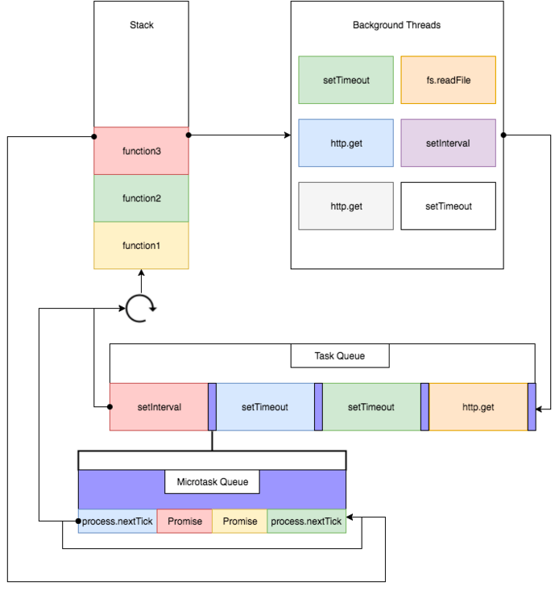
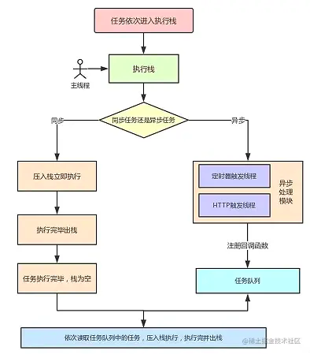

---
sidebar:
group:
title: 事件轮询机制 Event Loop
isTimeLine: true
date: 11-10-2023
---
# 事件轮询机制 Event Loop

## 什么是event loop（事件轮询机制）？

一种事件循环机制。

JS 语言的一大特点就是单线程，因此需要这种机制来处理各种事件的有序执行。

任务分为同步任务和异步任务，异步任务又分为宏任务和微任务，event loop就是描述如何处理这些任务的一种处理机制。

执行 JS 代码的时候其实就是往执行栈中放入函数,当遇到异步的代码时，会被挂起并在需要执行的时候加入到 Task（有多种 Task） 队列中,一旦执行栈为空，Event Loop 就会从 Task 队列中拿出需要执行的代码并放入执行栈中执行，所以本质上来说 JS 中的异步还是同步行为

### 进程与线程

模拟场景
* 有一个工厂
* 工厂里有多个车间,但每次只有一个车间在工作
* 每个车间有若干房间,若干工人在流水线工作

那么
* 工厂 --> CPU
* 多个工厂 --> 多核CPU
* 车间 --> 进程  : 同一个时间只能有一个进程运行
* 工人 --> 线程 : 多个线程可以协同完成一个任务
* 车间(进程)中的房间 --> 内存

本质上讲,两个名词都是 CPU 工作时间片的一个描述
* 进程:运行指令及加载和保存上下文所需要的时间
* 线程:执行一段指令所需时间


在浏览器中
* 一个tab是一个进程
* 一个tab中有多个线程同时执行
* js是单线程运行
* 浏览器页面是多线程:渲染线程,js线程,http请求线程,发起一个请求等价于创建一个线程

单线程优势
* 节省内存
* 节约上下文(运行的环境本身)切换时间
* 没有锁的问题

###  任务类型

> 浏览器和node中有区分，node11之前机制特殊，11版本之后和浏览器保持一致

宏任务 微任务

* 宏任务指的是，在主线程上排队执行的任务，只有前一个任务执行完毕，才能执行下一个任务
* 微任务指的是，不进入主线程、而进入"微任务列表"的任务
* 当前宏任务执行完后，会判断微任务列表中是否有任务。如果有，会把该微任务放到主线程中并执行，如果没有，就继续执行下一个宏任务

### 任务类型划分

**宏任务都有哪些？**


* 1）宏任务（Macrotasks）  

  * script全部代码（注意同步代码也属于宏任务）
  * xhr
  * setTimeout
  * setInterval
  * setImmediate (Node独有)
  * requestAnimationFrame (浏览器独有)
  * I/O
  * UI rendering (浏览器独有)

* 2）微任务（Microtasks）  
  * promise
  * MutationObserver
  * process.nextTick（node）

### 浏览器中的event loop

先借用一张图



> tip：队列是一种先进先出的数据结构
>
> 所有微任务都执行完毕后才会去执行下一个宏任务
>
> 如果在执行微任务中又产生了微任务，那么微任务也会加入到微任务队列中等待执行。
>
> 图中没有ui rendering的节点，它是由浏览器自行判断决定的，只要执行UI rendering，它的节点是在执行完所有的microtask之后，下一个macrotask之前，紧跟着执行UI render。


**事件轮询机制执行过程**

1. 代码执行过程中，宏任务和微任务放在不同的任务队列中
2. 当某个宏任务执行完后,会查看微任务队列是否有任务。如果有，执行微任务队列中的所有微任务(注意这里是执行所有的微任务)
3. 微任务执行完成后，会读取宏任务队列中排在最前的第一个宏任务（注意宏任务是一个个取），执行该宏任务，如果执行过程中，遇到微任务，依次加入微任务队列
4. 宏任务执行完成后，再次读取微任务队列里的任务，依次类推。

**event loop 与 浏览器更新渲染时机**

1） 浏览器更新渲染会在event loop中的 宏任务 和 微任务 完成后进行，即 **宏任务 →  微任务  →  渲染更新** （先宏任务 再微任务，然后再渲染更新）

2）宏任务队列中，如果有大量任务等待执行时，将**dom的变动作为微任务，能更快的将变化呈现给用户**，这样就可以在这一次的事件轮询中更新dom


字多不看系列：




### 经典题目

```js
Promise.resolve()
  .then(function() {
    console.log("promise0");
  })
  .then(function() {
    console.log("promise5");
  });
setTimeout(() => {
  console.log("timer1");
  Promise.resolve().then(function() {
    console.log("promise2");
  });
  Promise.resolve().then(function() {
    console.log("promise4");
  });
}, 0);
setTimeout(() => {
  console.log("timer2");
  Promise.resolve().then(function() {
    console.log("promise3");
  });
}, 0);
Promise.resolve().then(function() {
  console.log("promise1");
});
console.log("start");

// 打印结果： start promise0 promise1 promise5 timer1 promise2 promise4 timer2 promise3

```

**async await**

async await在面试题中还是比较常见的，猛一看比较有迷惑性，把它写成promise就清晰了。

```js
async function foo() {
    // await 前面的代码
    console.log(1);
    await bar();
    console.log(2);
    // await 后面的代码
}
// 等价于
function foo() {
  // await 前面的代码
    console.log(1);
    Promise.resolve(bar()).then(() => {
    // await 后面的代码
      console.log(2);
  });
}
```
常见题：
```js
console.log("script start");
async function async1() {
  await async2(); // await 隐式返回promise
  console.log("async1 end"); // 这里的执行时机：在执行微任务时执行
}
async function async2() {
  console.log("async2 end"); // 这里是同步代码
}
async1();
setTimeout(function() {
  console.log("setTimeout");
}, 0);
new Promise(resolve => {
  console.log("Promise"); // 这里是同步代码
  resolve();
})
  .then(function() {
    console.log("promise1");
  })
  .then(function() {
    console.log("promise2");
  }); 
console.log("script end");

// 打印结果:  script start => async2 end => Promise => script end => async1 end => promise1 => promise2 => setTimeout

```

## node中的Event Loop
Node 与 浏览器中的 Event Loop 完全不同

Node的Event Loop分为**6个阶段**,会按照**顺序**反复执行,每当进入某一个阶段的时候,都会从对应的回调队列中取出函数去执行


## timers
执行 ``setTimeout`` 与 ``setInterval``回调,由poll阶段控制

node中的定时器也是不准确的,只是**尽快执行**

## I/O
处理上一轮中少数未执行的 ``I/O``回调

## idle, prepare
内部实现

## poll
至关重要的阶段，这一阶段中，系统会做两件事情
1. 回到timer阶段执行回调
2. 执行I/O回调

判断是否设置了timer
* 是: 如果poll 队列为空，则会判断是否有 timer 超时，有的话就回到 timer 阶段执行回调
* 否:
  * 如果poll队列**不为空**,遍历回调队列并同步执行,直到队列为空或者达到系统限制
  * 如果**为空**
    * 如果**有**``setImmediate``回调需要执行,poll阶段会停止并进入``check阶段``执行回调
    * 如果**没有**``setImmediate``,会等待回调被加入的队列中并立即执行回调(超时防止一直等待下去)


## check
执行``setImmediate``回调

## close callbacks
执行 close 事件

## 例子
### 某些情况下定时器随机执行
```js
setTimeout(() => {
    console.log('setTimeout')
}, 1)
setImmediate(() => {
    console.log('setImmediate')
})
```
``setTimeout``可能在前,可能在后

**原因**
* ``setTimeout(fn,0)`` 等价于 ``setTimeout(fn,1)`` 源码决定
* 进入event loop 需要成本,如果准备时间超过1ms,timer阶段就会直接执行回调
* 如果准备时间小于1ms就先执行setImmediate

### 定时器执行顺序一定情况
**I/O回调中**
```js
const fs = require('fs')
fs.readFile(__filename, () => {
    setTimeout(() => {
        console.log('timeout');
    }, 0)
    setImmediate(() => {
        console.log('immediate')
    })
})
// timeout
// immediate
```
1. I/O回调在Poll阶段执行
2. 判断timer --> timers为空 --> 判断poll
3. poll为空 --> 有setimmediate --> poll阶段会停止并进入check阶段执行回调

**宏任务↑**

**微任务↓**
``微任务(microtask)``会在每个阶段完成前清空 微任务队列

## process.nextTick
>独立于 Event Loop 之外的，它有一个自己的队列，当每个阶段完成后，如果存在 nextTick 队列，就会清空队列中的所有回调函数，并且优先于其他 microtask 执行。

### 示例
```js
setTimeout(() => {
    console.log('timer1')
}, 0)

Promise.resolve().then(function () {
    console.log('promise1')
})

process.nextTick(() => {
    console.log('nextTick')
    process.nextTick(() => {
        console.log('nextTick')
        process.nextTick(() => {
            console.log('nextTick')
            process.nextTick(() => {
                console.log('nextTick')
            })
        })
    })
})
// nextTick
// nextTick
// nextTick
// nextTick
// promise1
// timer1
```
:::tip 参考
[从setTimeout-setInterval看JS线程](https://palmer.arkstack.cn/2017/12/%E4%BB%8EsetTimeout-setInterval%E7%9C%8BJS%E7%BA%BF%E7%A8%8B/)<br>
[什么是Event Loop](http://www.ruanyifeng.com/blog/2013/10/event_loop.html)<br>
[彻底弄得Event Loop](https://segmentfault.com/a/1190000016278115)
[从event loop规范探究javaScript异步及浏览器更新渲染时机](https://github.com/aooy/blog/issues/5)
:::


### event loop与 vue nextTick

**vue nextTick为什么要优先使用微任务实现？**
1. vue nextTick的源码实现，优先级判断，总结就是Promise > MutationObserver > setImmediate > setTimeout
2. 这里优先使用Promise，因为根据event loop与浏览器更新渲染时机，使用微任务，本次event loop轮询就可以获取到更新的dom
3. 如果使用宏任务，要到下一次event loop中，才能获取到更新的dom

**Node中的process.nextTick**

> process.nextTick 是 Node.js 自身定义实现的一种机制，有自己的 nextTickQueue

**process.nextTick执行顺序早于微任务**

示例:
```js
console.log("start");
setTimeout(() => {
  console.log("timeout");
}, 0);
Promise.resolve().then(() => {
  console.log("promise");
});
process.nextTick(() => {
  console.log("nextTick");
  Promise.resolve().then(() => {
    console.log("promise1");
  });
});
console.log("end");
// 执行结果 start end nextTick  promise promise1 timeout 
```


