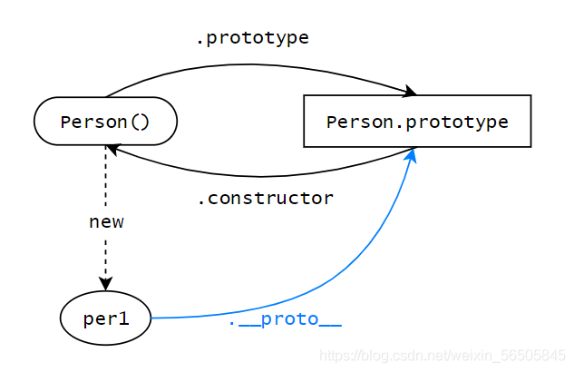
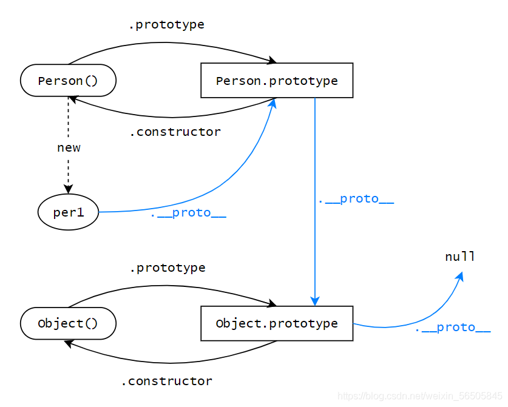
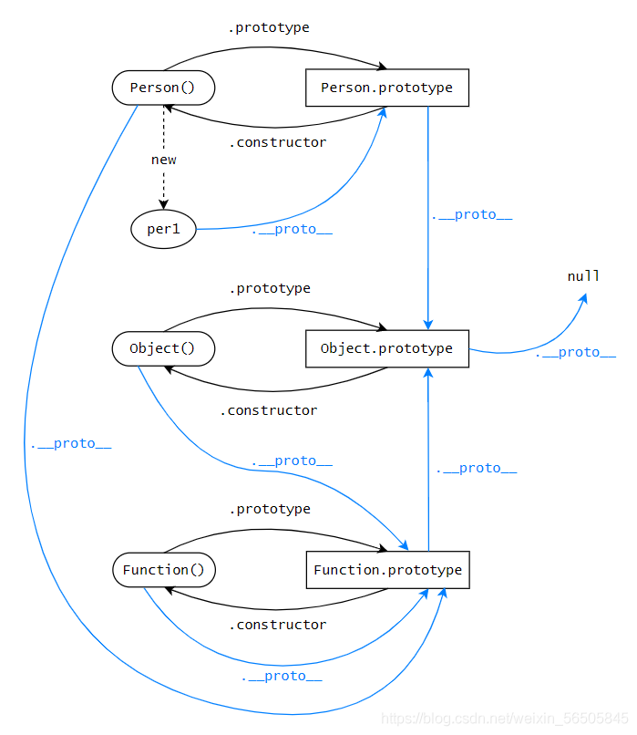

# 原型和原型链

## 原型和原型链





## 原型的作用

原型被定义为给其它对象提供共享属性的对象，函数的实例可以共享原型上的属性和方法

## 原型链

它的作用就是当你在访问一个对象上属性的时候，如果该对象内部不存在这个属性，那么就会去它__proto__属性所指向的对象（原型对象）上查找。如果原型对象依旧不存在这个属性，那么就会去其原型的__proto__属性所指向的原型对象上去查找。以此类推，直到找到nul，而这个查找的线路，也就构成了我们常说的原型链

**原型链和作用域的区别**： 原型链是查找对象上的属性，作用域链是查找当前上下文中的变量 


### proto、prototype、constructor属性介绍

1. js中对象分为两种，普通对象和函数对象
2. __proto__和constructor是对象独有的。prototype属性是函数独有的，它的作用是包含可以给特定类型的所有实例提供共享的属性和方法；但是在 JS 中，函数也是对象，所以函数也拥有__proto__和 constructor属性
3. constructor属性是对象所独有的，它是一个对象指向一个函数，这个函数就是该对象的构造函数
   构造函数.prototype.constructor === 该构造函数本身
4. 一个对象的__proto__指向其构造函数的prototype
   函数创建的对象.__proto__ === 该函数.prototype
5. 特殊的Object、Function
```js
console.log(Function.prototype === Function.__proto__); // true
console.log(Object.__proto__ === Function.prototype); // true
console.log(Function.prototype.__proto__ === Object.prototype); // true
console.log(Object.prototype.__proto__ === null); // true

```

## instanceof


instanceof 的基本用法，它可以判断一个对象的原型链上是否包含该构造函数的原型，经常用来判断对象是否为该构造函数的实例


**特殊示例**

```js
console.log(Object instanceof Object); //true
console.log(Function instanceof Function); //true
console.log(Function instanceof Object); //true
console.log(function() {} instanceof Function); //true

```

**手写instanceof**

```js
function instanceOf(obj, fn) {
  let proto = obj.__proto__;
  if (proto) {
    if (proto === fn.prototype) {
      return true;
    } else {
      return instanceOf(proto, fn);
    }
  } else {
    return false;
  }
}

// 测试
function Dog() {}
let dog = new Dog();
console.log(instanceOf(dog, Dog), instanceOf(dog, Object)); // true true
```

## instanceof与typeof的区别

1. typeof一般被用于来判断一个变量的类型
   typeof可以用来判断number、undefined、symbol、string、function、boolean、object 这七种数据类型，特殊情况：typeof null === 'object'
2. instanceof判断一个对象的原型链上是否包含该构造函数的原型


