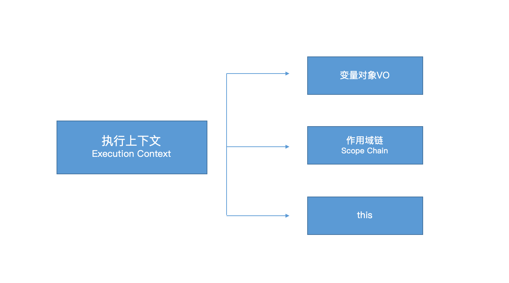
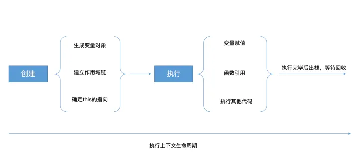
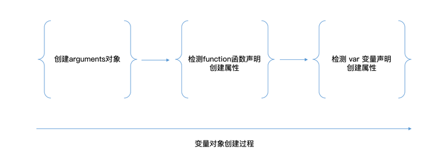
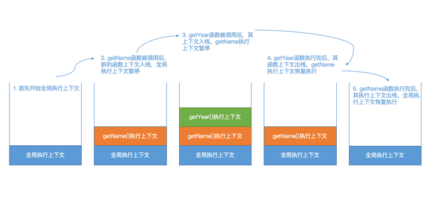

# 执行上下文和执行栈

## 什么是执行上下文？

https://juejin.cn/post/6844903983438381069

> JavaScript 引擎并非一行一行地分析和执行程序，而是一段一段地分析执行。当执行一段代码的时候，会进行一个“准备工作”(执行上下文)
>
> 执行上下文： 指当前执行环境中的变量、函数声明、作用域链、this等信息
> 
> Javascript 代码都是在执行上下文中运行的


三大重要属性 --->  变量对象、作用域链(Scope chain)、this



特点: 也是js语言的特点

1. 单线程，只在主线程上运行；（因此需要异步、eventloop事件机制处理）
2. 同步执行，从上向下按顺序执行；
3. 全局上下文只有一个，也就是window对象；
4. 函数执行上下文没有限制；
5 函数每调用一次就会产生一个新的执行上下文环境。

类型：

1. 全局执行上下文, 只有一个，（浏览器环境下，为全局的 window 对象）
2. 函数执行上下文，有无数个，只有在函数被调用时才会被创建，每次调用函数都会创建一个新的执行上下文，有无数个
3. Eval 函数执行上下文，js的eval函数执行其内部的代码会创建属于自己的执行上下文，很少用而且不建议使用


### 执行上下文生命周期

1）创建阶段
* 生成变量对象
  * 创建arguments
  * 扫描函数声明
  * 扫描变量声明
* 建立作用域链
* 确定this的指向

2）执行阶段

* 变量赋值
* 函数的引用
* 执行其他代码



### 变量对象

> 变量对象是与执行上下文相关的数据作用域，存储了上下文中定义的变量和函数声明

* 全局执行上下文的变量对象
  * 在全局执行上下文中，变量对象就是全局对象。
  * 在顶层js代码中，this指向全局对象，全局变量会作为该对象的属性来被查询。在浏览器中，window就是全局对象
* 函数执行上下文的变量对象
  *  函数上下文中，变量对象VO就是活动对象AO。
    初始化时，带有arguments属性。   
     函数代码分成两个阶段执行
  * 进入执行上下文时，此时变量对象包括
    * 形参
     * 函数声明，会替换已有变量对象
     * 变量声明，不会替换形参和函数
* 函数执行




### 执行上下文栈

> 执行上下文栈的作用是用来**跟踪代码**的，由于JS是单线程的，每次只能做一件事情，其他的事情会放在指定的上下文栈中排队等待执行。
> 
> 使用递归的时候，因为栈可存放的函数是有限制的，一旦存放了过多的函数且没有得到释放的话，就会出现爆栈

#### 说明

* 1）当 JS 引擎第一次遇到js脚本时，会创建一个全局的执行上下文并且压入当前执行栈
* 2）每当JS 引擎遇到一个函数调用，它会为该函数创建一个**新的执行上下文**并放入到栈顶中
* 3）当该函数执行结束时，执行上下文从栈中弹出，控制流程到达当前栈中的下一个上下文
* 4）一旦所有代码执行完毕，JS 引擎从当前栈中移除全局执行上下文

例子：

```js
function getName() {
    const year = getYear();

    const name = 'Lynn';
    console.log(`${name} ${year} years old this year`);
}

function getYear() {
    return 18;
}

getName();

// 1. 首先创建了全局执行上下文，当前全局执行上下文处于活跃状态。
// 2. 全局代码中有2个函数 getName 和 getYear，然后调用 getName 函数，JS引擎停止执行全局执行上下文，创建了新的函数执行上下文，且把该函数上下文放入执行上下文栈顶。
// 3. getName 函数里又调用了 getYear 函数，此时暂停了 getName 的执行上下文，创建了 getYear 函数的新执行上下文，且把该函数执行上下文放入执行上下文栈顶。
// 4. 当 getYear 函数执行完后，其执行上下文从栈顶出栈，回到了 getName 执行上下文中继续执行。
// 5. 当 getName 执行完后，其执行上下文从栈顶出栈，回到了全局执行上下文中。
```




