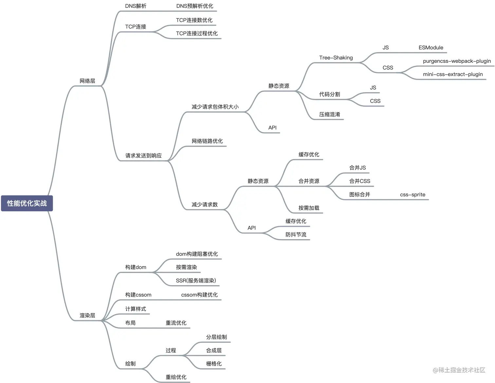
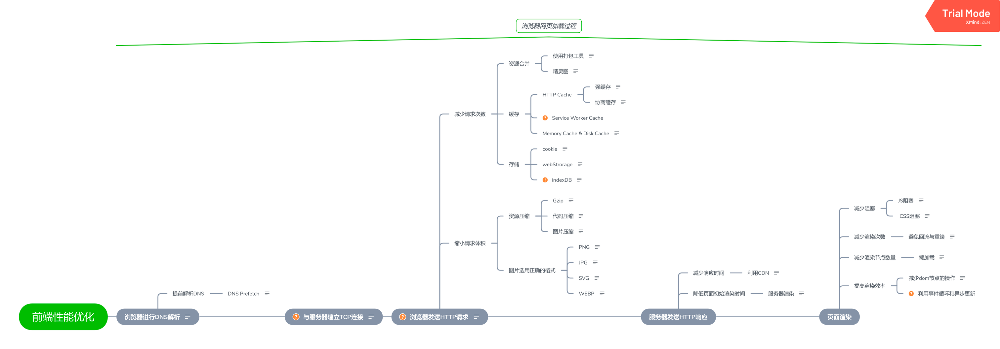

# 性能优化

## 目录

* [性能指标](./性能指标.md)
* [优化手段](./优化手段.md)
* [性能上报方式](./性能上报方式.md)

## 性能优化常见的场景

* 大型虚拟列表 - 虚拟滚动
* 减少大型不可变数据的响应性开销
* 避免不必要的组件抽象 - 组件实例比普通 DOM 节点要昂贵得多

业务拆解 - 微前端拆分

## 性能指标

1. 页面加载速度：指页面从开始加载到完全加载完成所需的时间。页面加载速度越快，用户体验就越好。
2. 资源加载时间：指页面中各个资源文件（如HTML、CSS、JavaScript、图片等）的加载时间。资源加载时间越短，页面响应速度就越快。
3. 渲染速度：指页面元素在浏览器中渲染的速度。渲染速度越快，用户看到的页面内容就越快。
4. 页面大小：指页面文件的大小，包括HTML、CSS、JavaScript、图片等资源文件的大小。页面大小越小，下载和加载速度就越快。
5. 代码质量：指前端代码的质量，包括可读性、可维护性、可扩展性等。代码质量越高，开发效率和代码稳定性就越好。
6. 响应时间：指页面对于用户交互的响应速度。响应时间越快，用户体验就越好。
7. 移动端适配：指前端页面在不同设备（如手机、平板等）上的适配效果。移动端适配越好，用户体验就越好。
8. 安全性：指前端页面的安全性，包括跨站脚本攻击（XSS）、跨站请求伪造（CSRF）等安全问题的防范。安全性越高，用户体验和网站安全性就越好。

## 页面性能指标 - 性能指标定义

### 含义说明

* 页面加载时间：指从页面开始加载到页面完全加载完成所需的时间。
* 白屏时间：指浏览器发起请求到开始显示第一个页面元素的时间。
* 首屏时间：指用户可以看到页面上主要内容所需要的时间。
* 整页时间：指从开始加载到所有元素都被加载完成后，在一定时间内（通常为2秒）仍然没有网络活动的时间。
* DOMContentLoaded时间：指DOM结构完全解析完成的时间。
* Load时间：指页面完成所有资源加载和渲染的时间。

---

## 有哪些工具可以监测和分析前端性能优化指标？

1. Lighthouse：是一个开源的自动化工具，用于帮助改进网络应用的质量。它可以评估页面性能、可访问性、无障碍性、SEO等方面，并提供改进建议。
2. SpeedCurve：可以帮助追踪自己的性能表现，以及竞争对手的性能表现。它提供了一个完整的性能管理平台，包括网页速度分析、性能日志、性能预算等功能。
3. Pingdom：在Pingdom输入URL地址，即可测试页面加载速度，分析并找出性能瓶颈。它还提供了实时监控、报告和警报等功能。
4. PageSpeed Insights：提供免费服务，可以分析网页的内容，提出建议，加快网页的速度。它为您提供了关键指标，如第一个内容绘制，总阻塞时间和更多。
5. WebPageTest：是一个在线的免费性能评测网站，支持IE，Chrome，使用真正的浏览器(IE和Chrome)和真实的消费者连接速度，从全球多个地点运行免费网站速度测试。可以运行简单的测试或执行高级测试，包括多步骤事务、视频捕获、内容阻塞等等。
6. Chrome DevTools：是Chrome浏览器自带的一个开发者工具，可以在浏览器中实时监测和优化网页性能。
7. New Relic：是一个完整的应用性能管理(APM)解决方案，可以监测和分析网页性能和应用程序性能。
8. WebPageTest API：是一个可以编程访问WebPageTest的API，可以在自己的网站或应用程序中使用WebPageTest的功能。

## 方向

性能优化是一个纬度比较大的方向

可以从http、项目本身以及加钱解法（增加服务起配置）几个方面

### http

- dns预解析
- http2.0
- http缓存

### 项目

- 降低http请求数

浏览器允许同时并发请求数目是有限制的（一般4-7个？），因此，后边的资源需要等待前面的资源加载后才能开始加载（阻塞）。

- 精灵图 
- webpack、vite等打包工具合并资源（小图base64）
- 路由懒加载
- 组件懒加载
- 图片懒加载
- cdn分发
- 开启gzip
- 服务端渲染

### 加钱解法

无脑增加服务器配置（带宽...）

