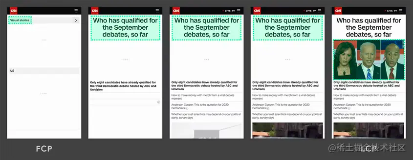
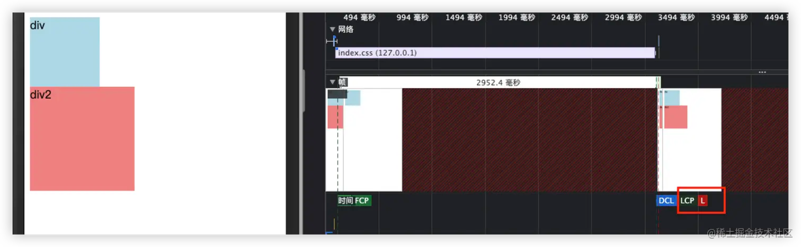

---
sidebar:
group:
title: 性能标准
isTimeLine: true
date: 11-10-2023
---
# 性能标准

## 评测工具

工具
1,performance
2,lighthouse

## 性能标准

官方地址：(https://developer.mozilla.org/en-US/docs/Web/API/Performance)

> performance很多方法 属性都废弃了，performance.toJSON() 返回的属性才是目前支持的

> 三大指标 ：LCP：最大内容绘制、FID：首次输入延迟、CLS：累计位移偏移
> 
> **LCP** 代表了页面的速度指标，虽然还存在其他的一些体现速度的指标，但是上文也说过 LCP 能体现的东西更多一些。一是指标实时更新，数据更精确，二是代表着页面最大元素的渲染时间，通常来说页面中最大元素的快速载入能让用户感觉性能还挺好。
> 
> **FID** 代表了页面的交互体验指标，毕竟没有一个用户希望触发交互以后页面的反馈很迟缓，交互响应的快会让用户觉得网页挺流畅。
> 
> **CLS** 代表了页面的稳定指标，尤其在手机上这个指标更为重要。因为手机屏幕挺小，CLS 值一大的话会让用户觉得页面体验做的很差。


* 性能核心指标主要包括：
  _**白屏时间FP 、 首屏时间FCP、 页面完全加载时间L**_，以及新增的用户体验指标 _**LCP、 FID、 CLS**_ 。

* 辅助性性能指标包括：
  DNS 解析 、请求响应时间、 DOM开始构建时间、 页面可交互时间、 DOM构建完成时间、 网络速度、 各类静态资源耗时、 ajax请求耗时、 LongTask 等等。


--- 

## 渲染相关

### FP （First Paint） - 用来衡量白屏时间

> FP 可以反映页面加载的整体速度。

指页面的首次渲染的时间点。在完成首次渲染之前，用户看到的都是 没有任何内容的白色页面，也就是我们常说的 白屏时间。  

### FCP （First Contentful Paint） - 首个内容绘制时间

> FCP 反映了用户可以看到有意义的内容的时间。

指页面的首个内容绘制时间，即浏览器在页面上绘制出第一块有实际内容的区域（如文本、图像等）的时间点。  

**解释：**

在实际情况中，FP 和 FCP 这两个指标通常是紧挨着的

例子：

这个例子 FP和FCP差了3s

首先html从上往下解析，解析完后css那个link还没下载完，所以会阻塞页面渲染，但是实际这时候页面会先渲染link标签之上的内容，也就是一个空的P标签，背景色是红色，所以这时候就是FP时间

接下来css的加载会阻塞dom渲染，等待3s后才渲染了本文节点，满足了到达FCP的条件（达到FCP的条件之一是要渲染文本）。

```html
<html lang="en">
  <head>
    <meta charset="UTF-8" />
    <meta http-equiv="X-UA-Compatible" content="IE=edge" />
    <meta name="viewport" content="width=device-width, initial-scale=1.0" />
    <title>Document</title>
    <style>
      p {
        width: 100px;
        height: 100px;
        background-color: red;
      }
    </style>
  </head>
  <body>
    <p id="test"></p>
    <div></div>
    <link rel="stylesheet" href="./css/index.css?sleep=3000" />
    <div>123</div>
  </body>
</html>
```


### DCL （DOM Content Loaded）

> DCL 反映了页面的可交互性，表示页面已经准备好响应用户的操作。

指当 HTML 文档被完全加载和解析后，DOM 树构建完成并且所有关联资源（如样式表、脚本等）已经下载完成，触发 DOMContentLoaded 事件的时间点。  


### LCP （Largest Contentful Paint） -  页面主要内容的加载完成时间（牛逼 < 2.5s < 一般  < 4s < 辣鸡）

> 衡量页面加载速度的重要指标- 视口内可见的最大图片或文本块的呈现时间
> 
> 最大内容绘制 (LCP) 指标会根据页面首次开始加载的时间点来报告可视区域内可见的最大图像或者文本块完成渲染的相对时间。


指页面上最大的一个可见元素（如图片、文本等）绘制完成的时间点。  

注意，最大元素随着页面渲染，是会变化的。还是从拿一张图说明，最大的元素一开始是文字，后面又变成了图片。

可视区“内容”最大的可见元素开始出现在屏幕上的时间点。LCP也不是完美的，也很容易出错，它会在用户进行交互后就停止捕获，可能会获取到错误的结果，如果有占据页面很大的轮播图也会产生问题会不断的更新 LCP。



如果在渲染过程中，判断了一个元素是最大元素，然后通过js又删除了这个元素，如果后面没有更大的元素符合条件，那么最大的元素还是被删除的元素。

如果渲染过程中又插入了一个更大的元素，那么LCP也会改变。
```html
// setTimeout的形式 或者在script标签前加link下载css阻塞
<body>
    <div class="div1">div</div>
    <script>
      setTimeout(() => {
        const ele = document.createElement('div')
        ele.className = 'div2'
        ele.innerText = 'div2'
        document.body.appendChild(ele)
      }, 2000)
    </script>
  </body>
```

但是一旦和页面发生交互，那么LCP将不再更新。如下图所示，新增了一个按钮，如果渲染红色方块前点击了按钮，那么LCP将停止更新。


- 哪些元素会影响 LCP 的值？  
  文本相关的元素或节点、图片相关的元素，包括元素、通过url()加载的背景图片等。

- 关于元素的大小：  
  LCP 仅考虑用户看得到的部分。例如，一个元素有部分内容是在视口之外，这些部分不会计入元素的大小。对于图片元素，如果是缩小其原始大小，则以显示时的大小为准；如果是拉伸其尺寸，则以其原始大小为准。
  对于所有元素，不考虑通过 CSS 添加的任何外边距、内边距或边框。

```js
// f12 console输入获取 LCP 值
new PerformanceObserver((entryList) => {
  for (const entry of entryList.getEntries()) {
    console.log('LCP candidate:', entry.startTime, entry);
  }
}).observe({type: 'largest-contentful-paint', buffered: true});

```

```js
// 浏览器访问最初的时间测量点
performance.navigationStart
// navigationStart 至当前的毫秒数
performance.now()
// 各个关键时间点 包括上面的 navigationStart
performance.timing
// 各个资源请求的时间统计信息
performance.getEntries()

// 计算页面白屏时间
performance.getEntriesByType("paint")
// body 标签之前获取当前时间 - performance.timing.navigationStart
// 白屏时间 = 页面开始展示的时间点 - 开始请求的时间点。

// FCP 首屏内容绘制
const fcp_time_by_interactive = performance.timing.interactive - performance.timing.fetchStart
const fcp_time_by_loadEventEnd = = performance.timing.loadEventEnd - performance.timing.navigationStart // 首屏内容渲染结束时间点 - 开始请求的时间点
// 在需要展示的元素页面之前获取当前时间 - performance.timing.navigationStart

// TTI 可交互时间
const tti = domContentLoadedEventEnd - navigationStart

// LCP 最大内容绘制
// 直接使用 PerformanceObserver 来捕获 LCP
const observer = new PerformanceObserver((entryList) => {
  const entries = entryList.getEntries();
  const lastEntry = entries[entries.length - 1];
  const lcp = lastEntry.renderTime || lastEntry.loadTime;
  console.log('LCP:', lcp);
});
observer.observe({ entryTypes: ['largest-contentful-paint'] });
// 或者用库来做
import { getLCP } from 'web-vitals';

// Measure and log the current LCP value,
// any time it's ready to be reported.
getLCP(console.log);

```

---

## 交互的响应度

### FID(First Input Delay) - 首次输入延迟 （牛逼 < 100ms < 一般  < 300ms < 辣鸡）

> 用户首次与网页互动 （如点击） 到浏览器实际开始处理脚本，以响应该互动的时间。 
>
> FID 测量从用户第一次与页面交互（例如当他们单击链接、点按按钮或使用由 JavaScript 驱动的自定义控件）直到浏览器对交互作出响应，并实际能够开始处理事件处理程序所经过的时间。

例子

浏览器解析到script标签，便会停止解析直到js脚本下载并执行完。

这段阻塞期，浏览器会先渲染一遍已经解析好的内容，所以页面会看到一个input框，当js下载完后，主线程一直在执行js（内容是一个耗时很久的for循环）

等待js执行完的那一段时间，就是用户感受的**FID值**。

```html
<body>
    <div class="div1">div div</div>
    <input type="text" />
    <script src="./js/index.js?sleep=2000"></script>
    <div class="div2">div</div>
    <!--  -->
  </body>
```

FID 通常发生在 FCP 和 TTI 之间。Time to Interactive (TTI): 从网页开始加载 到主要子资源已加载 且能够快速可靠地响应用户输入的时间。 我们都知道，JavaScript 引擎是单线程的。如上图所示，在 JavaScript 文件下载完成后，会在主线程开始处理，这会导致主线程处理忙碌状态。假设用户在耗时最长的任务途中忽然开始于网页交互，那么他必须等到该任务处理完成后，浏览器才能响应该次交互。这个时间差是用户必须等待的时间，即 FID。

> 除了事件监听函数，有些 HTML 元素也需要等到主线程任务完成后才能响应用户互动，包括\<input>、\<textarea>、\<select>和\<a>。

> FID 仅仅测量的是 延迟时间，不包括这个事件处理本身需要的时间和事件处理后浏览器更新界面的时间。

```js
// // f12 console输入获取 FID 值
// new PerformanceObserver((entryList) => {
//   for (const entry of entryList.getEntries()) {
//     const delay = entry.processingStart - entry.startTime;
//     console.log('FID candidate:', delay, entry);
//   }
// }).observe({type: 'first-input', buffered: true});

// 基于 PerformanceEventTiming 监听用户任意输入到浏览器响应的延时时间
var observer = new PerformanceObserver((list) => {
  list.getEntries().forEach(entry => {
    // name: entry.name
    // 整体耗时: entry.duration
    // 事件处理函数耗时：entry.processingEnd - entry.processingStart
  })
})
observer.observe({ type: 'event', buffered: true })

```


### TTI(Time to Interactive)

> TTI 指标测量页面从开始加载到主要子资源完成渲染，并能够快速、可靠地响应用户输入所需的时间。

long task > 50ms 

TTI指标测量是能持续/流畅响应用户操作的时间，当页面已经进行首次绘制后（FCP），此时浏览器不一定是能响应用户操作的，比如上面FID举的例子，或者是同构应用，页面能很快渲染，但是在客户端还需要一个激活过程。

TTI的计算方式较为复杂，有以下四点

1. 先进行First Contentful Paint 首次内容绘制 (FCP)。
2. 沿时间轴正向搜索时长至少为 5 秒的安静窗口，其中，安静窗口的定义为：没有长任务且不超过两个正在处理的网络 GET 请求。
3. 沿时间轴反向搜索安静窗口之前的最后一个长任务，如果没有找到长任务，则在 FCP 步骤停止执行。
4. TTI 是安静窗口之前最后一个长任务的结束时间（如果没有找到长任务，则与 FCP 值相同）。

FID测量的是用户首次操作卡顿的时间，TTI测量是FCP后到浏览器能够流畅响应用户输入的时间，判断浏览器是否能够流畅影响用户则是根据上面的几点方式。


**例子**： 

白色方块则是安静窗口，因为满足5s内没有长任务和两个以上的get请求，找到安静窗口后，再往前搜索最后一个长任务，也就是红色虚线处，那么到这个橙色长任务的结束时间就是TTI时间

如果没有长任务，TTI和FCP时间几乎是相同的。

实际有长任务的情况，html还是上面FID举例的那个，在FCP后，会用2s下载一个js文件，并且js文件是一个长任务，可以看到TTI和FCP之间差了大概2s的时间。


### TBT(Total Blocking Time) - FCP到TTI这个区间段，每个长任务段阻塞时间之和

> TBT指标可以理解为是TTI指标的一个补充指标，TTI描述的是页面什么时候可以持续响应交互，TBT则是描述阻塞的严重程度

比如长任务的定义是超过50ms，那么阻塞时间是总执行时间-50ms。也就是说一个长任务总时间是60ms,那么阻塞时间实际上是60-50=10ms。(计算的是阻塞时长 = 实际时长 - 50ms)

### CLS(Cumulative Layout Shift) - 累积布局偏移  （牛逼 < 0.1 < 一般  < 0.25 < 辣鸡）

> CLS指标测量的是页面的视觉稳定性 / 衡量页面的可见内容偏移的程度

假设你打开了一个网页，刚进去有一个确认按钮，点击确认之后，因为页面还没有加载完，突然，多出来一个取消按钮，确认按钮被挤上去了，实际你点击是取消按钮。

出现这种情况的一个最常见原因就是img标签没有固定宽高

只有当现有元素的起始位置发生变更时才算作布局偏移。如果将新元素添加到 DOM 或是现有元素更改大小，则不算作布局偏移，前提是元素的变更不会导致其他可见元素的起始位置发生改变。

* 什么情况下视为发生了布局偏移？

当现有元素更改其起始位置时，才会发生布局偏移， 添加新元素或者现有元素更改尺寸不计入布局偏移中。布局偏移的计算与Layout Instability API 有关，

布局偏移分数 = 影响分数 * 距离分数。影响比例 为变动大小占总视口的百分比，即两个帧变动块的并集。距离分数 为不稳定元素相对于视口的 移动距离 占总视口的百分比。


> 布局偏移肯定是无法避免的，例如用户的交互触发了一些布局和网页内容的变动，但是我们可以通过预先占好空间、显示进度加载组件、添加过渡动画等，帮助用户更好地了解接下来发生了什么。


### L （Load）

> L 反映了整个页面加载的时间。

指页面完全加载完成的时间点。包括所有资源（如图片、样式表、脚本等）都已下载完成，并且相关的 DOM、CSSOM 和 JavaScript 都已经处理完成。  


## 资源优化

该项措施可以帮助我们优化 FP、FCP、LCP 指标。

* 压缩文件、使用 Tree-shaking 删除无用代码
* 服务端配置 Gzip 进一步再压缩文件体积
* 资源按需加载
* 通过 Chrome DevTools 分析首屏不需要使用的 CSS 文件，以此来精简 CSS
* 内联关键的 CSS 代码
* 使用 CDN 加载资源及 dns-prefetch 预解析 DNS 的 IP 地址对资源使用 preconnect，以便预先进行 IP 解析、TCP 握手、TLS 握手
* 缓存文件，对首屏数据做离线缓存
* 图片优化，包括：用 CSS 代替蹄片、裁剪适配屏幕的图片大小、小图使用 base64 或者 PNG 格式、支持 WebP 就尽量使用 WebP、渐进式加载图片
* 

## 网络优化

该项措施可以帮助我们优化 FP、FCP、LCP 指标。
这块内容大多可以让后端或者运维帮你去配置，升级至最新的网络协议通常能让你网站加载的更快。
比如说使用 HTTP2.0 协议、TLS 1.3 协议或者直接拥抱 QUIC 协议~

## 优化耗时任务

该项措施可以帮助我们优化 TTI、FID、TBT 指标。

* 使用 Web Worker 将耗时任务丢到子线程中，这样能让主线程在不卡顿的情况下处理 JS 任务
* 调度任务 + 时间切片，这块技术在 React 16 中有使用到。简单来说就是给不同的任务分配优先级，然后将一段长任务切片，这样能尽量保证任务只在浏览器的空闲时间中执行而不卡顿主线程

## 不要动态插入内容
该项措施可以帮助我们优化 CLS 指标。

* 使用骨架屏给用户一个预期的内容框架，突兀的显示内容体验不会很好
* 图片切勿不设置长宽，而是使用占位图给用户一个图片位置的预期
* 不要在现有的内容中间插入内容，起码给出一个预留位置

## 动画流畅性

监听页面上任意动画的帧率帧数是否稳定

在动画运行期间监听每次requestAnimationFrame的执行，计算：

1. 帧率 动画运行帧数/动画运行时间
2. 掉帧率 (60FPS标准应该运行的帧数 - 实际运行帧数)/60FPS标准应该运行的帧

```js
// 以 60 帧每秒，每一帧之间的间隔
const msInOneFrame = 1000/60
const expectedFrames = Math.floor(e.elapsedTime*1000/msInOneFrame)
const error_rate = (expectedFrames-运行帧数)/expectedFrames

```


