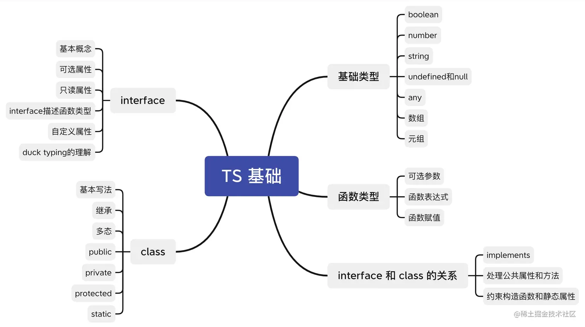

# 简介

## 什么是ts

背景： js是一门动态类型语言，只有运行的时候才能确定类型，灵活的同时意味着受到的约束更少，容易产生难追溯的bug。

概念： ts是js的超集，在代码编译阶段就确定类型，类型系统增强了代码的可读性和可维护性。

背景 + 解决的问题 + 使用 + ？在项目中的应用

## TS 编程的好处

1. 静态类型检查：TS引入了静态类型检查，可以在编译时捕获潜在的类型错误，从而减少运行时错误。通过类型检查，可以提高代码的可靠性和可维护性，并减少调试时间
2. 更好的可读性和可维护性：TS通过类型注解使代码更加清晰易读，提供了更好的文档化和自我描述性。类型注解可以作为代码的文档，帮助开发人员理解和使用代码，尤其在大型项目中尤为重要。
3. IDE支持：TS有很好的集成开发环境（IDE）支持，例如Visual Studio Code等。IDE可以根据类型信息提供代码自动补全、导航和重构等功能，极大地提高开发效率。
4. 提高团队协作：TS的类型系统可以明确定义接口、参数和返回值的类型约束，从而减少了团队成员之间的沟通成本，使得团队协作更加高效和准确。
5. 渐进增强：TS是JavaScript的超集，这意味着可以将现有的JavaScript代码逐步迁移到TS中，而不需要一次性重写整个代码库。可以选择性地为现有代码添加类型注解，逐渐引入TS的好处，同时保留对现有代码的兼容性。
6. 强大的生态系统和社区支持：TS拥有庞大的生态系统和活跃的社区支持，许多流行的JavaScript库和框架都提供了TS类型定义。这意味着可以在TS中无缝地使用这些库，并获得类型安全和更好的开发体验。此外，社区提供了大量的教程、文档和工具，方便开发者学习和解决问题。

