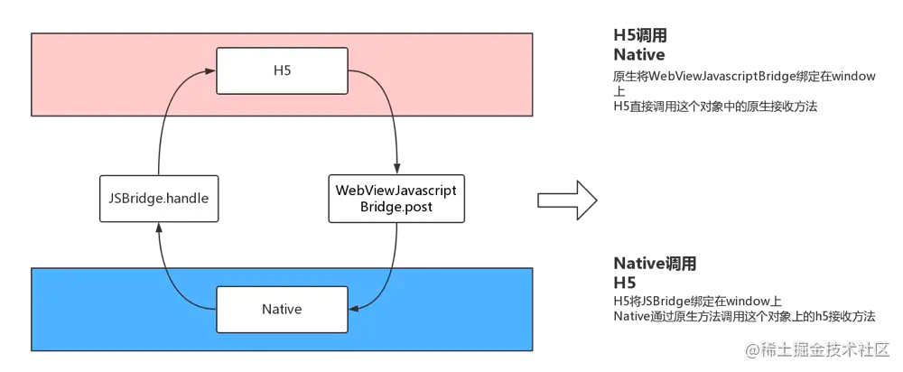

# JSBridge

## JSBridge

跨端通信

应用场景：
* 微信小程序
* 混合开发（Hybrid）应用
* React-Native
* ...

## JSBridge作用?

通过JSBridge可以实现 **H5 和 原生之间的双向通信** ，主要是给 H5 提供调用 原生（Native）功能的接口，让混合开发中的 H5 可以方便地使用地址位置、摄像头甚至支付等原生功能



## JSBridge 的通信原理?

主要有两种：

* 注入 API
* 拦截 URL SCHEME

**注入API**
注入 API 方式是最常用的方式，主要原理是通过 WebView 提供的接口，向 JavaScript 的 Context（window）中注入对象或者方法，让 JavaScript 调用时，直接执行相应的 Native 代码逻辑，达到 JavaScript 调用 Native 的目的。

代码示例：

1）初始化 WebViewJavascriptBridge
```js
// 根据navigator.userAgent来判断当前是 Android 还是 ios
const u = navigator.userAgent;
// Android终端
const isAndroid = u.indexOf("Android") > -1 || u.indexOf("Adr") > -1;
// IOS 终端
const isIOS = !!u.match(/\(i[^;]+;( U;)? CPU.+Mac OS X/);

/**
 * 配合 IOS 使用时的初始化方法
 */
const iosFunction = callback => {
  if (window.WebViewJavascriptBridge) {
    return callback(window.WebViewJavascriptBridge);
  }
  if (window.WVJBCallbacks) {
    return window.WVJBCallbacks.push(callback);
  }
  window.WVJBCallbacks = [callback];
  var WVJBIframe = document.createElement("iframe");
  WVJBIframe.style.display = "none";
  WVJBIframe.src = "demo://__BRIDGE_LOADED__";
  document.documentElement.appendChild(WVJBIframe);
  setTimeout(function() {
    document.documentElement.removeChild(WVJBIframe);
  }, 0);
};

/**
 * 配合 Android 使用时的初始化方法
 */
const androidFunction = callback => {
  if (window.WebViewJavascriptBridge) {
    callback(window.WebViewJavascriptBridge);
  } else {
    document.addEventListener(
      "WebViewJavascriptBridgeReady",
      function() {
        callback(window.WebViewJavascriptBridge);
      },
      false
    );
  }
};

window.setupWebViewJavascriptBridge = isAndroid ? androidFunction : iosFunction;

isAndroid &&
  window.setupWebViewJavascriptBridge(function(bridge) {
    // 注册 H5 界面的默认接收函数
    bridge.init(function(msg, responseCallback) {
      responseCallback("JS 返回给原生的消息内容");
    });
  });


```

2）注册与原生交互的事件函数

```js
// bridge.registerHandler('事件函数名',fun 执行函数);
window.setupWebViewJavascriptBridge(bridge => {
  // data：原生传过来的数据; 
  // callback: 原生传过来的回调函数
  bridge.registerHandler("H5Function", (data, callback) => {
    callback && callback();
  });
});


```
3）调用原生注册的事件函数

```js
// bridge.callHandler('安卓端函数名', "传给原生端的数据", callback 回调函数);
window.setupWebViewJavascriptBridge(bridge => {
  bridge.callHandler("changeData", data, result => {
    console.log(result);
  });
});
```

[使用 JSBridge 与原生 IOS、Android 进行交互](https://juejin.cn/post/6844903885555892232)  
[JSBridge的原理](https://juejin.cn/post/6844903585268891662)


**拦截 URL SCHEME**

URL SCHEME：URL SCHEME是一种类似于url的链接，是为了方便app直接互相调用设计的，形式和普通的 url 近似，主要区别是 protocol 和 host 一般是自定义的

例如打开微信扫码的SCHEME：weixin://scanqrcode
protocol 是 weixin，host 则是 scanqrcode

主要流程: -> 

Web 端通过某种方式（例如 iframe.src）发送 URL Scheme 请求，之后 Native 拦截到请求，并根据 URL SCHEME（包括所带的参数）进行相关操作（类似JSONP的方式）
URL SCHEME的缺陷

* 1）使用 iframe.src 发送 URL SCHEME 会有 url 长度的隐患
* 2）创建请求，需要一定的耗时，比注入 API 的方式调用同样的功能，耗时会较长


