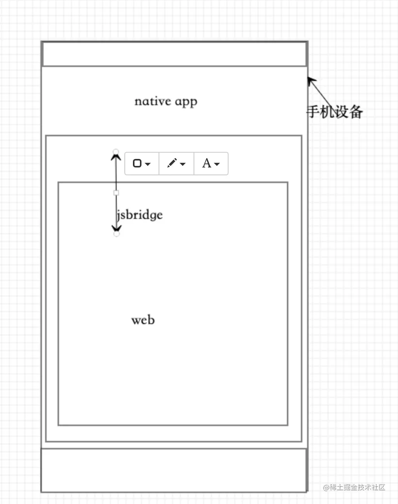

---
sidebar:
group:
title: hybird混合开发
isTimeLine: true
date: 11-10-2023
---
# hybird混合开发

参考：
https://juejin.cn/post/7102292121893879821?searchId=202311281138374895558C8ACF1A3D8C55

## Hybrid app
在原生 app中， 使用webview来加载html页面，把web端的页面展示出来，然后在Native app中的网页就像被放在了一个沙箱中，与外界隔离，访问不到一些外部的方法，无法调用一些手机端的api。


## JSBridge

它就像一个桥梁，连接这web端和native端，让native可以调用web端的代码，让web端可以调用native端的代码




## 开发具体流程
1.native app 开发人员完成webview布局
2.通过webview去给window对象里面添加JSBridge对象
3.提供文档

### Android

**js调用安卓**：

1.fnName(str) 传参的情况
--fnname:方法名，web端通过 window.AndroidJSBridge.fnName('xxxx') 调用, window.AndroidJSBridge.XX为固定写法，后面加方法名，参数类型为字符串，传入对象时，要转一下JSON.strinify

```text

WebSettings webSettings = webview.getSettings();
webSettings.setJavaScriptEnabled(true);
webview.loadUrl("file:///android_asset/html.html");
// 这里的this，一般是指加载web页面的context，name指的是js页面调用方法前的一个对象，具体看js代码
webview.addJavascriptInterface(MainActivity.this,"android");
webview.addJavascriptInterface(this,"name");


```

2.fnName() 不传参的情况,获取函数的返回值

```js
var result = window.AndroidJSBridge.fnName();
console.log(result);

```


**安卓调用js**

方法必须绑定在window对象下

```js
window.fnName = function (str) {
            return 'web提供给native的方法';
}


// java代码参考 调用fnName
//public void  javaCallJS(){
//    webView.loadUrl("javascript:fnName('call from java')");
//}
```

vue框架上 方法也需要挂在window下

```vue
mounted() {
    //将要给原生调用的方法挂载到 window 上面
    window.callJsFunction = this.callJsFunction
},
data() {
    return {
    	msg: "哈哈"
	}
},
methods: {
    callJsFunction(str) {
        this.msg = "我通过原生方法改变了文字" + str
        return "js调用成功"
	}
}

//java中 参考
    @Override
    public void callVueJS() {
        tbsWebView.post(new Runnable() {
            @Override
            public void run() {
              webView.loadUrl("javascript:callJsFunction('soloname')");
            }
        });
}
```


### IOS

**提供给web端调用的方法**

固定写法window.webkit.messageHandlers.xxx.postMessage({...})

```js
window.webkit.messageHandlers.fnName.postMessage({
                msg: str
});

```

**web提供给native的方法**

方法必须绑定在window对象下


```js
window.fnName = function (str) {
    return 'web提供给native的方法';
}

```


