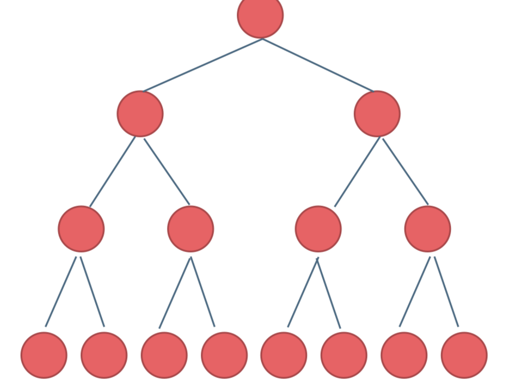
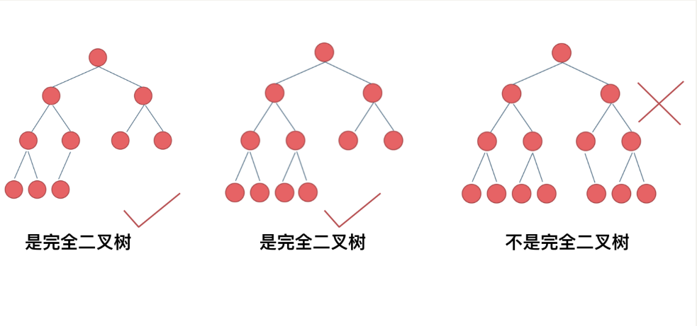

---
sidebar:
group:
title: 树的遍历
isTimeLine: true
date: 11-17-2023
tags:
categories:
sticky: 1
---
# tree

## 树的类型

* 满⼆叉树

> 如果⼀棵⼆叉树只有度为0的结点和度为2的结点，并且度为0的结点在同⼀层上，则这棵⼆叉树为满⼆叉树。
>
> 深度为k，有2^k-1个节点的⼆叉树

* 完全⼆叉树

> 在完全⼆叉树中，除了最底层节点可能没填满外，其余每层节点数
都达到最⼤值，并且最下⾯⼀层的节点都集中在该层最左边的若⼲位置。若最底层为第 h
层，则该层包含 1~ 2^h -1 个节点。

