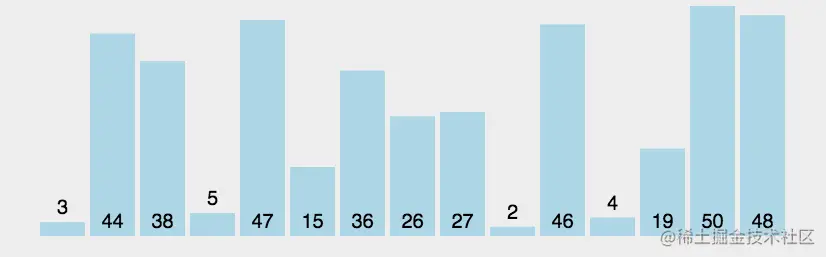

# 冒泡排序

## 冒泡排序

这个真的一看就明白。

冒泡排序的原理：


如果元素大小关系不正确，交换这两个数（在本例中为a> b），

比较一对相邻元素（a，b），

重复步骤1和2，直到我们到达数组的末尾（最后一对是第（N-2）和（N-1）项，因为我们的数组从零开始）

到目前为止，最大的元素将在最后的位置。 然后我们将N减少1，并重复步骤1，直到N = 1。




```js
function bubbleSort(array) {
        let t = 0;
        for (let i = 0; i < array.length - 1; i++){
            for (let j = 0; j < array.length - 1 - i; j++){
                if (array[j] > array[j + 1]) {
                    t = array[j];
                    array[j] = array[j + 1];
                    array[j + 1] = t;
                }
            }
        }
    }

```


