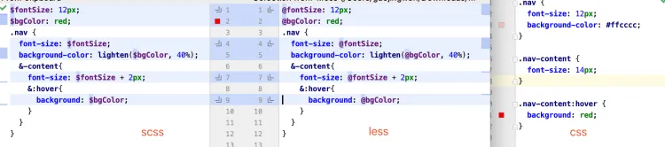
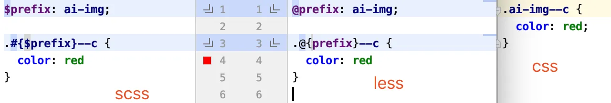
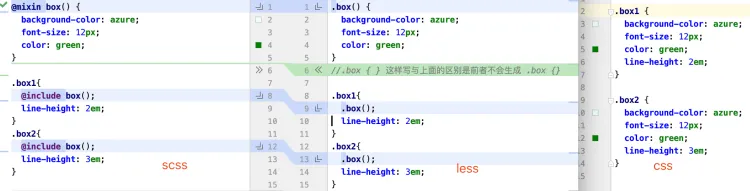
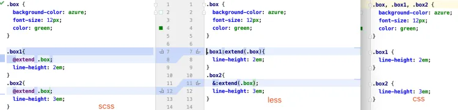
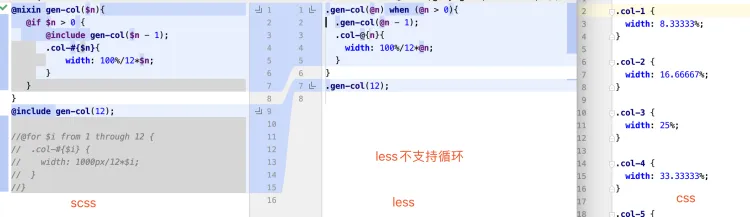

---
sidebar:
group:
title: less和sass区别
isTimeLine: true
date: 11-10-2023
---
# less和sass区别.md

## 预处理器的作用
* 可读性强 嵌套语法：反映层级关系和约束
* 逻辑复用
  * Extend和Mixin代码片段
  * 变量和计算： 减少重复代码
  * 循环 用于负复杂有规律的样式
* 模块化 import导入

## less和sass区别

**less特点**

less 用node写的，可在浏览器中引入less.js不需要预编译

* 优势 编译快
* 缺点： 复杂特性书写比较繁琐， 功能不如scss强大

**scss特点**

* 用ruby写的，编译慢，所以有了移植版本， node-sass
* scss安装比较恶心，项目中经常遇到环境问题，因为它与node版本有依赖关系
* 不过现在又除了一个工具叫dart-scss没这个问题了
* dart-sass性能好 （node-sass实时编译，dart-sass 保存时编译）
* 目前最新版dart-sass 已经更名为 sass


## 区别和用法
### 变量、嵌套、内置函数

### 命名空间


### mixin


### extend


### 循环



## 案例 0.5px边框

```css
.box {
  height: 200px;
  width: 200px;
  background: linear-gradient(180deg, #ebecf1, #ebecf1 50%, transparent 50%) top left no-repeat,
              linear-gradient(360deg, #ebecf1, #ebecf1 50%, transparent 50%) bottom left no-repeat;
  background-size: 100% 1px, 100% 1px;
  background-color: #ffffff;
}
```


```scss
/**
  0.5px 精美边框 函数
  $directions 是一个数组 (T, B, R, L)
  T代表top， B代表bottom, R代表right, L代表left 循序无关
  $borderColor 颜色值
  例子: @include myBorders((T, B));
 */
$color-gray-border: #ebecf1;
$color-white: #ffffff;

@mixin myBorders($directions, $borderColor: $color-gray-border, $bg-color: $color-white) {
  $directionsMap: (
          L: linear-gradient(90deg, $borderColor, $borderColor 50%, transparent 50%) bottom left no-repeat,
          R: linear-gradient(270deg, $borderColor, $borderColor 50%, transparent 50%) bottom right no-repeat,
          T: linear-gradient(180deg, $borderColor, $borderColor 50%, transparent 50%) top left no-repeat,
          B: linear-gradient(360deg, $borderColor, $borderColor 50%, transparent 50%) bottom left no-repeat
  );
  $sizesMap: (
          L: 1px 100%,
          R: 1px 100%,
          T: 100% 1px,
          B: 100% 1px
  );
  $dirResult: ();
  $sizResult: ();
  @each $direction in $directions {
    $dirResult: append($dirResult, map_get($directionsMap, $direction), comma);
    $sizResult: append($sizResult, map_get($sizesMap, $direction), comma);
  }
  background: $dirResult;
  background-size: $sizResult;
  background-color: $bg-color;
}

.box {
  height: 200px;
  width: 200px;
 @include myBorders((T, B));
}
```

```less
/* 0.5px 精美边框 函数
    T代表top， B代表bottom, R代表right, L代表left
    borders-h 水平（上下）边框
    borders-v 垂直（左右）边框
    borders-h-v 上下左右边框
  例:
    .borders1 {
      .borders-h()
    }
*/
.borders-h(@borderColor: @color-line-gray, @bg-color: @color-main-white) {
  background: linear-gradient(180deg, @borderColor, @borderColor 50%, transparent 50%) top left no-repeat, linear-gradient(360deg, @borderColor, @borderColor 50%, transparent 50%) bottom left no-repeat;
  background-size: 100% 1px, 100% 1px;
  background-color: @bg-color;
}
.borders-v(@borderColor: @color-line-gray, @bg-color: @color-main-white) {
  background: linear-gradient(90deg, @borderColor, @borderColor 50%, transparent 50%) bottom left no-repeat, linear-gradient(270deg, @borderColor, @borderColor 50%, transparent 50%) bottom right no-repeat;
  background-size: 1px 100%, 1px 100%;
  background-color: @bg-color;
}
.borders-h-v(@borderColor: @color-line-gray, @bg-color: @color-main-white) {
  background: linear-gradient(180deg, @borderColor, @borderColor 50%, transparent 50%) top left no-repeat, linear-gradient(360deg, @borderColor, @borderColor 50%, transparent 50%) bottom left no-repeat, linear-gradient(90deg, @borderColor, @borderColor 50%, transparent 50%) bottom left no-repeat, linear-gradient(270deg, @borderColor, @borderColor 50%, transparent 50%) bottom right no-repeat;
  background-size: 100% 1px, 100% 1px, 1px 100%, 1px 100%;
  background-color: @bg-color;
}
/* 0.5px边框 单条边框的情况
    例：
    .border-top {
      .border(T) // T,B,L,R分别代表top,bottom,left,right
    }
*/
.border-direction(@d, @borderColor) when (@d=B) {
  background-size: 100% 1px;
  background-position: bottom left;
  background-image: linear-gradient(360deg, @borderColor, @borderColor 50%, transparent 50%);
}
.border-direction(@d, @borderColor) when (@d=T) {
  background-size: 100% 1px;
  background-position: top left;
  background-image: linear-gradient(180deg, @borderColor, @borderColor 50%, transparent 50%);
}
.border-direction(@d, @borderColor) when (@d=L) {
  background-size: 1px 100%;
  background-position: bottom left;
  background-image: linear-gradient(90deg, @borderColor, @borderColor 50%, transparent 50%);
}
.border-direction(@d, @borderColor) when (@d=R) {
  background-size: 1px 100%;
  background-position: top right;
  background-image: linear-gradient(270deg, @borderColor, @borderColor 50%, transparent 50%);
}
.border(@d:B, @borderColor: @color-line-gray) {
  background-repeat: no-repeat;
  .border-direction(@d, @borderColor);
}
```
