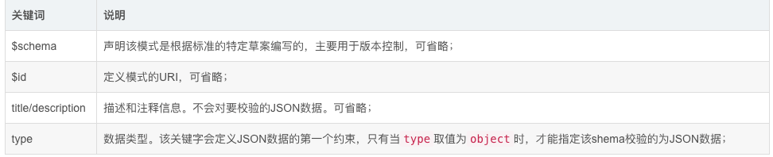
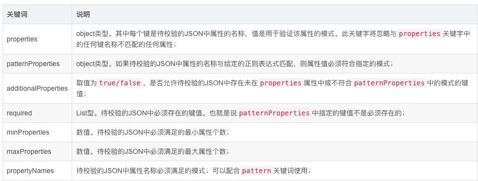
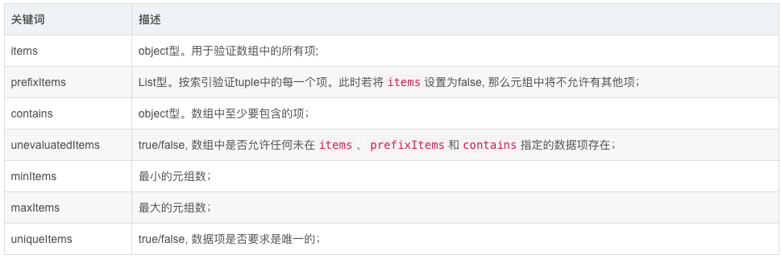
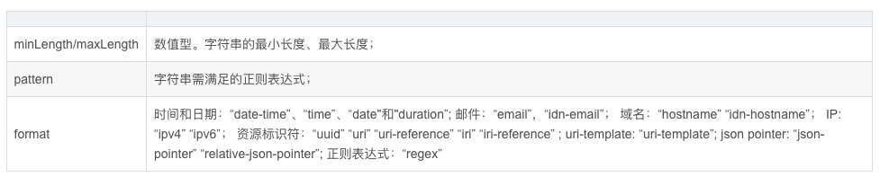
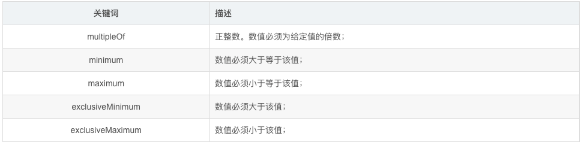

---
sidebar:
title: 前置知识-json schema
isTimeLine: true
date: 2024-09-10
tags:
---

# json schema

## 什么是 Schema？

JSON Schema 是用于验证 JSON 数据结构的强大工具，Schema可以理解为模式或者规则。

JSON Schema是一种用于描述JSON数据的规范，可以用来定义JSON数据对象的结构、格式和约束条件。通过JSON Schema，可以对JSON数据进行验证、校验和文档化，确保数据的正确性和完整性。

主要有以下作用：
1. 对现有的json数据格式进行描述（字段类型、内容长度、是否必须存在、取值示例等）；
2. 是一个描述清晰、人机可读的文档；
3. 自动测试、验证客户端提交的数据；

[JSON Schema 规范(中文版)](https://doc.yonyoucloud.com/doc/wiki/project/json/schema.html)

## Schema示例

### 基本语法

JSON Schema关键词

* $schema：该关键字声明该模式是根据标准的特定草案编写的，主要用于版本控制，可省略。
* $id：该关键字定义模式的URI，可省略。
* title和description：该JSON Schema的注释和描述信息，不会向验证的数据调节约束。
* type：该关键字会定义JSON数据的第一个约束，比如是JSON对象还是数组。
* properties:需要约束的属性，值的类型是type的值。

> type：数据类型

* string
* number
* integer
* object
* array
* 布尔值
* null

## Json schema 类型

### Object

关键字:type（限定类型）,properties(定义object的各个字段),required（限定必需字段）

* properties定义属性
* required必需属性
* maxProperties最大属性个数
* minProperties最小属性个数
* additionalProperties true or false or object

### array

array有三个单独的属性:items,minItems,uniqueItems

* items array 每个元素的类型.
* minItems 约束属性，数组最小的元素个数
* maxItems 约束属性，数组最大的元素个数
* uniqueItems 约束属性，每个元素都不相同
* additionalProperties 约束items的类型，不建议使用 示例
* Dependencies属性依赖 用法

### string

* maxLength定义字符串的最大长度，>=0.
* minLength定义字符串的最小长度，>=0
* pattern用正则表达式约束字符串

### integer
number 关键字可以描述整数数字。integer类型的约束有以下几个

* minimum最小值.
* exclusiveMinimum如果存在 "exclusiveMinimum" 并且具有布尔值 true，如果它严格意义上大于 "minimum" 的值则实例有效。
* maximum约束属性，最大值exclusiveMaximum如果存在 "exclusiveMinimum" 并且具有布尔值 true，如果它严格意义上小于 "maximum" 的值则实例有效。
* multipleOf是某数的倍数，必须大于0的整数

### number

number 关键字可以描述任意长度，任意小数点的数字。

* minimum最小值.exclusiveMinimum如果存在 "exclusiveMinimum" 并且具有布尔值 true，如果它严格意义上大于 "minimum" 的值则实例有效。
* maximum约束属性，最大值
* exclusiveMaximum如果存在 "exclusiveMinimum" 并且具有布尔值 true，如果它严格意义上小于 "maximum" 的值则实例有效。

### boolean

true or false

### enum

枚举类型

### const

常数

