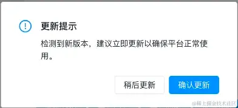
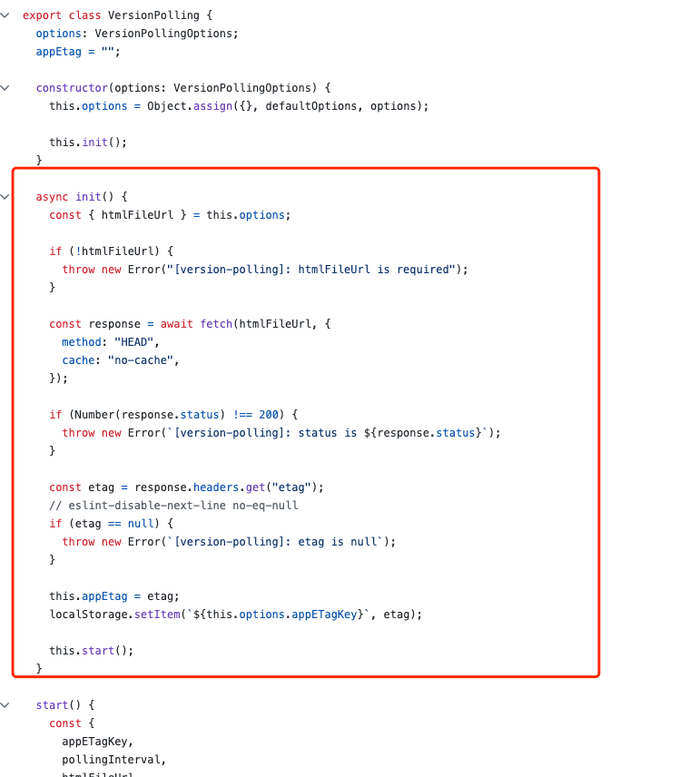
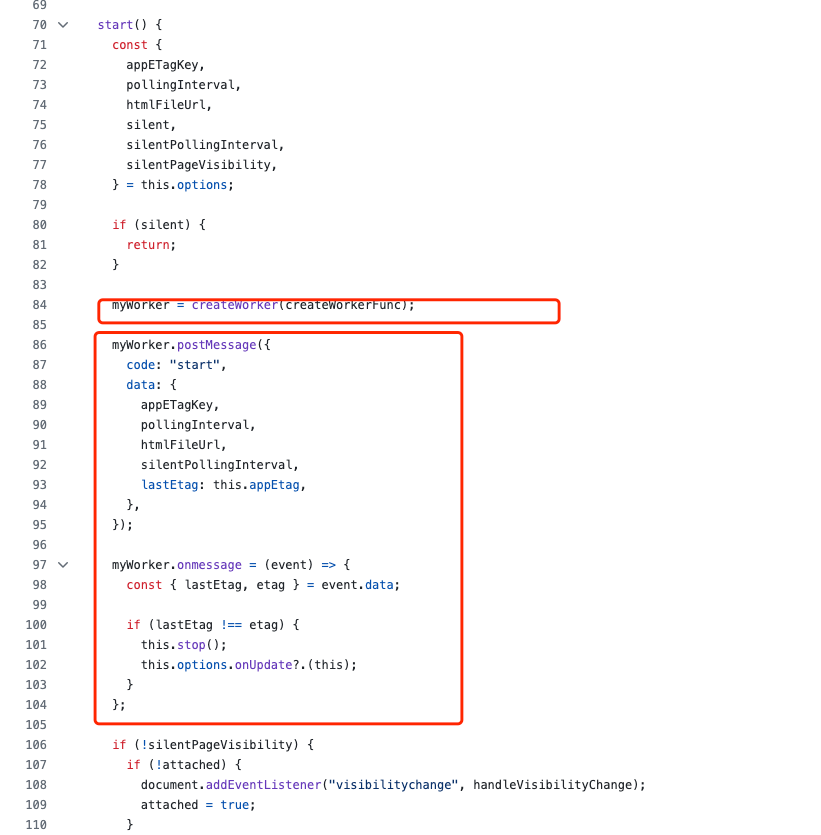
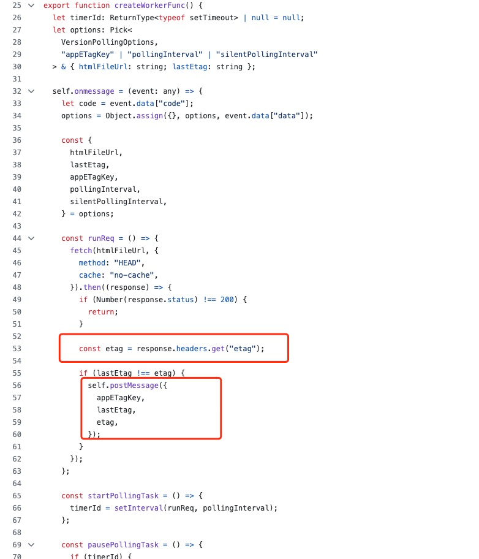
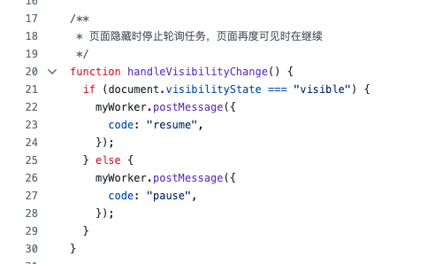

---
sidebar:
title: 部署更新通知
isTimeLine: true
date: 2024-01-14
tags:
---

# 部署更新通知

## 部署更新通知

前端的静态资源会缓存在浏览器内存中，且在整个使用过程中通常不会自动重新加载。这种特性意味着如果应用有新的版本发布，用户可能仍在使用旧版本，无法立即获得最新的功能、修复或安全更新。

期望： 每次发布之后，提示用户系统有更新。



## 方案选择

### 1、比较构建文件的hash值

配置webpack/vite打包时生成hash值，通过对比hash值判断是否有更新。

```js
// 存储当前脚本标签的哈希值集合
let scriptHashes = new Set();
let timer = undefined;
/**
 * 从首页获取脚本标签的哈希值集合
 * @returns {Promise<Set<string>>} 返回包含脚本标签的哈希值的集合
 */
async function fetchScriptHashes() {
    // 获取首页HTML内容
    const html = await fetch('/').then((res) => res.text());
    // 正则表达式匹配所有<script>标签
    const scriptRegex = /<script(?:\s+[^>]*)?>(.*?)</script\s*>/gi;
    // 获取匹配到的所有<script>标签内容
    const scripts = html.match(scriptRegex) ?? [];
    // 将脚本标签内容存入集合并返回
    return new Set(scripts);
}

/**
 * 比较当前脚本标签的哈希值集合与新获取的集合，检测是否有更新
 */
async function compareScriptHashes() {
    // 获取新的脚本标签哈希值集合
    const newScriptHashes = await fetchScriptHashes();

    if (scriptHashes.size === 0) {
        // 初次运行时，存储当前脚本标签哈希值
        scriptHashes = newScriptHashes;
    } else if (
        scriptHashes.size !== newScriptHashes.size ||
        ![...scriptHashes].every((hash) => newScriptHashes.has(hash))
    ) {
        // 如果脚本标签数量或内容发生变化，则认为有更新
        console.info('更新了', {
            oldScript: [...scriptHashes],
            newScript: [...newScriptHashes],
        });
        // 清除定时器
        clearInterval(timer);
        // 提示用户更新
        updateNotice();
    } else {
        // 没有更新
        console.info('没更新', {
            oldScript: [...scriptHashes],
        });
    }
}

// 每60秒检查一次是否有新的脚本标签更新
timer = setInterval(compareScriptHashes, 60000);
```

### 2、利用HTTP协议的缓存机制，比较Etag或last-modified前后是否一致

```js
let versionTag = null; // 版本标识
let timer = undefined;

/**
 * 获取首页的 ETag 或 Last-Modified 值，作为当前版本标识
 * @returns {Promise<string|null>} 返回 ETag 或 Last-Modified 值
 */
const getVersionTag = async () => {
    const response = await fetch('/', {
        cache: 'no-cache',
    });
    return response.headers.get('etag') || response.headers.get('last-modified');
};

/**
 * 比较当前的 ETag 或 Last-Modified 值与最新获取的值
 */
const compareTag = async () => {
    const newVersionTag = await getVersionTag();

    if (versionTag === null) {
        // 初次运行时，存储当前的 ETag 或 Last-Modified 值
        versionTag = newVersionTag;
    } else if (versionTag !== newVersionTag) {
        // 如果 ETag 或 Last-Modified 发生变化，则认为有更新
        console.info('更新了', {
            oldVersionTag: versionTag,
            newVersionTag: newVersionTag,
        });
        // 清除定时器
        clearInterval(timer);
        // 提示用户更新
        updateNotice();
    } else {
        // 没有更新
        console.info('没更新', {
            oldVersionTag: versionTag,
            newVersionTag: newVersionTag,
        });
    }
};

// 每60秒检查一次是否有新的 ETag 或 Last-Modified 值
timer = setInterval(compareTag, 60000);
```


### 3、第三方插件

* version-polling

扒一扒他的源码

* 首先初始化一个 VersionPolling 类，init方法获取响应的 etag 标识并存进localstorage。然后调用start方法。

* 同步创建一个web worker，通过监听etag变化，然后使用postmessage通知主页面进程。


* 页面失活时停止监听



