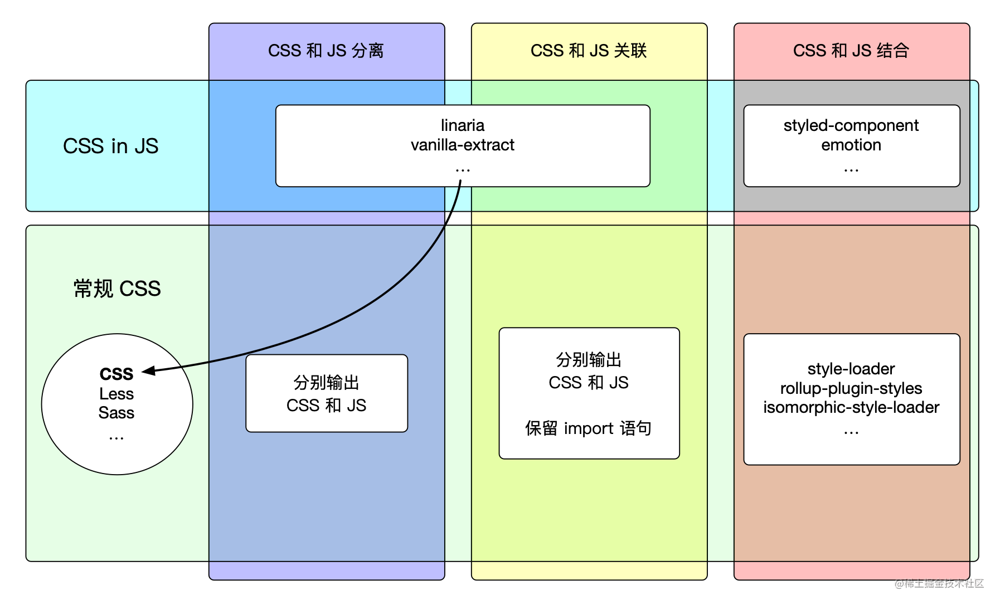
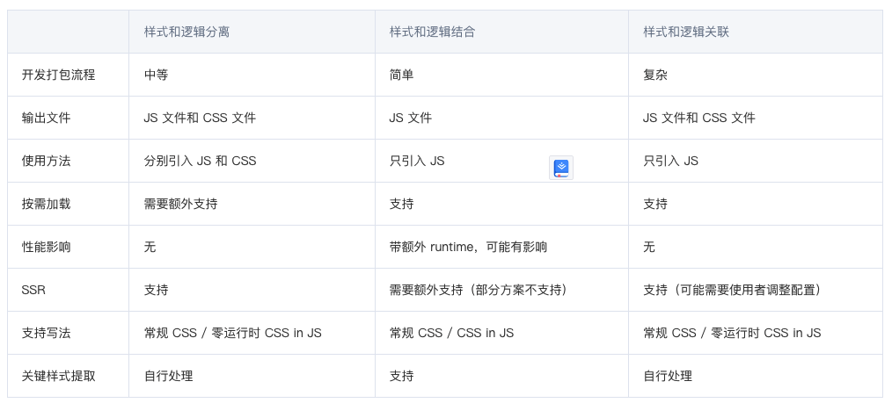

---
sidebar:
title: 组件库相关问题汇总
step: 6
isTimeLine: true
date: 2020-09-14
tags:
- 组件库
---

# 问题汇总

## Q: 为什么需要二次封装组件库？

实际工作中，我们在项目中需要自定义主题色，更改按钮样式，自定义图标,自定义table组件等等，这些都可以基于antd组件库进行二次封装，减少重复工作，提升开发效率。

高内聚低耦合

- **统一风格**：在一个大的项目或者多个相关的项目中，保持一致的界面风格和交互方式是非常重要的。通过二次封装，我们可以定义统一的样式和行为，减少不一致性。
- **降低维护成本**：当底层的组件库更新时，我们可能需要在项目的多个地方进行修改。但是如果我们有了自己的封装，只需要在封装层面进行更新即可，这大大降低了维护成本。
- **增加定制功能**：有些时候，我们需要在原有组件库的基础上增加一些特定的功能，如特定的验证、错误处理等。二次封装提供了这样的可能。
- **提高开发效率**：在一些常用的功能（如表单验证、全局提示等）上，二次封装可以提供更方便的API，提高开发效率。

## Q: 请结合一个组件库设计的过程,谈谈前端工程化的思想

巨石应用 -> 多应用 -> mono repo（单一代码库管理）转变

- 1、lerna、nx、yarn workspace、pnpm workspace管理多个包，实现组件级别的解藕、独立版本控制、按需加载等特性。
- 2、规范化提交：使用规范化的提交信息可以提高 Git 日志的可读性，并且可以通过 conventional commits 自动生成 CHANGELOG。可以使用
  commitizen、commitlint 等工具来配置。
- 3、代码规范化：通过 ESLint、Prettier 等工具实现代码规范化和格式化，并封装为自己的规范预设。
- 4、 组件开发调试：需要考虑热更新编译、软链接引用等问题，以方便在开发过程中进行组件的调试。
- 5、文档站点：可以基于 dumi 搭建文档站点，并实现 CDN 加速、增量发布等优化。可以使用 surge 实现 PR 预览。
- 6、 单元测试：需要考虑 jest、enzyme 等工具的配合使用，生成测试覆盖率报告。
- 7、 按需加载：需要配合 babel-plugin-import 实现按需加载，即在编译时修改导入路径来实现组件的按需加载。
- 8、 组件设计：需要考虑响应式、主题、国际化、TypeScript 支持等问题，以保证组件的灵活性和可扩展性。
- 9、 发布前的自动化脚本：需要编写自动化脚本来规范发布流程，确保发布的一致性和可靠性。
- 10、 发布后的处理：考虑补丁升级、文档站点同步发布等问题，以便及时修复问题并提供最新的文档。

## Q: 如何对一个组件库进行测试?

> 组件库的测试大致可以分为两类：一类是针对组件本身的功能和性能的测试（例如，单元测试、性能测试），另一类是针对组件在集成环境下的行为和性能的测试（例如，集成测试、系统测试）。

- 1、功能测试（单元测试）
  通常来说，组件的功能测试可以通过单元测试来完成。单元测试的目的是验证组件的单个功能是否按照预期工作。这通常可以通过编写测试用例来完成，每个测试用例针对一个特定的功能。

```js
import {Button} from '../src/Button';

test('Button should do something', () => {
    const component = new YourComponent();
// your test logic here
    expect(component.doSomething()).toBe('expected result');
});

```

- 2、边界测试
  边界测试是一种特殊的功能测试，用于检查组件在输入或输出达到极限或边界条件时的行为。

```js
test('Button should handle boundary condition', () => {
    const component = new YourComponent();
// test with boundary value
    expect(component.handleBoundaryCondition('boundary value')).toBe('expected result');
});
```

- 3、响应测试
  响应测试通常涉及到 UI 组件在不同的设备或屏幕尺寸下的行为。这可能需要使用端到端（E2E）测试工具，如 Puppeteer、Cypress 等。

```js
import {test} from '@playwright/test';

test('Button should be responsive', async ({page}) => {
    await page.goto('http://localhost:3000/your-component');
    const component = await page.$('#your-component-id');
    expect(await component.isVisible()).toBe(true);

    // Simulate a mobile device
    await page.setViewportSize({width: 375, height: 812});
    // Check the component under this condition
    // your test logic here
});
```

- 4、交互测试
  交互测试也可以通过端到端（E2E）测试工具来完成。

```js
test('Button should handle interactions', async ({page}) => {
    await page.goto('http://localhost:3000/your-component');
    const component = await page.$('#your-component-id');

    // Simulate a click event
    await component.click();
    // Check the result of the interaction
    // your test logic here
});
```

- 5、异常测试
  异常测试用于验证组件在遇到错误或非法输入时能否正确处理。这通常可以通过在测试用例中模拟错误条件来完成。

```js
test('Button should handle errors', () => {
    const component = new YourComponent();
// Test with illegal argument
    expect(() => {
        component.doSomething('illegal argument');
    }).toThrow('Expected error message');
});
```

- 6、性能测试
  性能测试用于验证组件的性能，例如，加载速度、内存消耗等。

```js
import {performance} from 'perf_hooks';

test('Button should have good performance', () => {
    const start = performance.now();
    const component = new YourComponent();
    component.doSomething();
    const end = performance.now();
    const duration = end - start;
    expect(duration).toBeLessThan(50);  // Expect the operation to finish within 50 ms
});
```

- 7、 自动化测试
  单元测试、集成测试和系统测试都可以通过自动化测试工具进行。例如，Jest 和 Mocha 可以用于自动化运行 JavaScript
  单元测试，Puppeteer 和 Selenium 可以用于自动化运行端到端测试。

```js
module.exports = {
    roots: ['<rootDir>/src'],
    testMatch: ['**/__tests__/**/*.+(ts|tsx|js)', '**/?(*.)+(spec|test).+(ts|tsx|js)'],
    transform: {
        '^.+\\.(ts|tsx)$': 'ts-jest'
    }
};

```

## Q: Element-UI 的多语言方案是怎么设计的?

Element UI 使用了 Vue 的插件 vue-i18n 实现多语言支持，具体的设计和实现过程如下：

- 1、定义语言包
  首先，Element UI 定义了一个 JavaScript 对象作为语言包。每种语言都有一个对应的语言包，例如：

```js
export default {
    el: {
        colorpicker: {
            confirm: 'OK',
            clear: 'Clear'
        },
// ...other components
    }
};
```

- 2、加载语言包
  Element UI 提供了一个 i18n 方法用于加载语言包。

```js
import ElementUI from 'element-ui';
import locale from 'element-ui/lib/locale/lang/en';

Vue.use(ElementUI, {locale});
```

- 3、使用语言包
  Element UI 的组件会使用 $t 方法获取语言包中的文本。例如：

```js
<template>
    <el-button>{{$t('el.button.confirm')}}</el-button>
</template>
```

在这个例子中，按钮的文本会根据当前的语言包来显示。

- 4、集成 vue-i18n
  如果你的项目中已经使用了 vue-i18n，Element UI 会优先使用 vue-i18n 提供的 $t 方法。你可以这样配置：

```js
import Vue from 'vue';
import VueI18n from 'vue-i18n';
import ElementUI from 'element-ui';
import enLocale from 'element-ui/lib/locale/lang/en';
import zhLocale from 'element-ui/lib/locale/lang/zh-CN';

Vue.use(VueI18n);

const messages = {
    en: {
        message: 'hello',
        ...enLocale // 或者用 Object.assign({ message: 'hello' }, enLocale)
    },
    zh: {
        message: '你好',
        ...zhLocale // 或者用 Object.assign({ message: '你好' }, zhLocale)
    }
};

const i18n = new VueI18n({
    locale: 'zh', // set locale
    messages, // set locale messages
});

Vue.use(ElementUI, {
    i18n: (key, value) => i18n.t(key, value)
});
```

在这个例子中，我们先加载了 vue-i18n，然后定义了两种语言的语言包（英文和中文）。最后，我们配置了 Element UI 使用 vue-i18n 的 $t
方法。

这样，Element UI 的组件就能够根据 vue-i18n 的语言设置显示对应的文本。

## Q: 组件库如何实现在线主题定制的?

- 1、使用 CSS 变量定义样式
  将组件的样式使用 CSS 变量定义,这样可以通过改变 CSS 变量的值来修改样式。

```css
:root {
    --primary-color: #1890ff;
}

.btn {
    background: var(--primary-color);
}
```

- 2、提供主题文件进行配置
  让用户可以通过导入自定义的主题文件来覆盖默认样式。

```js
// theme.js
export default {
    '--primary-color': '#409eff'
}
```

- 3、在线主题编辑器
  提供一个在线工具,用户可以在工具中配置主题,生成主题文件。

工具会提交主题配置,服务器端接收后动态编译生成新的样式,并返回给前端。

- 4、前端应用新样式
  前端通过加载服务器返回的 CSS 文件来应用新的主题样式,实现样式更新而无需重新打包。

```js
// 请求主题文件
fetchTheme(theme).then(css => {
// 动态创建style标签,插入css
    const style = document.createElement('style');
    style.innerHTML = css;
    document.head.appendChild(style);
})
```

- 5、持久化主题配置
  将用户主题配置持久化本地存储,这样每次访问都可以应用上次选定的主题。

## Q: 组件库的类型定义应该怎样设计?

组件库的类型定义设计取决于很多因素，包括库的大小、复杂度、可能的使用场景等。

- 1、定义全局类型 versus 定义组件Props类型
  在组件库中，我们经常需要定义一些可以在多个组件之间共享的全局类型，以及针对特定组件的props类型。例如：

```ts
// 全局类型
export interface Size {
    width: number;
    height: number;
}

// 组件Props类型
export interface ButtonProps {
    size?: Size;
    label: string;
    onClick?: () => void;
}
```

- 2、类型导出应该集中还是分散?
  是否集中导出类型取决于组件库的大小和复杂度。对于小型库，可以在一个单独的文件中集中导出所有类型；对于大型库，可能需要将类型定义分散在各个组件文件中，然后在一个单独的文件中重新导出它们。例如：

```ts
// 在各个组件文件中定义和导出类型
// button.ts
export interface ButtonProps { /*...*/
}

// 在一个单独的文件中重新导出所有类型
// types.ts
export type {ButtonProps} from './button';

```

- 3、如何设计类型层级关系?类型复用?
  在设计类型时，应尽可能地利用 TypeScript 的类型系统来构建类型层级关系，并复用类型。例如，你可以使用类型交叉（&amp;）和类型联合（|）来复用类型：

```ts
// 在各个组件文件中定义和导出类型
type SmallSize = { width: number; height: number };
type LargeSize = SmallSize &amp; { depth: number };

type Size = SmallSize | LargeSize;
```

- 4、类型定义要充分还是精简?
  类型定义应尽可能精简，同时提供足够的信息来描述类型的形状和行为。避免使用 any 或 unknown 类型，除非有特别的理由。例如：

```ts
// 在各个组件文件中定义和导出类型
// 不好的类型定义
interface ButtonProps {
    [key: string]: any;  // 这不提供任何有关props的信息
}

// 好的类型定义
interface ButtonProps {
    size?: Size;
    label: string;
    onClick?: () => void;
}
```

总的来说，设计好的类型定义可以提高代码的可读性和可维护性，同时减少运行时错误。

## Q: 组件库的渐进升级策略应该怎么设计?

组件库的渐进升级策略通常会涉及到版本控制、向下兼容性、废弃通知以及旧版本的兼容性等多个方面。这种策略的主要目的是在保持库的稳定性和功能性的同时，尽可能地减少对用户的影响。

- 1、版本控制策略
  组件库通常遵循语义化版本 (SemVer) 规范进行版本控制。在语义化版本中，每个版本号都由三部分组成：主版本号、次版本号和补丁版本号。

例如，版本号为 1.2.3 表示主版本号为 1，次版本号为 2，补丁版本号为 3。

主版本号（Major）: 当你做了不兼容的 API 修改
次版本号（Minor）: 当你做了向下兼容的功能性新增
补丁版本号（Patch）: 当你做了向下兼容的问题修复

- 2、向下兼容处理
  向下兼容性是指在升级组件库时，保证新版本不会破坏旧版本的功能。例如，如果新版本的一个组件删除了一个属性，而这个属性在旧版本中是必需的，那么这个变化就不是向下兼容的。

在进行不向下兼容的变化时，应在主版本号上进行增加，以警告用户可能需要修改他们的代码。

- 3、功能被废弃怎么通知用户升级?
  当一个功能或者组件被废弃时，应在库的文档、更新日志以及相关的 API 文档中明确注明。在代码中，可以通过添加警告或者错误信息来提醒用户：

```js
function deprecatedFunction() {
    console.warn('Warning: deprecatedFunction is deprecated and will be removed in the next major version.');
// 功能的原始实现
}
```

- 4、兼容旧版本的方案
  兼容旧版本的策略取决于特定的需求和资源。一种常见的策略是在主版本升级后，继续维护旧版本的一个分支，以便在必要时进行修复和改进。例如，如果当前版本是
  2.x.x，那么可以维护一个 1.x.x 的分支。

在实践中，以上的策略和方法可能需要根据具体的情况进行调整。一个好的渐进升级策略应能够平衡新功能的引入、旧功能的废弃以及向下兼容性的维护。

## Q: 组件库的按需加载实现中存在哪些潜在问题,如何解决?

按需加载（也称为代码拆分）是现代前端开发中常见的一种优化手段，可以有效地减少应用的初始加载时间。对于组件库来说，它使用户只加载和使用他们真正需要的组件，而不是加载整个库。

- babel-plugin-import
  Babel 插件: 使用如 babel-plugin-import 的 Babel 插件可以在编译时将导入整个库的语句转换为仅导入使用的组件。

```javascript
import {Button} from 'your-ui-lib';
// 在编译时，babel-plugin-import 将上面的语句转换为以下语句：
// import Button from 'your-ui-lib/button';
```

- tree-shaking

Webpack、Rollup 等工具都已经支持了 Tree shaking。在项目的配置中开启 Tree shaking，然后使用 ES Modules 的导入导出语法，即可实现按需加载。

但是在使用 Tree shaking 的时候，有一个需要特别注意的地方，就是“副作用（side effects）”。

有些模块的代码可能会在导入时执行一些副作用，例如改变全局变量、改变导入模块的状态等。这种情况下，即使模块中的部分导出没有被使用，由于其副作用，也不能被
Tree shaking 移除。否则，可能会导致程序运行出错。

例如，在 CSS in JS 的库中，可能存在这样的代码：

```js
import './styles.css'; // 有副作用，改变了全局的样式
```

在这种情况下，你需要在 package.json 中显式地指定模块的副作用，以防止它们被错误地移除：

```json
{
  "name": "your-library",
  "sideEffects": [
    "./src/styles.css"
  ]
}
```

如果你的库没有任何副作用，你可以将 sideEffects 设置为 false：

```json
{
  "name": "your-library",
  "sideEffects": false
}
```

## Q: 样式如何实现真正的按需加载?避免样式重复打包?





- 样式和逻辑分离
  这种方案中,组件的CSS和JS在代码层面上是分离的,开发时写在不同的文件里。在打包时生成独立的逻辑文件和样式文件。

  优点:
  适用面广,可以支持不同的框架和技术栈。
  支持SSR,样式处理留给使用者。
  可以直接提供源码,便于主题定制。   
  缺点:
  使用时需要分别引入逻辑和样式,按需加载实现复杂，需要借助babel-plugin-import、unplugin-vue-components等。
  样式文件打包可能存在冗余。
  适合需要高适用性和灵活性的组件库。

- 样式和逻辑结合
  这种方案将CSS和JS打包在一起,输出单一的JS文件。主要有两种实现形式:

- CSS in JS:样式以对象或字符串形式存在在JS中。
  将CSS打包进JS:通过构建工具,将CSS文件内容注入到JS中。

优点:
使用简单,只需要引入JS即可。
天然支持按需加载。  
缺点:
需要额外的runtime,可能影响性能。
难以利用浏览器缓存。
SSR需要框架额外支持。

- 样式和逻辑关联

这种方案下,虽然CSS和JS在源码层分离,但组件内会直接引用样式,且输出文件中保留import语句。

优点:

使用简单,只引入JS即可。
支持按需加载。
缺点:

对构建和SSR都有一定要求。
样式编译复杂。

## Q: 设计一个组件库的 CI/CD 和发布流程。

> 可以参考antd

当你设计一个组件库的 CI/CD 和发布流程时，可以考虑以下步骤：

- 1、分支管理：
  开发者在开发新特性或修复 bug 时，应该在新的分支（通常称为 feature 分支）上进行开发。完成开发后，提交一个 pull request 到
  main 或 master 分支，并进行代码审查。

```shell
git checkout - b feature /new-component
#开发过程
...
git add .
git commit - m "Add new component"
git push origin feature /new-component
```

- 2、代码检查：
  使用如 ESLint、Stylelint 等工具进行代码检查，使用 Jest 等工具进行单元测试和覆盖率检查。这些步骤可以在提交代码时或者 pull
  request 的过程中自动进行。

例如，可以在 package.json 中添加如下 scripts：

```json
{
  "scripts": {
    "lint": "eslint --ext .js,.jsx,.ts,.tsx src",
    "test": "jest"
  }
}
```

并在 CI/CD 工具中（如 GitHub Actions、Jenkins 等）配置相应的任务：

```shell
# .github/workflows/ci.yml
name: CI
on: [push, pull_request]
jobs:
build:
runs-on: ubuntu-latest
steps:
- name: Check out code
uses: actions/checkout@v2
- name: Use Node.js
uses: actions/setup-node@v2
with:
node-version: '14'
- name: Install dependencies
run: npm ci
- name: Run lint
run: npm run lint
- name: Run tests
run: npm run test
```

- 3、版本管理：
  在合并代码并发布新版本前，需要确认新的版本号，并生成相应的 changelog。可以使用如 standard-version 这样的工具自动化这个过程。

```shell
npx standard - version
```

- 4、构建：
  使用如 Webpack、Rollup 等工具进行构建，生成可以在不同环境（如浏览器、Node.js）下使用的代码。

```shell
npm run build
```

- 5、发布：
  将构建好的代码发布到 npm，同时更新文档网站。

```shell
npm publish
```

- 6、部署：
  部署到github pages或者自建服务

### 如何实现button按钮

```ts
import React, {CSSProperties, FC, MouseEvent, ReactNode} from 'react';

interface ButtonProps {
    lock?: boolean;
    classNames?: Record<string, string>;
    danger?: boolean;
    disabled?: boolean;
    ghost?: boolean;
    href?: string;
    htmlType?: 'button' | 'submit' | 'reset';
    icon?: ReactNode;
    loading?: boolean | { delay: number };
    shape?: 'default' | 'circle' | 'round';
    size?: 'large' | 'middle' | 'small';
    styles?: Record<string, CSSProperties>;
    target?: string;
    type?: 'primary' | 'dashed' | 'link' | 'text' | 'default';
    onClick?: (event: MouseEvent<HTMLButtonElement | HTMLAnchorElement>) => void;
    children?: ReactNode;
}

const Button: FC<ButtonProps> = ({
                                     lock,
                                     classNames,
                                     danger,
                                     disabled,
                                     ghost,
                                     href,
                                     htmlType = 'button',
                                     icon,
                                     loading,
                                     shape,
                                     size,
                                     styles,
                                     target,
                                     type = 'default',
                                     onClick,
                                     children
                                 }) => {
    const baseClassName = 'button';

    const className = [
        baseClassName,
        type &amp;&amp; `${baseClassName}--${type}`,
        size &amp;&amp; `${baseClassName}--${size}`,
        shape &amp;&amp; `${baseClassName}--${shape}`,
        disabled &amp;&amp; `${baseClassName}--disabled`,
        danger &amp;&amp; `${baseClassName}--danger`,
        ghost &amp;&amp; `${baseClassName}--ghost`,
        loading &amp;&amp; `${baseClassName}--loading`,
        lock &amp;&amp; `${baseClassName}--lock`,
    ].filter(Boolean).join(' ');

    const handleClick = (e: MouseEvent<HTMLButtonElement | HTMLAnchorElement>) => {
        if (disabled) {
            e.preventDefault();
        } else if (onClick) {
            onClick(e);
        }
    };

    return href ? (
            <a
                className = {className}
        href = {href}
    target = {target}
    onClick = {handleClick}
        >
        {children}
        < /a>
) :
    (
        <button
            className = {className}
    type = {htmlType}
    disabled = {disabled}
    onClick = {handleClick}
        >
        {children}
        < /button>
)
    ;
};

export default Button;
```

### 如何实现modal组件

```ts
interface IModalProps {
    afterClose?: () => void;
    bodyStyle?: CSSProperties;
    cancelButtonProps?: React.ButtonHTMLAttributes<HTMLButtonElement>;
    cancelText?: ReactNode;
    centered?: boolean;
    closeIcon?: boolean | ReactNode;
    confirmLoading?: boolean;
    destroyOnClose?: boolean;
    focusTriggerAfterClose?: boolean;
    footer?: ReactNode;
    forceRender?: boolean;
    getContainer?: HTMLElement | (() => HTMLElement) | string | false;
    keyboard?: boolean;
    mask?: boolean;
    maskClosable?: boolean;
    maskStyle?: CSSProperties;
    modalRender?: (node: ReactNode) => ReactNode;
    okButtonProps?: React.ButtonHTMLAttributes<HTMLButtonElement>;
    okText?: ReactNode;
    okType?: string;
    style?: CSSProperties;
    title?: ReactNode;
    open?: boolean;
    width?: string | number;
    wrapClassName?: string;
    zIndex?: number;
    onCancel?: (e: React.MouseEvent<HTMLButtonElement>) => void;
    onOk?: (e: React.MouseEvent<HTMLButtonElement>) => void;
    afterOpenChange?: (open: boolean) => void;
}

const Modal: React.FC<IModalProps> = ({
                                          children,
                                          title = '',
                                          onCancel,
                                          onOk,
                                          open = false,
                                          mask = true,
                                      }) => {
    return (
        <>
            {mask &amp;&amp; <div className = "modal-mask"
    style = {
    {
        display: open ? 'block' : 'none'
    }
}>
    </div>}
    {
        open &amp;&amp; (
            <div className = "modal"
        style = {
        {
            display: 'block'
        }
    }>
        <h2 className = "modal-title" > {title} < /h2>
            < div
        className = "modal-body" > {children} < /div>
            < div
        className = "modal-footer" >
        <button className = "modal-footer-cancel"
        onClick = {onCancel} >
            Cancel
            < /button>
            < button
        className = "modal-footer-ok"
        onClick = {onOk} >
            OK
            < /button>
            < /div>
            < /div>
    )
    }
    </>
)
    ;
}
    ;

    Modal.info = function (props: IModalProps) {
        const div = document.createElement('div');
        document.body.appendChild(div);

        function remove() {
            ReactDOM.unmountComponentAtNode(div);
            document.body.removeChild(div);
        }

        function onCancel(e: React.MouseEvent<HTMLButtonElement>) {
            if (props.onCancel) {
                props.onCancel(e);
            }
            remove();
        }

        function onOk(e: React.MouseEvent<HTMLButtonElement>) {
            if (props.onOk) {
                props.onOk(e);
            }
            remove();
        }

        ReactDOM.render(
            <Modal {...props}
        onCancel = {onCancel}
        onOk = {onOk}
        open = {true}
        />,
        div
    )
        ;
    };
```

## 如何实现高性能Tree组件

### 实现Tree组件的核心思路是什么?

Tree组件的核心思路是将原始的嵌套children数据结构平铺成一维数组,然后通过计算每个节点的深度(deep)
、层级关系等信息,在渲染时动态计算缩进宽度、连接线等,从而实现树形结构的可视化。

### Tree组件如何实现高性能大数据渲染?

* 将原始树形数据平铺为一维数组,便于后续计算
* 计算出实际需要渲染的节点数据,过滤隐藏的节点
* 利用虚拟列表技术只渲染可视区域的数据,实现大数据量的高效渲染

```ts
function flattenTreeData(treeData = [], parent = null) {
    const nodes = [];

    treeData.forEach((node) => {
        const newNode = {
            ...node,
            parent,
        };

        nodes.push(newNode);

        if (newNode.children) {
            nodes.push(...flattenTreeData(newNode.children, newNode));
        }
    });

    return nodes;
}
```

### 如何计算Tree组件中节点的各种状态(展开/折叠、选中等)?

* 展开/折叠状态根据ExpandedKeys计算
* 复选框选中状态需要考虑受控/非受控,严格受控模式,及父子节点关联
* 需要递归计算父节点和子节点的状态
* 利用平铺后的索引进行相关节点查询

### Tree组件的交互如何实现?点击节点展开折叠,复选框状态切换等

* 点击展开折叠通过更新节点自身状态、可视状态及ExpandedKeys实现
* 点击复选框需要递归更新父子节点的状态,及相关keys
* 计算并保存实时状态,通过回调函数通知外部

```ts
function toggleExpanded(nodes, node) {
    return nodes.map((currentNode) => {
        if (currentNode === node) {
            return {
                ...currentNode,
                expanded: !currentNode.expanded,
            };
        }

        return currentNode;
    });
}

// 在渲染时计算缩进：
function renderNode(node) {
    const indentLevel = getIndentLevel(node);
    const style = {
        paddingLeft: `${indentLevel * 16}px`,
    };

    return (
        <div style = {style}
    onClick = {()
=>
    handleNodeClick(node)
}>
    {
        node.label
    }
    </div>
)
    ;
}
```

### 如何实现高性能表格Table组件？

可参考ali-react-table：高性能 React
表格组件(https://ali-react-table.js.org/blog/2020/04/15/ali-react-table-introduction/)

### 表格组件的性能瓶颈主要在哪里?

* 渲染大量 DOM;
* 频繁的更新渲染,如选中行状态改变引起整个表格重新渲染。

### 如何优化表格组件的渲染性能?

* 只渲染必要的列：

```ts

const columnsToRender = columns.filter(column => column.shouldRender);

return (
    <table>
        <thead>
            <tr>
                {
                    columnsToRender.map(column => (
                        <th key = {column.key} > {column.title} < /th>
                    ))
                }
    < /tr>
    < /thead>
    < tbody >
    {
        data.map(row => (
            <tr key = {row.id} >
                {
                    columnsToRender.map(column => (
                        <td key = {column.key} > {row[column.key]} < /td>
                    ))
                }
                < /tr>
        ))
    }
    < /tbody>
    < /table>
);
```

* 细粒度更新，只更新变化行/列。在React中，可以使用React.memo或者shouldComponentUpdate来避免不必要的重渲染：

```ts
function Row({data, columns}) {
    return (
        <tr>
            {
                columns.map(column => (
                    <Cell key = {column.key} data = {data[column.key]}
    />
))
}
    </tr>
)
    ;
}

const areEqual = (prevProps, nextProps) => {
    return prevProps.data === nextProps.data &amp;&amp; prevProps.columns === nextProps.columns;
};

export default React.memo(Row, areEqual);
```

* 采用虚拟化技术，只渲染可视区的行。可以使用第三方库如react-window或者react-virtualized来实现：

```ts
import {FixedSizeList as List} from "react-window";

function Table({data, columns}) {
    const Row = ({index, style}) => (
        <div style = {style} >
            {
                columns.map(column => (
                    <Cell key = {column.key} data = {data[index][column.key]}
    />
))
}
    </div>
)
    ;

    return (
        <List
            height = {500}
    itemCount = {data.length}
    itemSize = {35}
        >
        {Row}
        < /List>
)
    ;
}
```

* 使用Web Workers来处理数据处理或计算密集型任务：

```ts
// 创建一个新的 worker
const worker = new Worker('worker.js');

// 向 worker 发送数据
worker.postMessage(data);

// 监听 worker 的消息
worker.addEventListener('message', (event) => {
    // 更新表格数据
    updateTable(event.data);
});
```

worker.js

```ts
self.addEventListener('message', (event) => {
    // 处理数据
    const processedData = processData(event.data);

    // 发送处理后的数据
    self.postMessage(processedData);
});
```

### 基于Web Components封装组件库

https://juejin.cn/post/7096265630466670606

[参考]https://cloud.tencent.com/developer/article/2306641?cps_key=1d358d18a7a17b4a6df8d67a62fd3d3d
