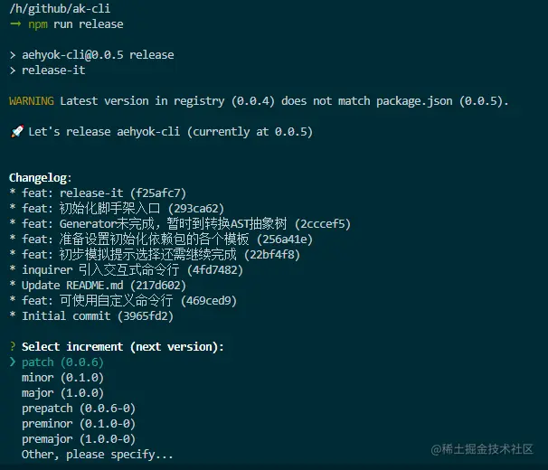

---
sidebar:
group:
title: release-it
isTimeLine: true
date: 11-16-2023
tags:
categories:
sticky: 1
---
# release-it


## release-it能干什么

* 我们先正常提交我们自己的代码，需求或bug以及其他
* 自动根据上一个版本标签（Tag）与最新历史进行对比并产出日志
* conventional-changelog将变更写入到CHANGELOG.md
* 解析日志内容更新package.json的版本号
* 提交内容变化并打上版本标签
* 打开浏览器github，发布change-log版本

## 使用

不多bb先安装

```shell
npm i release-it
```

package.json添加一条命令

```json
"scripts": {
    "release": "release-it"
  },
```

运行
```shell
npm run release
```




### 生成了changelog但是没有地方进行记录,于是release-it/conventional-changelog

安装

```js
// npm i @release-it/conventional-changelog -D
```

配置 .release-it.json

```json
{
  "github": {
    "release": true
  },
  "git": {
    "commitMessage": "release: v${version}"
  },
  "npm": {
    "publish": false
  },
  "hooks": {
    "after:bump": "echo 更新版本成功"
  },
  "plugins": {
    "@release-it/conventional-changelog": {
      "preset": "angular",
      "infile": "CHANGELOG.md"
    }
  }
}
```

运行 ...
