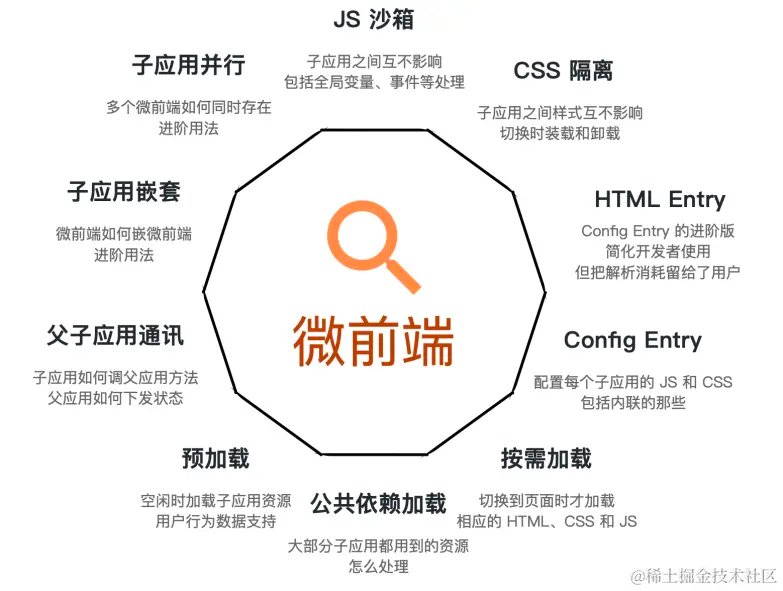
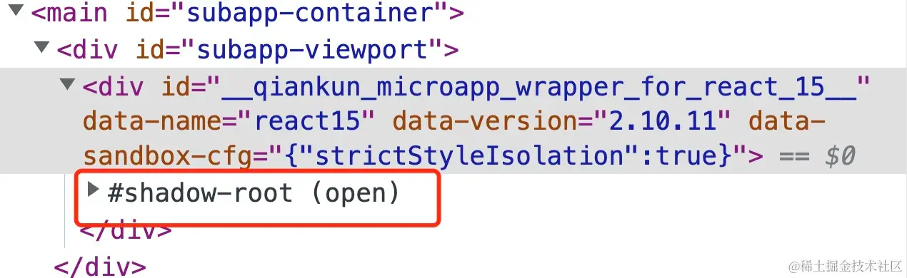

---
sidebar:
title: qiankun深入
step: 6
isTimeLine: true
date: 2020-09-14
---

# qiankun


* 生命周期篇；
* IE 兼容篇；
* 生产环境部署篇；
* 性能优化、缓存方案篇；


qiankun基于single-spa

QianKun 基于 single-spa ，阿里系开源的微前端框架，应该也是大家接触最多的了，社区比较活跃，这点比较重要。
QianKun对single-spa方案进行完善，主要的完善点：

* 子应用资源由 js 列表修改进为一个url，大大减轻注册子应用的复杂度  
* 实现应用隔离，完成js隔离方案  （window工厂）  和css隔离方案  （类vue的scoped）
* 增加资源预加载能力，预先子应用html、js、css资源缓存下来，加快子应用的打开速度





## 工作原理

应用加载：qiankun 通过动态创建 script 标签的方式加载子应用的入口文件。加载完成后，会执行子应用暴露出的生命周期函数。

生命周期管理：qiankun 要求每个子应用都需要暴露出 bootstrap、mount 和 unmount 三个生命周期函数。bootstrap 函数在应用加载时被调用，mount 函数在应用启动时被调用，unmount 函数在应用卸载时被调用。

沙箱隔离：qiankun 通过 Proxy 对象创建了一个 JavaScript 沙箱，用于隔离子应用的全局变量，防止子应用之间的全局变量污染。

样式隔离：qiankun 通过动态添加和移除样式标签的方式实现了样式隔离。当子应用启动时，会动态添加子应用的样式标签，当子应用卸载时，会移除子应用的样式标签。

通信机制：qiankun 提供了一个全局的通信机制，允许子应用之间进行通信。


# JS沙箱是怎么做隔离的

- import-html-entry 

> import-html-entry 能够获取到各个项目打包后的 index.html 资源，并且自由地控制各个脚本、样式文件的加载、执行时机

### 使用


```js
import importHTML from 'import-html-entry';

importHTML('//localhost:7104').then(res => {
  const { execScripts, getExternalScripts, getExternalStyleSheets } = res;
  // 执行脚本，控制台输出： '我是 7104 端口'
  execScripts().then(exports => {
    // 获取导出的内容，控制台输出： function main () {console.log('我是 main 函数')}
    console.log(exports) 
  })
  
  // 获取并执行外部脚本
  // scripts 是个数组，数组中的每一项都是字符串化的脚本文件
  getExternalScripts().then(scripts => {
    // 执行脚本，控制台输出： '我是 7104 端口'
    scripts.forEach(eval);
  });

  // 获取外部样式表
  getExternalStyleSheets().then(styleSheets => {
    // styleSheets 是个数组，数组中的每一项都是字符串化的样式文件
    styleSheets.forEach(styleSheet => {});
  });
});

```

### 原理实现
```js
const executableScript = `
  ;(function(window, self, globalThis){
    ;${scriptText}${sourceUrl}
  }).bind(window.proxy)(window.proxy, window.proxy, window.proxy);
`

eval.call(window, executableScript)


 // -- > 

// 把要执行 JS 代码放在一个立即执行函数中，且函数入参有 window, self, globalThis
// 给这个函数 绑定上下文 window.proxy
// 执行这个函数，并 把上面提到的沙箱对象 window.proxy 作为入参分别传入

function fn(window, self, globalThis) {
    // 你的 JavaScript code
}

const bindedFn = fn.bind(window.proxy);

bindedFn(window.proxy, window.proxy, window.proxy);


```

## 3 种沙箱：

沙箱原理实现参考--
https://juejin.cn/post/7308583491934994470?searchId=202312051138171E5BF3CDF6DD10C77C67#heading-2

SnapshotSandbox：记录 window 对象，每次 unmount 都要和微应用的环境进行 Diff
LegacySandbox：在微应用修改 window.xxx 时直接记录 Diff，将其用于环境恢复
ProxySandbox：为每个微应用分配一个 fakeWindow，当微应用操作 window 时，其实是在 fakeWindow 上操作


https://juejin.cn/post/7148075486403362846?searchId=20231117113416A643EB13D82F74CBD53C

## 样式隔离

- scoped css  
如果开启了 experimentalStyleIsolation 选项，qiankun 会使用 scoped css 的方式来进行样式隔离。

```css
// 默认样式
.react15-icon { 
  height: 400px; 
}

// 加上特定属性选择器前缀后
div[data-qiankun="react15"] .react15-icon { 
  height: 400px; 
}

```


- shadow dom    

当配置为 { strictStyleIsolation: true } 时， qiankun 会为每个微应用的容器包裹上一个 shadow dom



shadow dom 下的样式 只会应用于其内部的元素，不会泄漏到外部的文档或其他 shadow dom 中的元素；从而达到样式隔离的目的。

> 需要强调的是，shadow dom 的 DOM 访问方法、样式选择器等许多特性与普通 DOM 都有所差异，因此在使用时会有许多限制，需要谨慎开启！


## qiankun的通信设计

> 发布-订阅的设计模式

**用法**

qiankun提供了initGlobalState(state)定义全局状态，返回通信方法:

* onGlobalStateChange 监听state变化，通知触发更新
* setGlobalState 更新state
* offGlobalStateChange 注销函数，不再监听state

主应用

```js
import { initGlobalState, MicroAppStateActions } from 'qiankun';


// 初始化 state
const actions: MicroAppStateActions = initGlobalState(state);


actions.onGlobalStateChange((state, prev) => {
  // state: 变更后的状态; prev 变更前的状态
  console.log(state, prev);
});
actions.setGlobalState(state);
actions.offGlobalStateChange();
```

微应用

```js
// 从生命周期 mount 中获取通信方法，使用方式和 master 一致
export function mount(props) {
  props.onGlobalStateChange((state, prev) => {
    // state: 变更后的状态; prev 变更前的状态
    console.log(state, prev);
  });

  props.setGlobalState(state);
}
```

**源码解析**

https://juejin.cn/post/7308583491934994470?searchId=202312051138171E5BF3CDF6DD10C77C67#heading-2


## 通信 - qiankun中如何实现父子项目间的通信？如果让你实现一套通信机制，你该如何实现？

* Actions 通信：qiankun 官方提供的通信方式，适合业务划分清晰，较简单的微前端应用。这种通信方式主要通过 setGlobalState 设置 globalState，并通过 onGlobalStateChange 和 offGlobalStateChange 来注册和取消 观察者 函数，从而实现通信。
* 自己实现一套通信机制（可以思考一下如何追踪State状态，类似Redux模式

全局变量：在全局（window）对象上定义共享的属性或方法。这种方式简单明了，但有可能导致全局污染，需要注意变量命名以避免冲突。
自定义事件：使用原生的 CustomEvent 或类似的第三方库来派发和监听自定义事件。这种方式避免了全局污染，更加符合模块化的原则，但可能需要更复杂的事件管理。

2.1. 定义一个全局的通信对象，例如 window.globalEvent，这个对象提供两个方法，emit 和 on。
2.2. emit 方法用于派发事件，接收事件名称和可选的事件数据作为参数。
2.3. on 方法用于监听事件，接收事件名称和回调函数作为参数。当相应的事件被派发时，回调函数将被执行。

```js
window.globalEvent = {
  events: {},
  emit(event, data) {
    if (!this.events[event]) {
      return;
    }
    this.events[event].forEach(callback => callback(data));
  },
  on(event, callback) {
    if (!this.events[event]) {
      this.events[event] = [];
    }
    this.events[event].push(callback);
  },
};
```


**1.在主项目中使用qiankun注册子项目时，如何解决子项目路由的hash与history模式之争？**

如果主项目使用 history 模式，并且子项目可以使用 history 或 hash 模式，这是 qiankun 推荐的一种形式。在这种情况下，子项目可以选择适合自己的路由模式，而且对于已有的子项目不需要做太多修改。但是子项目之间的跳转需要通过父项目的 router 对象或原生的 history 对象进行。

**2. 如果主项目和所有子项目都采用 hash 模式，可以有两种做法：**

* 使用 path 来区分子项目：这种方式不需要对子项目进行修改，但所有项目之间的跳转需要借助原生的 history 对象。
* 使用 hash 来区分子项目：这种方式可以通过自定义 activeRule 来实现，但需要对子项目进行一定的修改，将子项目的路由加上前缀。这样的话，项目之间的跳转可以直接使用各自的 router 对象或 <router-link>。

**3. 如果主项目采用 hash 模式，而子项目中有些采用 history 模式

这种情况下，子项目间的跳转只能借助原生的 history 对象，而不使用子项目自己的 router 对象。对于子项目，可以选择使用 path 或 hash 来区分不同的子项目。**

## 在qiankun中，如果实现组件在不同项目间的共享，有哪些解决方案？

1. 父子项目间的组件共享：主项目加载时，将组件挂载到全局对象（如window）上，在子项目中直接注册使用该组件。
2. 子项目间的组件共享（弱依赖）：通过主项目提供的全局变量，子项目挂载到全局对象上。子项目中的共享组件可以使用异步组件来实现，在加载组件前先检查全局对象中是否存在，存在则复用，否则加载组件。
3. 子项目间的组件共享（强依赖）：在主项目中通过loadMicroApp手动加载提供组件的子项目，确保先加载该子项目。在加载时，将组件挂载到全局对象上，并将loadMicroApp函数传递给子项目。子项目在需要使用共享组件的地方，手动加载提供组件的子项目，等待加载完成后即可获取组件。

需要注意的是，在使用异步组件或手动加载子项目时，可能会遇到样式加载的问题，可以尝试解决该问题。另外，如果共享的组件依赖全局插件（如store和i18n），需要进行特殊处理以确保插件的正确初始化。

如果让你设计一个自动化部署，如何设计
如何保证代码质量
如何保证组件库质量
子项目版本如何管理，子项目更新版本后，如何让依赖他的项目也构建
主版本。次版本。补丁版本，什么时候需要发布补丁版本，什么时候需要发布主版本
webpack和vite区别


todo

* mini版qiankun手撸代码  -> 

https://juejin.cn/post/7294474535021510683?searchId=20231117113416A643EB13D82F74CBD53C

* 使用上坑点

https://juejin.cn/post/7114589692560932878?searchId=20231117113416A643EB13D82F74CBD53C


* [微前端qiankun从搭建到部署的实践](https://juejin.cn/post/6875462470593904653#heading-9)


