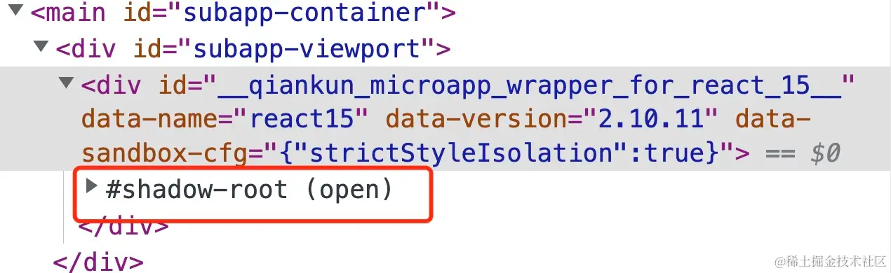

---
sidebar:
title: qiankun深入
step: 6
isTimeLine: true
date: 2020-09-14
---

# qiankun

qiankun基于single-spa

# JS沙箱是怎么做隔离的

- import-html-entry 

> import-html-entry 能够获取到各个项目打包后的 index.html 资源，并且自由地控制各个脚本、样式文件的加载、执行时机

### 使用


```js
import importHTML from 'import-html-entry';

importHTML('//localhost:7104').then(res => {
  const { execScripts, getExternalScripts, getExternalStyleSheets } = res;
  // 执行脚本，控制台输出： '我是 7104 端口'
  execScripts().then(exports => {
    // 获取导出的内容，控制台输出： function main () {console.log('我是 main 函数')}
    console.log(exports) 
  })
  
  // 获取并执行外部脚本
  // scripts 是个数组，数组中的每一项都是字符串化的脚本文件
  getExternalScripts().then(scripts => {
    // 执行脚本，控制台输出： '我是 7104 端口'
    scripts.forEach(eval);
  });

  // 获取外部样式表
  getExternalStyleSheets().then(styleSheets => {
    // styleSheets 是个数组，数组中的每一项都是字符串化的样式文件
    styleSheets.forEach(styleSheet => {});
  });
});

```

### 原理实现
```js
const executableScript = `
  ;(function(window, self, globalThis){
    ;${scriptText}${sourceUrl}
  }).bind(window.proxy)(window.proxy, window.proxy, window.proxy);
`

eval.call(window, executableScript)


 // -- > 

// 把要执行 JS 代码放在一个立即执行函数中，且函数入参有 window, self, globalThis
// 给这个函数 绑定上下文 window.proxy
// 执行这个函数，并 把上面提到的沙箱对象 window.proxy 作为入参分别传入

function fn(window, self, globalThis) {
    // 你的 JavaScript code
}

const bindedFn = fn.bind(window.proxy);

bindedFn(window.proxy, window.proxy, window.proxy);


```

## 3 种沙箱：

SnapshotSandbox：记录 window 对象，每次 unmount 都要和微应用的环境进行 Diff
LegacySandbox：在微应用修改 window.xxx 时直接记录 Diff，将其用于环境恢复
ProxySandbox：为每个微应用分配一个 fakeWindow，当微应用操作 window 时，其实是在 fakeWindow 上操作


https://juejin.cn/post/7148075486403362846?searchId=20231117113416A643EB13D82F74CBD53C

## 样式隔离

- scoped css  
如果开启了 experimentalStyleIsolation 选项，qiankun 会使用 scoped css 的方式来进行样式隔离。

```css
// 默认样式
.react15-icon { 
  height: 400px; 
}

// 加上特定属性选择器前缀后
div[data-qiankun="react15"] .react15-icon { 
  height: 400px; 
}

```


- shadow dom    

当配置为 { strictStyleIsolation: true } 时， qiankun 会为每个微应用的容器包裹上一个 shadow dom



shadow dom 下的样式 只会应用于其内部的元素，不会泄漏到外部的文档或其他 shadow dom 中的元素；从而达到样式隔离的目的。

> 需要强调的是，shadow dom 的 DOM 访问方法、样式选择器等许多特性与普通 DOM 都有所差异，因此在使用时会有许多限制，需要谨慎开启！


## todo

* mini版qiankun手撸代码  -> 

https://juejin.cn/post/7294474535021510683?searchId=20231117113416A643EB13D82F74CBD53C

* 使用上坑点

https://juejin.cn/post/7114589692560932878?searchId=20231117113416A643EB13D82F74CBD53C


