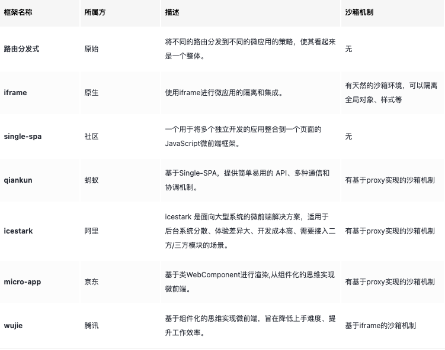

# 实现方式




## 路由分发式微前端 -nginx 

Nginx服务器的反向代理来将请求分发到不同的微应用

```text
http {
  server {
    listen       80;
    server_name  xxx;
    location /api/ {
      proxy_pass http://192.168.0.3:8000/api;
    }
    location /web/admin {
      proxy_pass http://192.168.0.1/pc/app1;
    }
    location /web/notifications {
      proxy_pass http://192.168.0.2/pc/app1;
    }
    location / {
      proxy_pass /;
    }
  }
}

```

**特点**

* 主要依赖于路由来区分和加载不同的微应用。
* 当用户导航到某个路由时，主应用将决定加载哪个子应用。
* 每个子应用可以拥有自己独立的技术栈、开发团队和部署策略。

**优点**

* 团队独立性：每个团队可以独立地开发、测试和部署自己的微应用。
* 技术栈灵活性：不同的微应用可以使用不同的技术栈。
* 风险隔离：一个微应用的问题不太可能影响到其他微应用。

**缺点**

* 复杂性增加：需要管理子应用之间的通信、样式隔离和JS隔离等问题；
* 状态共享复杂：管理多个子应用之间的共享状态可能会变得复杂；
* 用户体验：由于每次切换应用时，浏览器都需要重新加载页面，可能会影响用户体验；
* 微应用并存问题：多个微应用无法在同一页面并存，这可能限制了一些交互设计；
* 局限性：由于依赖于路由进行应用分发，这种方法在一些使用场景上可能会相对受限。

## iframe

使用iframe标签来嵌入和隔离不同的微应用，实现微前端的设计原则。每个子应用都在其自己的iframe容器中运行，与其他子应用完全隔离

**优点**

* 隔离性强：iframe提供了天然的沙箱隔离，使得CSS、JavaScript、DOM之间不会相互影响。
* 实现简易：只需通过加载相应的iframe页面，就能独立运行子应用。
* 兼容性好：基于标准HTML特性实现的iframe，兼容各种浏览器。
* 扩展性强：可以同时加载和显示多个子应用。

**缺点**

* URL不同步：iframe的URL与主应用的URL不同步，导致浏览器刷新时iframe的URL状态可能丢失，后退或前进按钮可能无法正常使用。
* UI不同步：由于DOM结构不共享，可能会导致用户界面（UI）的不一致。
* 全局上下文隔离：全局上下文完全隔离，内存变量不共享。这意味着iframe内外系统的通信、数据同步等可能会变得复杂。例如，主应用的cookie需要透传到根域名都不同的子应用中才能实现免登效果。
* 性能问题：由于每次进入子应用都是一次浏览器上下文重建、资源重新加载的过程，可能导致应用性能降低，影响用户体验。

##  single-spa

**优点**

* 多框架支持：single-spa支持多种前端框架，包括React、Angular、Vue等。这意味着你可以在同一应用中混合使用不同的前端技术栈，无需重写现有代码。
* 独立部署和开发：每个微前端应用都可以独立部署和开发，使得团队可以独立地迭代和发布他们的部分，而不会影响整个应用。
* 增量升级：在面对复杂场景时，全量技术栈升级或重构通常难度较大。微前端提供了一种实施渐进式重构的有效策略。
* 友好的jQuery支持：single-spa对jQuery的支持友好，方便了传统网页转换为微前端的过程。

**缺点**

* 复杂性：single-spa作为一个框架，需要额外的学习和配置，可能增加项目的复杂性。
* 性能开销：按需加载和运行多个微前端应用可能会带来一些性能开销，尤其是在初始加载时，需要仔细优化和配置以保证良好的性能表现。
* 无沙箱机制：对于CSS和JavaScript的隔离需要手动实现，例如通过Shadow DOM或者Proxy。
* 无内置通信机制：微应用间的通信需要自己实现，可能需要借助全局状态、自定义事件或其他第三方库。
* 无内置应用生命周期管理：single-spa并未提供应用的加载和卸载机制，需要开发者自行实现。
* 无全局状态管理：single-spa本身并不提供全局状态管理，需要与其他状态管理库配合使用。

## qiankun

基于single-spa开发的微前端框架

原理

* qiankun是基于single-spa实现的微前端框架，但有所不同，它采用html Entry的方式加载子应用。
* qiankun提供了两种CSS隔离模式：严格模式strictStyleIsolation（基于Shadow DOM）和实验性模式experimentalStyleIsolation（基于scoped CSS的思想，通过运行时修改CSS选择器来实现子应用间的样式隔离）。
* qiankun设计了三种沙箱机制：单例沙箱（包括SnapshotSandbox基于diff和legacySandBox基于proxy）以及多例沙箱（proxySandbox基于proxy）。
* qiankun提供了简单的props和actions全局状态管理和通信机制。

**优点**

* 自动分析和加载：qiankun能自动分析html以获取js和css，不需要开发者手动指定如何加载。
* 沙箱机制：基于快照和Proxy的思路实现了JS隔离，基于Shadow Dom和scoped css的思路实现了CSS隔离。
* 提供通信机制：qiankun提供了acitons全局状态管理的机制和props，用于应用间的通信。
* 自动应用加载和卸载：qiankun能监听路由变化，实现当前路由对应的子应用的自动加载和卸载。

**缺点**

* 路由限制：qiankun基于路由匹配，无法同时激活多个子应用。
* 适配成本高：从生命周期、静态资源路径、路由、webpack配置等方面都需要做一系列的适配工作，可能导致适配成本较高。
* CSS沙箱隔离不完全：严格模式基于Shadow DOM，虽然形成了天然的隔离，但第三方组件的弹窗默认挂在到body下面，这样弹窗中的自定义样式会失效，需要手动设置挂载节点。实验性模式类似于scoped css模式来隔离，对于样式名冲突时，也可能出现问题。
* 不支持ESM脚本：qiankun官方不支持如vite等ESM脚本的运行。
* 可能导致数据通信沉重：由于数据都是由基座派发下来的，可能在大量数据交互的情况下导致通信沉重。


## icestark

优先级低，暂不了解

## 京东 micro-app

以类WebComponent的方式进行渲染，采用了组件化的思维来实现微前端

**原理**

micro-app借鉴了WebComponent的思想，它通过CustomElement结合自定义的Shadow DOM，将微前端封装成一个类WebComponent组件，从而实现微前端的组件化渲染。

**优点**

* 简单易用：micro-app的使用方式类似于iframe，上手简单。
* 侵入性低：对原有代码的影响微乎其微。
* 功能丰富：micro-app提供了js沙箱、样式隔离、元素隔离、预加载、数据通信、静态资源补全等丰富的功能。隔离机制类似于qiankun，例如，样式隔离基于scoped css，js沙箱机制基于Proxy。
* 零依赖：micro-app不依赖于任何第三方库。

**缺点**

* 静态资源补全问题：静态资源补全是基于父应用的，而非子应用。这需要开发者自己手动解决。
* 接入成本：虽然接入成本相比qiankun有所降低，但路由依旧存在依赖。
* 路由状态保持问题：在多应用激活后，无法保持各子应用的路由状态，刷新后全部丢失。
* 隔离问题：css沙箱使用scoped css思想，但无法绝对隔离，例如可能存在样式名冲突。js沙箱在做全局变量查找缓存时，虽然性能有所优化，但仍存在隔离问题。
* Vite运行支持：虽然支持vite运行，但必须使用plugin改造子应用，且js代码无法进行沙箱隔离。
* 浏览器兼容性：对于不支持webcomponent的浏览器，micro-app没有进行降级处理


## wujie

Wujie框架的核心技术是基于WebComponent容器与iframe沙箱来实现微前端。


