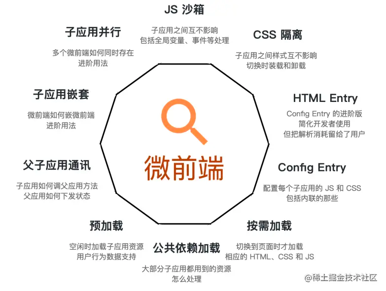
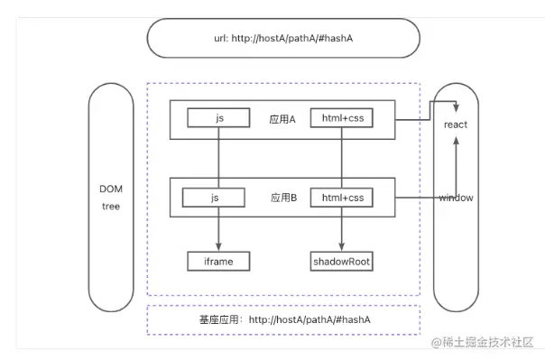

---
sidebar:
title: 微前端
step: 6
isTimeLine: true
date: 2020-09-14
tags:
- 微前端
---

# 微前端是什么

微前端的概念是由ThoughtWorks在2016年提出的，它借鉴了微服务的架构理念，核心在于将一个庞大的前端应用拆分成多个独立灵活的小型应用，将多个可以独立开发、独立运行、独立部署的小型应用融合为一个应用。

# 有什么用？

* 独立开发/部署： 各个团队之间仓库独立，单独部署，互不依赖
* 技术栈无关：主框架不限制接入应用的技术栈，子应用可自主选择技术栈
* 增量升级： 当一个应用庞大之后，技术升级或重构相当麻烦，而微应用具备渐进式升级的特性
* 提升效率： 应用越庞大，越难以维护，协作效率越低下。微应用可以很好拆分，提升效率
* 模块化开发：微前端架构强调模块化，每个微应用都是一个独立的模块，**代码更加清晰，更容易维护**。。

# 具体应用场景有哪些？

* 兼容遗留系统：团队需要在兼容已有系统的前提下，使用新框架去开发新功能。此时团队如果需要使用新框架，新技术去开发新的应用，使用微前端是很好的解决方案。
* 应用聚合：大型互联网公司都会为用户提供很多应用和服务，如何为用户呈现具有统一用户体验的应用聚合成为必须解决的问题。而在大型商业公司内部，往往部署有大量的软件服务。如何为员工提供服务聚合，提供员工工作效率，成为企业内部IT建设的重中之重。前端聚合已成为一个技术趋势，目前比较理想的解决方案就是微前端。
* 团队间共享：不用应用之间往往存在很多可以共享和功能和服务，如果在团队之间进行高质量的共享成为提高研发效率的一条重要途径。微前端可以采用组件或者服务的方式进行团队间的技术共享。
* 活动营销页、红包落地页、明星投票页等等一系列与营销活动相关的移动端页面。

# 微前端实现历程

### iframe

优点：  
非常简单，无需任何改造
完美隔离，JS、CSS 都是独立的运行环境
不限制使用，页面上可以放多个 iframe 来组合业务

缺点：  
无法保持路由状态，刷新后路由状态就丢失（这点也不是完全不能解决，可以讲路由作为参数拼接在链接后，刷新时去参数进行页面跳转）
完全的隔离导致与子应用的交互变得极其困难
iframe 中的弹窗无法突破其本身
整个应用全量资源加载，加载太慢


### single-spa

> single-spa 通过劫持路由的方式来做子应用之间的切换
> 
> 缺陷：
> 1、single-spa 加载的微应用时 需要以 JS 文件作为入口，这会把所有的资源文件打包在一个 bundle 中，造成最终输出的 bundle 十分庞大
> 2、对于每一个微应用，我们都需要手动实现它的生命周期，并暴露给 single-spa 使用

```js
// my-single-spa
let apps = [];

// 注册微应用
export function registerApplication(options) {
  const {
    name,
    app,
    activeWhen
  } = options
  apps.push({
    name: name,
    loadApp: app,
    activeWhen,
    status: 'NOT_LOADED'
  });
}

// 加载微应用
export function start() {
  started = true;
  reroute();
}

// 路由变化回调
export function reroute() {
  const activeApps = [];
  const inactiveApps = [];

  apps.forEach(app => {
    if (app.activeWhen(window.location.href)) {
      activeApps.push(app);
    } else {
      inactiveApps.push(app);
    }
  });

  activeApps.forEach(async app => {
    if (app.status === 'NOT_LOADED') {
      app.loadApp().then(result => {
        app.status = 'NOT_BOOTSTRAPPED';
        app.bootstrap = result.bootstrap;
        app.mount = result.mount;
        app.unmount = result.unmount;
      }).then(() => {
        app.bootstrap().then(() => {
          app.status = 'NOT_MOUNTED';
        }).then(() => {
          app.mount();
          app.status = 'NOT_MOUNTED';
        }).then(() => {
          app.status = 'MOUNTED';
        });
      })
    }
  });

  inactiveApps.forEach(async app => {
    if (app.status === 'MOUNTED') {
      app.status = 'UNMOUNTING';
      app.unmount().then(() => {
        app.status = 'NOT_LOADED';
      });
    }
  });
}

window.addEventListener('hashchange', reroute);
window.addEventListener('popstate', reroute);

```


# 微前端都有哪些

阿里系的qiankun、京东的micro-app、腾讯wujie

### 区别 

- 1.渲染方式上：
-spa的渲染方式，采用了监听URL的变化来进行加载不同的子应用，这样的方法会感觉太原始以及繁琐了，所以在渲染方式，micro-app以及wujie都采用了webComponent的方式进行渲染。（这中间其实也有一点问题，因为没有看源码，micro-app官网说是类似web Component）
有可能有些人不太了解这个API，这个API是新出的，有些浏览器目前不支持。
简单介绍一下web Component是什么？
我们都知道Vue，React都有组件，可以在项目中去实现组件化的思想。而Web Component就是浏览器组件化的一个方案，是浏览器支持的组件，可以通用于各种框架，某种意义算是原生的，而像input等浏览器的控件都算是一个WebComponent。
而这个API有比较重要的方法，第一个就是customElement，这个是自己可以创建一个组件，可以对做属性监听，还有样式改变各种东西，做一个浏览器原生组件，而wujie和micro-app就是通过这种方式创建了一个子应用，来加载子应用。这样去优化渲染方式更加优雅以及方便。第二个是shadow DOM，这个节点在外层的DOM是没办法看得到这个DOM，可以将DOM树挂载到这个节点上，这样外面的dom节点没办法看到里面的，然后里面也没办法看到外面的dom节点，形成一个天生的隔离。

- 2.CSS样式隔离
qiankun框架是采用自己的两个沙箱，第一个沙箱是利用我们刚刚说的WebComponent的第二个方法，将子应用挂载到ShadowDom节点下面，这样就形成了天然的CSS隔离，但是这样的隔离存在一定的问题，就是第三方组件的弹窗是默认挂载到主应用的DOM节点，这样Shadow Dom里面的样式没办法作用到主应用，所以弹窗样式就消失了。目前的解决方法是在第三方组件中手动设置挂载节点，挂载到Shadow Dom上。第二个沙箱就是采用了像vue，react的方式的CSS Moudles，通过作用域（scpoed）等来实现隔离。
micro-app框架是采用了子应用的CSS名字前面加上子应用app的名字来区分css的样式，防止不同的子应用出现冲突，但是还是存在冲突的可能，如果主应用有一摸一样的css名字，那主子应用就会出现css样式冲突，并不能彻底解决，特别是比较复杂的大型项目中。micro-app框架还提供shadow dom的隔离方法来使用，不过依然存在弹窗样式问题。
wujie框架css样式隔离采用了shadow dom的方式来进行隔离，但是解决了弹窗样式问题，这个方法得益于wujie框架的js隔离采用了iframe的方式，在进行挂载的时候，对iframe进行操作的时候，iframe通过proxy的方法将dom劫持到shadow dom上，这样挂载的节点操作的时候就直接被拦截挂载到shadow dom上，完美解决。

- 3.JS隔离
qiankun框架以及micro-app框架采用同样的JS隔离方法，当然micro-app在加载的时候做了一些优化，要快一些，但是方案基本是不变的。
一共存在三种沙箱，前两种是单例模式，后一种不是。
第一种legacySandBox
legacySandBox核心就是在子应用加载的时候去还原之前子应用的状态，当卸载的时候还原主应用的状态。当加载子应用的时候，将修改的状态应用到子应用上，卸载的时候记录子应用的状态修改，还原主应用。对比的方法是监听修改的属性并记录，进行记录修改的状态。
第二种snapshotSandBox
snapshotSandBox核心是在子应用激活 / 卸载时分别去通过快照的形式记录/还原状态来实现沙箱的。当第三种不被支持的时候，会降级到第二种方式。这种方式跟第二种的区别在于是将子应用的状态与主应用的状态做diff去记录修改的状态。
第三种 proxySandBox
第三种常应用于多实例的场景。这种沙箱的核心在于在每个子应用的内部，会创造一个fake window对象，这样如果不是window原有的属性，都将记录子fake window上，如果是原有属性，就会改变原有属性，这种方式是通过Proxy以及defineProperty的方式实现。
除此之外，wujie微前端还采用了js预加载，而其他两种框架只能预加载静态资源，css等，而其采用的方式是新的一个api，requestIdeCallbacks，这个API会将运行放在每一帧的空余时间内运行，不影响阻塞dom操作以及各种交互，充分利用了资源，使得首页加载速度加快很多。


# 微前端需要解决的问题




## qiankun为代表

qiankun是蚂蚁金服前端团队基于single-spa开发的微前端框架，它提供了更完善、更先进的功能和解决方案，以帮助开发者更轻松地构建微前端应用。
原理

* qiankun是基于single-spa实现的微前端框架，但有所不同，它采用html Entry的方式加载子应用。
* qiankun提供了两种CSS隔离模式：严格模式strictStyleIsolation（基于Shadow DOM）和实验性模式experimentalStyleIsolation（基于scoped CSS的思想，通过运行时修改CSS选择器来实现子应用间的样式隔离）。
* qiankun设计了三种沙箱机制：单例沙箱（包括SnapshotSandbox基于diff和legacySandBox基于proxy）以及多例沙箱（proxySandbox基于proxy）。
* qiankun提供了简单的props和actions全局状态管理和通信机制。

demo可参考：qiankun 使用方式代码Github

主应用

只有主应用需要安装qiankun，子应用不需要
name，entry，container，activeRule，当判断页面路由匹配到activeRule时，就去动态创建script，把entry中的文件加载出来，因为子应用mount生命周期判断了渲染的#app，所以就可以把内容渲染到自定义的container中
activeRule 则是和 window.location.pathname匹配，通过一级路由标识子应用

子应用接入

判断是否有传入的container，来判断是要渲染到主应用的#app，还是自己的#app
需要打包成一个umd格式的库：为了能通过window['app-name1']拿到子应用声明的生命周期，配合子应用的export的生命周期

实现原理
1、监视路由

window.location.pathname等相关变化，触发接下来的匹配逻辑

2、匹配子应用

重写路由window.popState, replaceState，在保留原有功能的基础上，增加子应用entry映射相关逻辑
针对变化的路由，匹配子应用

3、加载子应用

import-html-entry 解析入口文件中的html 和 script
动态创建script去执行jsCode
通过umd模块获取子应用，调用子应用mount方法，render子应用

4、渲染子应用

把js和html，渲染到提前预留的#app容器中


### 优点

自动分析和加载：qiankun能自动分析html以获取js和css，不需要开发者手动指定如何加载。
沙箱机制：基于快照和Proxy的思路实现了JS隔离，基于Shadow Dom和scoped css的思路实现了CSS隔离。
提供通信机制：qiankun提供了acitons全局状态管理的机制和props，用于应用间的通信。
自动应用加载和卸载：qiankun能监听路由变化，实现当前路由对应的子应用的自动加载和卸载。

### 缺点

路由限制：qiankun基于路由匹配，无法同时激活多个子应用。
适配成本高：从生命周期、静态资源路径、路由、webpack配置等方面都需要做一系列的适配工作，可能导致适配成本较高。
CSS沙箱隔离不完全：严格模式基于Shadow DOM，虽然形成了天然的隔离，但第三方组件的弹窗默认挂在到body下面，这样弹窗中的自定义样式会失效，需要手动设置挂载节点。实验性模式类似于scoped css模式来隔离，对于样式名冲突时，也可能出现问题。
不支持ESM脚本：qiankun官方不支持如vite等ESM脚本的运行。
可能导致数据通信沉重：由于数据都是由基座派发下来的，可能在大量数据交互的情况下导致通信沉重。


## webComponent
浏览器原生API，
通过webComponent动态加载子应用，目前主流用同样方案的是无界和Micro App



https://juejin.cn/post/7212603829572911159#heading-9

```js
window.onload = () => {
    class WuJie extends HTMLElement {
        constructor() {
            super()
            this.init()
            this.getAttr('url')
        }
        init() {
          const shadow =  this.attachShadow({ mode: "open" }) //开启影子dom 也就是样式隔离
          const template = document.querySelector('#wu-jie') as HTMLTemplateElement
          console.log(template);
          
          shadow.appendChild(template.content.cloneNode(true))
        }
        getAttr (str:string) {
           console.log('获取参数',this.getAttribute(str));
           
        }

        //生命周期自动触发有东西插入
        connectedCallback () {
           console.log('类似于vue 的mounted');
        }
        //生命周期卸载
        disconnectedCallback () {
              console.log('类似于vue 的destory');
        }
        //跟watch类似
        attributeChangedCallback (name:any, oldVal:any, newVal:any) {
            console.log('跟vue 的watch 类似 有属性发生变化自动触发');
        }

    }
    
    window.customElements.define('wu-jie', WuJie)
}

```


