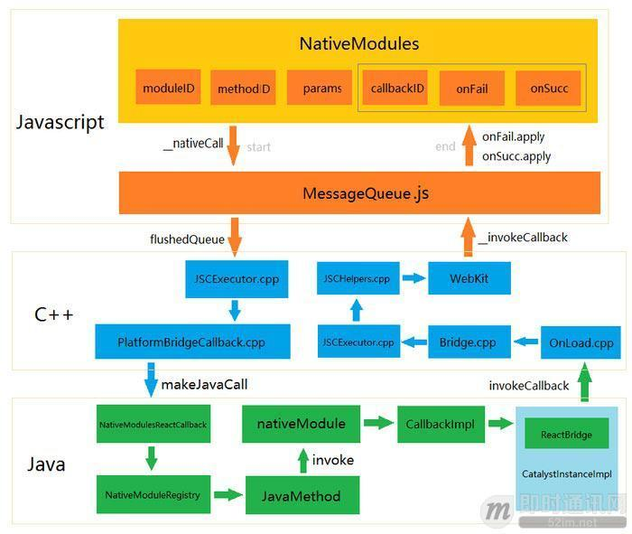
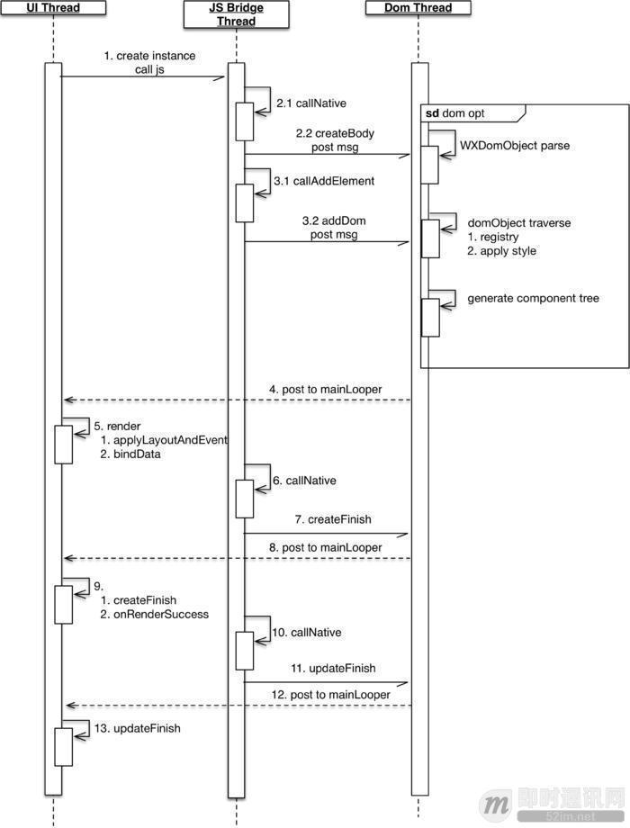

---
sidebar:
title: 前沿技术盘点
isTimeLine: true
date: 2024-08-14

---
# 前沿技术盘点

## 前沿技术盘点

## 服务端渲染：Nuxt.js、Next.js 和 Nest.js

* Nuxt.js 适合构建 Vue.js 应用程序的服务端渲染和静态站点生成，
* Next.js 适合构建 React 应用程序的服务端渲染和静态站点生成，
* Nest.js 适合构建 Node.js 后端应用程序。

### Nuxt.js

Nuxt.js 是一个基于 Vue.js 的服务端渲染框架，它提供了一些内置的功能来简化 Vue 应用程序的开发和部署。

Nuxt.js 支持服务端渲染(SSR)和静态站点生成(SSG)，使得网站在 SEO 和性能方面有很好的表现。

Nuxt.js 提供了一些内置的功能，例如路由、中间件、布局等，使得开发者可以更快地构建 Vue 应用程序。

### Next.js

Next.js 是一个基于 React 的服务端渲染框架，它提供了一些内置的功能来简化 React 应用程序的开发和部署。

Next.js 也支持服务端渲染(SSR)和静态站点生成(SSG)，使得网站在 SEO 和性能方面有很好的表现。

Next.js 提供了一些内置的功能，例如路由、数据预取、静态导出等，使得开发者可以更快地构建 React 应用程序。

### Nest.js

Nest.js 是一个基于 Node.js 的后端框架，它提供了一些内置的功能来简化 Node.js 应用程序的开发和部署。

Nest.js 主要用于构建 RESTful API、GraphQL 服务和 WebSocket 服务等后端应用程序。

Nest.js 提供了一些内置的功能，例如模块、控制器、服务、中间件等，使得开发者可以更快地构建 Node.js 应用程序。

## 跨平台方案盘点：React Native、weex、Flutter

### React Native

和前端开发不同：react native 所有的标签都不是真实控件，JS代码中所写控件的作用，类似 Map 中的 key 值。JS端通过这个 key 组合的 Dom ，最后Native端会解析这个 Dom ，得到对应的Native控件渲染，如 Android 中 标签对应 ViewGroup 控

### weex

实现原理
和 react native一样——weex 所有的标签也不是真实控件，JS 代码中所生成存的 dom，最后都是由 Native 端解析，再得到对应的Native控件渲染，如 Android 中 标签对应 WXTextView 控件。

weex 中文件默认为 .vue ，而 vue 文件是被无法直接运行的，所以 vue 会被编译成 .js 格式的文件，Weex SDK会负责加载渲染这个js文件。Weex可以做到跨三端的原理在于：在开发过程中，代码模式、编译过程、模板组件、数据绑定、生命周期等上层语法是一致的。不同的是在 JS Framework 层的最后，web 平台和 Native 平台，对 Virtual DOM 执行的解析方法是有区别的。

在 weex 中，主要包括三大部分：JS Bridge、Render、Dom，分别对应WXBridgeManager、WXRenderManager、WXDomManager，三部分通过WXSDKManager统一管理。其中 JS Bridge 和 Dom 都运行在独立的 HandlerThread 中，而 Render 运行在 UI 线程。

JS Bridge 主要用来和 JS 端实现进行双向通信，比如把 JS 端的 dom 结构传递给 Dom 线程。Dom 主要是用于负责 dom 的解析、映射、添加等等的操作，最后通知UI线程更新。而 Render 负责在UI线程中对 dom 实现渲染。

### 

https://cloud.tencent.com/developer/article/1183457

