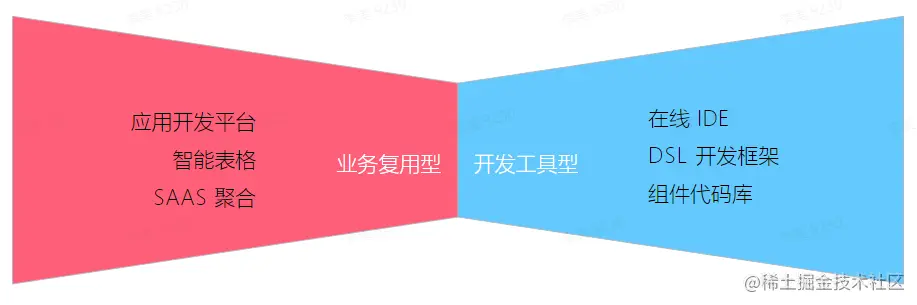
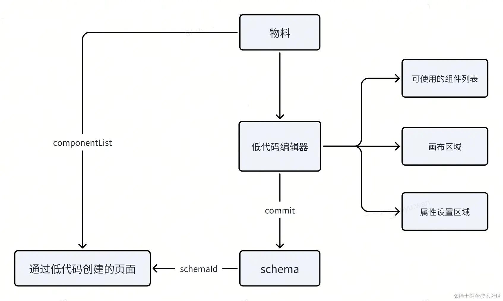

---
sidebar:
title: 低代码
step: 6
isTimeLine: true
date: 2020-09-14
---
# 低代码

* **阿里巴巴-开源**  
  - [低代码引擎 (LowCodeEngine)](https://github.com/alibaba/lowcode-engine)  
  - 宜搭（基于低代码引擎的商业产品）
  

* **百度-开源**  
  - [amis](https://github.com/baidu/amis) - 后端友好型低代码方案， 更符合后端

* **腾讯-开源**  
  - [微搭低代码引擎](https://github.com/Tencent/tmagic-editor)  
  - 微搭（商业产品）

* **华为-开源**  
  - [tiny-engine](https://github.com/huawei/tiny-engine) - 轻量级低代码引擎

* 网易云音乐： Tango

* 美乐低代码 - https://github.com/MetaLowCodeTeam/MetaLowCode
* shida - **视频可视化**搭建项目
* 金蝶云·苍穹 
* 明道云
* 简道云
* [Variant Form](https://github.com/vform666/variant-form) - 高性能表单设计器
* [OpenDataV](https://github.com/AnsGoo/openDataV) - 数据可视化低代码平台

[github-精选低代码 (LowCode) 资源列表](https://github.com/aliaszz/awesome-lowcode-component)

## 低代码

* 面向业务人员

  表单驱动

* 面向开发人员

  模型驱动

适合人事行政进行资料归档、OA审批，销售人员客户管理

# 低代码平台的实现思路

## 动态表单实现方案

* Formily——阿里巴巴统一前端表单解决方案
* [vue-json-schema-form](https://vue-json-schema-form.lljj.me/zh/guide/#%E5%A4%9A%E7%89%88%E6%9C%AC%E9%80%89%E6%8B%A9) 
* [form-create-designer](https://juejin.cn/post/7375733955893903371?searchId=202409141537557CBF1EB624650F274E8C#heading-10)[---文档地址](https://view.form-create.com/start_vue3
  )
* form-generator——基于Element UI表单设计及代码生成器
* H5-Dooring——H5页面搭建神器
* V6.Dooring——可视化大屏制作工具

## 参考

* https://juejin.cn/post/7283060133646286884?searchId=202405081615387514B9419759B005DB88
* https://juejin.cn/post/6999530464721666056
* https://juejin.cn/post/7164694758588153863

### go-view -- 可视化图表类 低代码
https://gitee.com/dromara/go-view#https://gitee.com/AHEAD4/go-view-docker

