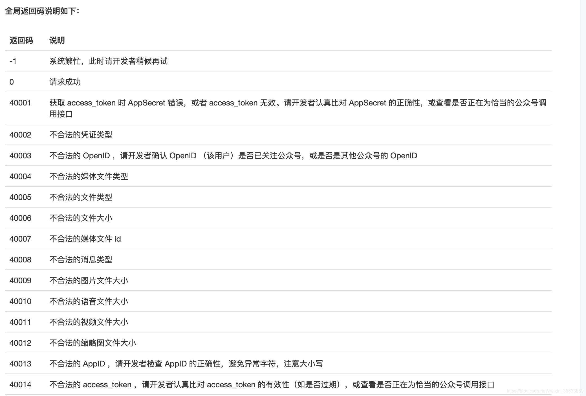

---
sidebar:
title: restful规范
date: 2024-05-14
tags:
- 前端规范
- restful
categories:
- 规范
---
# restful规范


# 什么是RESTful？

RESTful,简称REST。
1. 英文：Representational State Transfer。
2. 直译：表现层状态转化。
3. 本质：用URL定位资源，用HTTP动词（GET,POST,DELETE,DETC）描述操作。
4. 特点：RESTful是一种软件架构风格、设计风格，而不是标准，只是提供了一组设计原则和约束条件。它主要用于客户端和服务器交互类的软件。 基于这个风格设计的软件可以更简洁，更有层次，更易于实现缓存等机制。

# Restful API接口设计规范

## 协议
包含 http 和 https，使用 https 可以确保交互数据的传输安全。

## 路径规则|域名
路径又称 “终点”（endpoint），表示 API 的具体网址。
在 RESTful 架构中，每个网址代表一种资源（resource），所以网址中不能有动词，只能有名词，而且所用的名词往往与数据库的表格名对应。一般来说，数据库中的表都是同种记录的 “集合”（collection），所以 API 中的名词也应该使用复数。
包含两种形式：
a、主域名：https://api.example.com
b、子目录：https://example.org/api/

## 版本控制
版本号：v {n} n 代表版本号，分为整形和浮点型
整型：大功能版本发布形式；具有当前版本状态下的所有 API 接口，例如：v1,v2。
浮点型：为小版本号，只具备补充 api 的功能，其他 api 都默认调用对应大版本号的 api 例如：v1.1 v2.2。
放入位置：
1、将版本号放入URL中（方便直观）。
2、将版本号放在请求头。

## 请求类型
GET（SELECT）：从服务器取出资源（一项或多项）。
POST（CREATE）：在服务器新建一个资源。
PUT（UPDATE）：在服务器更新资源（客户端提供改变后的完整资源）。
PATCH（UPDATE）：在服务器更新资源（客户端提供改变的属性）。
DELETE（DELETE）：从服务器删除资源。

## 参数

### 地址栏参数
主要用于过滤查询
a、restful 地址栏参数 /api/v1/product/122 122 为产品编号，获取产品为 122 的信息
b、get 方式的查询字串，此种方式主要用于过滤查询，如下：
```text
?limit=10：指定返回记录的数量
?offset=10：指定返回记录的开始位置。
?page=2&per_page=100：指定第几页，以及每页的记录数。
?sortby=name&order=asc：指定返回结果按照哪个属性排序，以及排序顺序（sequence、order）。
?producy_type=1：指定筛选条件
```


### 请求body数据

主要用于提交新建数据

### 请求头

用于存放请求格式信息、版本号、token 密钥、语言等信息

```text
{
    Accept: 'application/json',     //json格式
    version: 'v1.0'                       //版本号
    Authorization: 'Bearer {access_token}',   //认证token
    language: 'zh'                      //语言
}
```

### 返回格式

默认返回格式：

```text
{
    code: 0,                         //状态码
    msg: 'ok',                       //提示信息
    data: {}                          //主体数据
}
```

使用 json 格式作为响应格式，状态码分为两种：
* a、statusCode: 系统状态码，用于处理响应状态，与 http 状态码保持一致，如：200 表示请求成功，500 表示服务器错误。
* b、code：业务状态码，用于处理业务状态，一般 0 标识正常，可根据需求自行设计错误码对照表




# 总结

url地址中只包含名词表示资源，使用http动词表示动作进行操作资源.

```text
GET /blog/getArticles --> GET /blog/Articles  获取所有文章
GET /blog/addArticles --> POST /blog/Articles  添加一篇文章
GET /blog/editArticles --> PUT /blog/Articles  修改一篇文章 
GET /rest/api/deleteArticles?id=1 --> DELETE /blog/Articles/1  删除一篇文章
```


