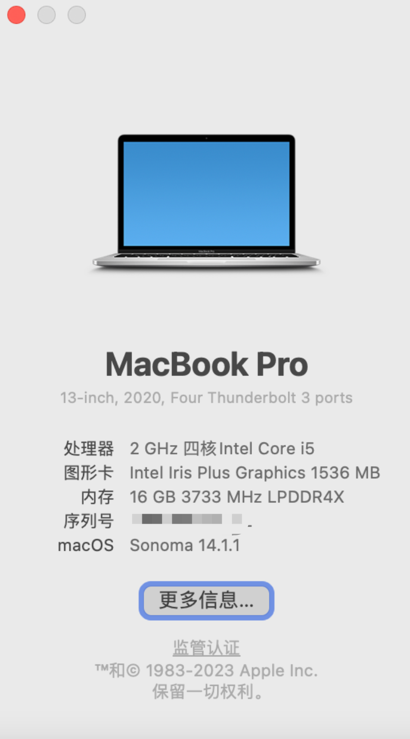

---
sidebar:
group:
title: stable diffusion部署
date: 2023-12-10
sticky: 1
---
# stable diffusion部署


## 前言

最近在看ai方面的知识，工具主要有 mj、sd、lora等，因为mj收费的原因，所以决定先本地部署一个sd试一下，这里记录一下本地部署的过程。

## sd本地部署

本地部署比较吃电脑配置，有条件的也可以使用云服务器部署（网上有白嫖三个月的教程）。

我的电脑配置：

win：1060显卡，6G显存，16G内存，一块521G的固态硬盘。
mac：


安装教程：

[Stable Diffusion 安装教程（附安装包）](https://blog.csdn.net/A2421417624/article/details/137766693)
[一学就会，Macpro本地部署 Stable Diffusion](https://zhuanlan.zhihu.com/p/652700145)
[Mac一键本地部署sd](http://www.hnbyed.com/news/4875.html)


### mac部署

**1、安装homebrew**

这一步巨慢无比，午饭都吃完了还没更新完

brew安装&更新慢：[更换国内镜像源](https://blog.csdn.net/itguangit/article/details/122192858)

**2、执行以下命令来一次性安装所有必要的依赖：**

brew install cmake protobuf rust python@3.10 git wget

**3、安装Python**

有两种方式来安装Python，你可以根据自己的需求选择其中一种

---

* **方式一：使用命令行直接安装**

执行以下命令来一次性安装所有必要的依赖：

```shell
brew install cmake protobuf rust python@3.10 git wget
```


---

* **方式二：使用Anaconda来创建虚拟环境（推荐）**

conda可以将各个环境隔离出来，库和包也互不影响


**安装conda**
```shell
brew install --cask anaconda
```

> 备注：这一步也巨慢无比，中间还报了一次443错误，果断从清华镜像源换成了中科大镜像源，虽然还是慢就是了
> 
> tip：源有可能也不能用，多换几个试一试

出现这个说明成功了


**配置环境变量， ~/.zshrc追加配置**

```shell
echo 'export PATH="/usr/local/anaconda3/bin:$PATH" ' >> ~/.zshrc
source ~/.zshrc
conda init zsh
```

**创建一个名为 sdwebui 的虚拟环境，指定Python版本为3.10.6**
```shell
conda create --name sdwebui python=3.10.6
```

**激活，进入SDWEBUI环境**

这里有个坑点：conda init之后需要重启终端

```shell
conda activate sdwebui
```

**下载项目**
首先，我们需要下载Stable-Diffusion-WebUI项目

```shell
#下载项目文件
git clone https://github.com/AUTOMATIC1111/stable-diffusion-webui.git
```

**没想到clone步骤也有坑**

```text
--报错：

Cloning into 'stable-diffusion-webui'...
remote: Enumerating objects: 33138, done.
remote: Counting objects: 100% (10/10), done.
remote: Compressing objects: 100% (10/10), done.
error: RPC failed; curl 18 HTTP/2 stream 5 was reset02.00 KiB/s
error: 8151 bytes of body are still expected
fetch-pack: unexpected disconnect while reading sideband packet
fatal: early EOF
fatal: fetch-pack: invalid index-pack output

---解决：
git config --global http.postBuffer 524288000000
```


```shell
# 进入项目目录
cd stable-diffusion-webui

# 启动运行
./webui.sh
```

**坑点**

```text
**坑点1：**

env: bash\r: No such file or directory

# 解决：因为文件格式问题
vi ./webui.sh
# 输入 esc -> :
set ff=unix
# esc -> : -> wq

----
**坑点2：**
[notice] A new release of pip available: 22.2.1 -> 24.0
[notice] To update, run: pip install --upgrade pip
Traceback (most recent call last):
  File "/Users/chenpengfei/Desktop/cpf/stable_diffusion/stable-diffusion-webui/launch.py", line 48, in <module>
    main()
  File "/Users/chenpengfei/Desktop/cpf/stable_diffusion/stable-diffusion-webui/launch.py", line 39, in main
    prepare_environment()
  File "/Users/chenpengfei/Desktop/cpf/stable_diffusion/stable-diffusion-webui/modules/launch_utils.py", line 386, in prepare_environment
    raise RuntimeError(
RuntimeError: Torch is not able to use GPU; add --skip-torch-cuda-test to COMMANDLINE_ARGS variable to disable this check

# 解决
vi webui-user.sh

修改为 export COMMANDLINE_ARGS="--skip-torch-cuda-test --no-half"
```
----

**安装成功**

在命令行窗口中，你将看到一个网址链接。将该链接（通常为http://127.0.0.1:7860）复制到浏览器中，即可进入Stable Diffusion界面。

以后，每次使用Stable Diffusion时，只需找到之前保存的”stable-diffusion-webui”文件夹，然后运行”webui.sh”即可。

请注意，在使用过程中，不要关闭终端窗口，因为终端会输出相关信息。

**安装中文语言包**

要安装中文语言包，你可以选择以下两种方式：

方式一：通过WebUI拓展进行安装

1. 打开Stable Diffusion WebUI，并进入”Extensions”选项卡。
2. 点击”Install from URL”，注意下方的”URL for extension’s git repository”输入框。
3. 粘贴或输入中文语言包的Git仓库地址：https://github.com/VinsonLaro/stable-diffusion-webui-chinese
4. 点击下方的黄色按钮”Install”完成安装，然后重新启动WebUI（点击”Install from URL”左侧的”Installed”，然后点击下方的黄色按钮”Apply and restart UI”，再点击页面底部的”Reload UI”）。
5. 点击”Settings”，在左侧选择”User interface”界面，在最下方的”Localization (requires restart)”中，选择”Chinese-All”或”Chinese-English”。
6. 点击界面顶部的黄色按钮”Apply settings”，然后再点击右侧的”Reload UI”即可完成中文汉化。

方式二：直接复制翻译好的本地化模板
1. 在任意目录下执行以下命令：
2. git clone https://github.com/VinsonLaro/stable-diffusion-webui-chinese
3. 进入下载好的文件夹，将”localizations”文件夹内的”Chinese-All.json”和”Chinese-English.json”复制到”stable-diffusion-webuilocalizations”目录下。
4. 再次打开Stable Diffusion WebUI，点击”Settings”，在左侧选择”User interface”界面，在最下方的”Localization (requires restart)”中，选择”Chinese-All”或”Chinese-English”。
5. 点击界面顶部的黄色按钮”Apply settings”，然后再点击右侧的”Reload UI”即可完成中文汉化。

### 更新 ----- 装到最后能跑，但是极其慢，也许是我电脑intel iris plus graphics 650显卡太垃圾了，mac还是不折腾了，我老老实实windows或者云部署吧，也许mac显卡性能好的可以装一下玩玩

### windows部署

没有按照官网部署的教程，用了网上找的一个整合包（秋叶整合包），用整合包的原因还是觉得配置环境和模型太麻烦，比较喜欢傻瓜式安装，但是使用整合包后续升级可能不方便，可以自行取舍。

windows安装起来还是很顺利的，安装完成跑的速度也能接受（gtx1060显卡）。

**安装教程**

https://blog.csdn.net/weixin_49720173/article/details/137225953


