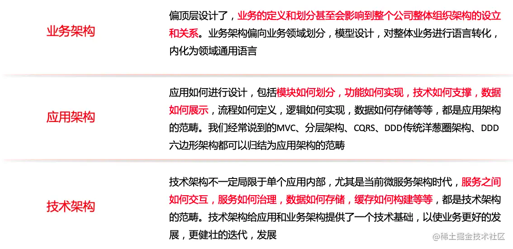
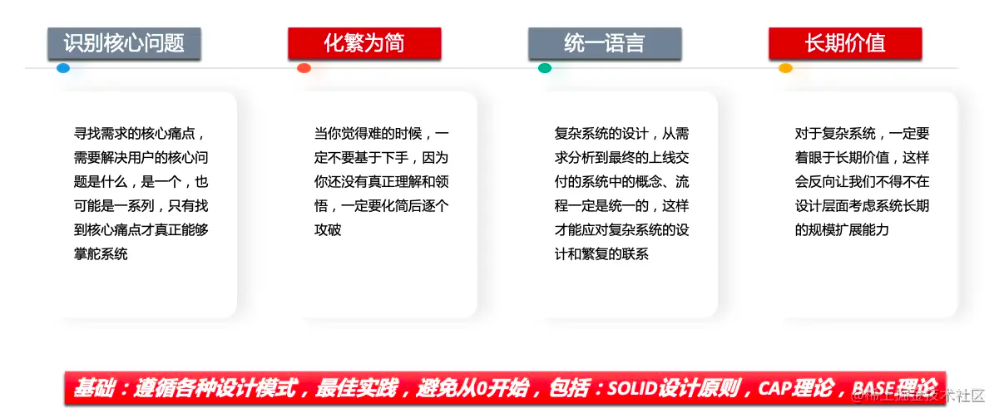
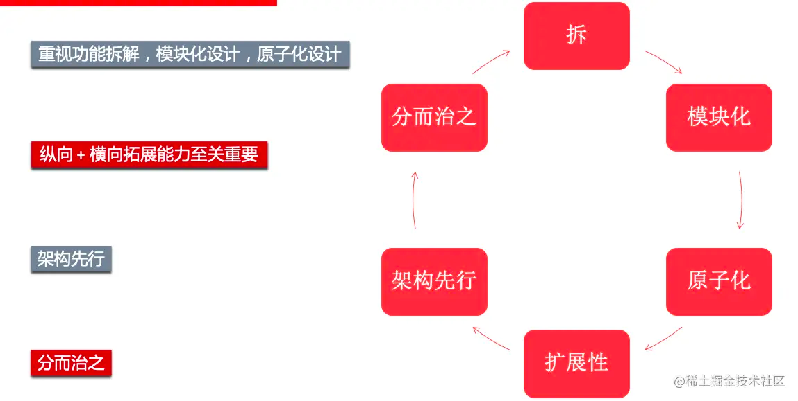
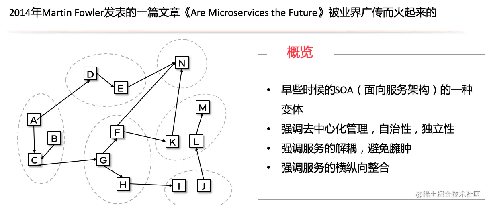

---
sidebar:
group:
title: 设计复杂系统需要考虑什么
date: 2023-12-10

sticky: 1
---
# 设计复杂系统需要考虑什么

https://juejin.cn/post/7226933611265343525?searchId=202312121343273949AA2476C32D06411A

https://juejin.cn/post/7269396835658907707?from=search-suggest

## 复杂系统

什么样的系统称得上是复杂系统：

把每一个功能模块比做一个点，那么每个模块之间有相互关联连成一条线，当功能模块足够多的情况下，形成的一个复杂系统。

## 架构

### 什么是架构

设计软件的人为软件赋予的形状： 描述系统如何划分成多个组件、多个组件之间如何排列、多个组件之间如何通信。

IEEE的定义：架构 = 组成单元的结构 + 组成单元的关系 + 原则和指南

* 整体：强调部分的组成，强调合力
* 规则：强调部分之间有关联关系，有规则，有约束
* 通信：强调部分之间有往来，有交互                                                                                                                                                                                                                                                                                                                                                                                                                                                                                                                                                                                                                                                                                                                                                                                                                                                                                                                                                                                                                                                                                                                                                                                                                                                                                                                                                                                                                                                                                                                                                                                                                                                                                                                                                              

### 架构能解决什么问题

架构这个词是源于建筑行业的，英文原词是：Architecture，维基百科上的解释是规划、设计和建造建筑物的过程及产物。那我们就用建筑行业来理解一下。建房子对大家而言再熟悉不过了，那我们盖个小平层、盖个两层小高层、盖个5层小高层、搞个10层、盖个几百层的摩天大楼的过程、因素、风险是完全不同的。盖摩天大楼需要付出的成本更高，过程中的不确定性更多，挑战和风险也更大，例如如何选地、选择什么样的结构，如何承重，采光如何控制，优化、如何取暖，如何上水、排水，如何通风，如何避震等等。这些东西我们考虑的越多，房子未来的质量，可控性也会越好。

架构本质上就是一种**指导型的约束**，以约定整体和部分、部分和部分之间的关系，以使整体**更加稳定，更加可靠**。

好的架构能够对特定的问题，特定的领域起到规范和指导作用

## 架构分类

### 技术架构

技术架构不一定局限于单个应用内部，尤其是当前微服务架构时代，服务之间如何交互，服务如何治理，数据如何存储，缓存如何构建等等，都是技术架构的范畴。技术架构给应用和业务架构提供了一个技术基础，以使业务更好的发展，更健壮的迭代，发展。

**功能性需求**

功能需求会直接决定业务架构，架构必须能够正确、完整地对功能性需求起到支撑作用

**非功能性需求**

架构满足功能性需求是第一要务，同时我们需要考性能、可靠性、扩展性、兼容性等等

* 可靠性 - 确保架构能够稳定、高效的运行。不会时不时的出现服务崩溃或者不可用的情况
* 可用性 - 服务对外要始终处于可用的状态，即使单个服务实例出现问题，我们依然可以正常的对外提供服务
* 扩展性 - 需求不是一次性提出的，不是一层不变的。需要对系统、服务的整体能力有全面的定位和把控

**治理能力**

好的架构一定是方便运营、管理和监控的。甚至微观到工程管理，代码一定是易于维护、扩展、协同的。

**响应性能**

功能性需求都会对性能有一定的预期。这个业务要我们在架构上做很多工作，比如读写分离、缓存、异步等等的介入，以满足整体架构的响应能力。

### 如何设计？

复杂系统设计中非常重要的两个环节：需求分析、架构设计

**DDD的模式分析业务**

* 确认角色
* 确认角色功能
* 确认问题子域
* 确认模型、事件、归属
* 确认界限上下文

**设计原则**

1. 识别出核心问题
  对于需求的承接，有些人会直接进行入开发设计阶段，尤其是对于出入职场的小伙伴。其实遇到需求我们更多的需要思考，为什么要做这个需求，这个想明白，非常有助于我们进行业务等相关的架构设计，进而掌舵整个需求。这样不会很容易的走入偏路。
2. 复杂的问题简单化，需要把复杂的问题拆解成各个小的模块，进行逐个攻破，各个模块职责会相对单一，未来的扩展性和可维护性也相对独立、简单
3. 确认使用通用的语言进行沟通，尤其是面向领域设计中，领域模型的认识大家一定要保持一致
4. 理清系统、模型的定位、关系、交互等
5. 具备未来的规划能力，包括系统、技术、方案、容量等等，以使系统能够长期更好、更稳定的提供价值服务
6. 遵循各种设计模式，最佳实践，避免从0开始，包括：SOLID设计原则，CAP理论，BASE理论

需要通过领域架构明确领域划分及领域边界，通过系统架构明确功能模块和功能边界，通过应用架构明确各个应用的职责、边界、结构划分、依赖关系等。通过技术架构明确我们使用的技术栈及在整体系统中的应用边界。通过数据架构明确我们的数据存储方式、结构、数据使用方式等

功能拆解，模块化设计，原子化设计

分布式、云化、微服务化、大数据化

## 微服务架构

## DevOps架构

等。如果说敏捷更多是为了解决需求、产品、研发、测试之间的协同、高效，那么DevOps更多的是在解决研发、运维间的协同问题

